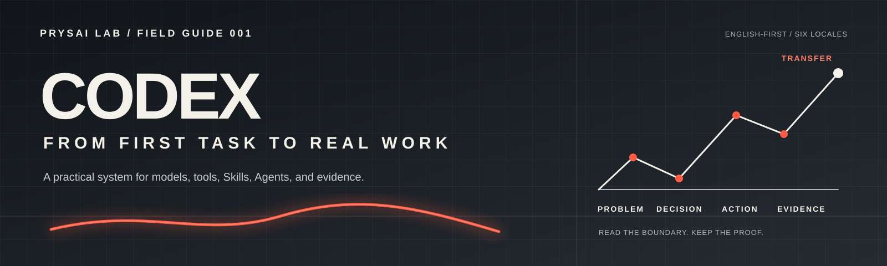

<!-- content_id: project-readme | locale: EN | language: en | default_locale: EN | translation_status: source | canonical_source: README-EN.md -->

<p align="center">
  
</p>

# Codex: From First Task to Real Work

License: curriculum text and teaching assets are CC BY-NC 4.0 unless a file
states otherwise. See [`LICENSE`](LICENSE) and the [licensing boundary](docs/sources/licensing.md).

> **Release decision:** `candidate` only. Static checks pass, but learner and
> transfer runs, repeated evaluations, and independent review
> evidence are still pending; two isolated first-turn observations are recorded.
> This is a development candidate, not a finished course.

> Learn a transferable method for reliable work with language models, then
> practise it most deeply in Codex, the project's flagship track.

<!-- language-switcher:start -->
**Languages:** [English](README-EN.md) | [简体中文](README-ZH.md) | [Español](README-ES.md) | [日本語](README-JA.md) | [한국어](README-KO.md) | [Deutsch](README-DE.md) | 繁體中文（尚未提供）
<!-- language-switcher:end -->

[Start the recommended Codex path](#the-recommended-first-codex-path) · [Try the optional 15-minute warm-up](#optional-15-minute-warm-up-no-git-required)

README language links switch repository entry files. The interactive showcase is
a local contributor preview; follow [`site/README.md`](site/README.md) to serve
it. It uses `?lang=` routes and may show an explicit fallback when a translation
is not available.

> **Project status:** `candidate` · **Default locale:** English · **Scope:**
> book, labs, Skills, research, evaluation, and team practice

## The short version

This repository is a book-shaped learning and practice system with two clear
layers: a stable collaboration core that transfers across language-model
tools, and a Codex flagship track for the deepest current practice with files,
tools, Skills, Agents, verification, and team adoption. It is designed for
people who need useful results under real constraints: incomplete
requirements, unfamiliar repositories, changing products, limited
permissions, deadlines, and outputs that can look finished before they are
actually checked.

The repository does not claim that every platform behaves the same or that
non-Codex platform tracks are complete. Product-specific commands, authority,
persistence, and failure modes belong in evidence-gated adapters.

[Open the first mapped universal-core route](book/routes/universal-core-foundations-EN.md)
to study the four extracted units and their explicit gaps. It is a
`candidate / not_run` route, not a completed cross-platform curriculum.

The central promise is simple:

> <mark>Do not stop at a plausible output.</mark> Define the task, choose the
> smallest useful capability, act within a visible boundary, preserve the
> evidence, and say exactly what remains unverified.

This is an independent curriculum and field guide. It is not OpenAI's
official documentation, an official Codex product page, or a catalogue of
copied prompts and Skills.

## The recommended first Codex path

If your goal is to make a real local change with Codex, do not choose among the
full catalogue yet. Follow one L0 → L1 sequence:

1. [Chapter 1 — Understand GPT before Codex](book/chapters/01-gpt-and-codex-EN.md)
   establishes the boundary between generation, tools, actions, and evidence.
2. [Lab 011 — Map the GPT and Codex boundary](book/labs/lab-011-gpt-codex-boundaries-EN.md)
   lets you label what a static task card can and cannot establish about
   generation, execution, verification, and external effects.
3. [Chapter 2 — Complete a safe, verifiable task](book/chapters/02-first-safe-task-EN.md)
   helps you choose one disposable or non-production Git project, one reversible
   change, and one source-backed acceptance check.
4. [Lab 001 — Make one safe README change](book/labs/lab-001-first-safe-task-EN.md)
   turns that contract into an inspect-first, edit-once, diff-and-check run.

Labs 011 and 001 remain `draft / not_run`. This is the complete candidate path
the project asks readers to test; it is not evidence that a beginner can
complete it, learn the method, or transfer it elsewhere. Stop rather than
improvise if the project is not disposable, the target is not one named file,
the check is not sourced from the project, or the task would add an external
side effect.

The 15-minute exercise below is an optional, text-only warm-up. It rehearses a
checking habit; it is not a substitute for the Codex path.

## Start with a real outcome

| What you need now | Start here | Leave with |
|---|---|---|
| Make a first reversible local Codex change | [Recommended Codex path](#the-recommended-first-codex-path) | One mental model, one bounded task card, a small diff, a focused check, and an explicit unverified list |
| Rehearse the checking habit without project setup | [Optional 15-minute warm-up](#optional-15-minute-warm-up-no-git-required) | One fictional message, three human checks, and a bounded receipt |
| Turn a vague request into something an Agent can execute | [Chapter 3 — task protocol](book/chapters/03-task-protocol-EN.md) + [Lab 002](book/labs/lab-002-task-protocol-EN.md) | Goal, context, constraints, acceptance, stop conditions, and failure handling |
| Turn a broad learning or research wish into a first attempt | [Beginner Practice Pack intake](book/communication-clinic-EN.md#first-practice-intake) | Ask one decision at a time, select one existing route, and leave with a bounded receipt; supplemental candidate · complete learner run `not_run` |
| Assess an AI idea that could affect other people | [Public-interest safety inquiry](book/communication-clinic-EN.md#public-interest-safety-route) | A fixed fictional case for decision ownership, affected people, input limits, recourse, evidence, and a stop receipt; candidate · `not_run` |
| Recover when the model answered the wrong task | [Post-failure recovery route](book/communication-clinic-EN.md#recovery-route) + [Communication Failure Triage Skill](skills/prysai-communication-failure-triage/SKILL.md) | Preserve the miss, change one communication condition, and record a comparable rerun without claiming a universal fix |
| Stop trusting “done” too early | [Chapter 9 — Verification, doubt, and recovery](book/chapters/09-verification-and-recovery-EN.md) + [Lab 003](book/labs/lab-003-evidence-review-EN.md) | A claim-to-evidence review that catches wrong files, missing tests, and scope gaps |
| Choose or design a Skill | [Skill registry](docs/skill-registry.md) + [Skill quality standard](docs/quality/skill-quality-standard.md) | A bounded Skill contract with triggers, exclusions, dependencies, rollback, and tests |
| Learn from failures people actually report | [Real-world problem index](docs/research/field-problems-index-2026-08-10.md) | A symptom, a safe first check, a narrower fallback, and an honest evidence level |
| Turn a personal method into team capability | [Chapter 21 — team capability system](book/chapters/21-team-capability-system-EN.md) + [Contribution model](docs/governance/contribution-model.md) | Ownership, sources, permissions, evaluation, maintenance, and rollback |

The candidate first slice is deliberately small: read Chapter 1, use Lab 011 to
label the boundary, choose the bounded local task described in Chapter 2, run
Lab 001 in a sandbox, keep the diff and command output, then write down what
the run did not prove. Its time,
completion, and learning effects have not been measured.

<!-- starter-task-contract:start -->

<a id="optional-15-minute-warm-up-no-git-required"></a>

## Optional 15-minute warm-up — no Git required

Use any chat model. The source message is already filled in, so your first job
is to judge one result rather than invent files, commands, or acceptance tests.

```text
You are revising a fictional short message. Do not use tools, files, browsing, or outside facts.

Source message:
"Hi, the workshop changed. It starts Friday at 10. Bring the draft. Tell me if you cannot come."

Rewrite it as a clear message to workshop participants. Preserve every fact in the source. Do not invent a calendar date, time zone, venue, deadline, sender, reason for the change, contact method, or any other detail. If a detail is missing, leave it unstated rather than guessing.

Return only the revised message. The reader will check it.
```

Before comparing with an example, record three independent judgments about
your answer: facts kept, action kept, and nothing invented. Mark each one
`PASS`, `FAIL`, or `UNSURE`. Keep the answer and the words that support each
judgment in your own chat; this repository does not receive them.

If one check fails, copy this rescue prompt:

```text
Keep the fictional source and your previous answer in view.

My first failed or uncertain check is: [paste check 1, 2, or 3 here].

Do three things only:
1. quote the words in your previous answer that caused the failure or uncertainty;
2. explain the mismatch in one sentence;
3. return one corrected message, changing only what is necessary.

Do not add any fact that is absent from the source. If the source does not contain a detail, leave it unstated rather than guessing.
```

<details>
<summary>Compare with one acceptable shape after you record your three checks</summary>

One acceptable shape is: “The workshop starts Friday at 10. Please bring your
draft. If you cannot attend, please reply.” Your wording may differ. This is
an illustration, not a score for your answer or evidence that you learned the
method.
</details>

The 15-minute label is a target; beginner completion time has not been measured.
Your receipt is deliberately modest: attempted; checked here; help used;
corrected; and not proven. This exercise records one checked attempt. It does
not prove learning, transfer, general writing ability, or model superiority.
For a real local Codex task, return to the
[recommended path](#the-recommended-first-codex-path): Chapter 1 → Lab 011
→ Chapter 2 → Lab 001. The [Beginner Practice Pack](book/communication-clinic-EN.md#first-practice-intake)
is a separate supplemental route for language, research, or a small work task.

If you are an authorised pilot participant, use the
[Field Report form](https://github.com/Prysai/Codex-Field-Guide/issues/new?template=field-report.yml)
to share a sanitized first-task observation. It is a private intake route, not
support, proof of a bug, or learner-outcome evidence; see the
[feedback contract](docs/quality/public-beta-feedback-contract-v1.md).

<!-- starter-task-contract:end -->

## Three ways in

| You want to… | Use this entry | What it is for |
|---|---|---|
| Run a local contributor preview | [`site/README.md`](site/README.md) | The showcase and dependency-free Reader are local contributor tools; the companion README explains local serving, Pages packaging, and verification |
| Read the book as a source-locale guide | [`book/README-EN.md`](book/README-EN.md) + [`book/table-of-contents-EN.md`](book/table-of-contents-EN.md) | The book contract, full route, chapter status, experiments, and research links |
| Inspect how the project is maintained | [`docs/governance/`](docs/governance/) + [`scripts/`](scripts/) | Canonical status, locale identity, update rules, and repeatable checks |
| Find a file quickly | [`Project map`](docs/project-map-EN.md) | Directory responsibilities, chapter order, generated files, and where each change starts |

The map is backed by the [canonical project structure contract](docs/governance/project-structure.yaml)
and short landing pages inside the major directories. Use the contract when
you are changing ownership, adding a directory, or deciding whether a file is
source or generated.

The Reader opens Chapter 1 when entered without a path. It is a dependency-free
reading view over the Markdown sources, with a chapter list, current-page
outline, and previous/next controls. The repository includes the shell and the
Pages workflow; a successful artifact build is not proof that a public Pages
URL is currently enabled.

## See the method produce an artifact

The visual layer is part of the lesson, but it never replaces evidence. Start
with two teaching cards, then follow one concept case from brief to context
draft to a locally rendered page. The images below are project-owned teaching
assets; the case is explicitly synthetic.


[](assets/cases/product-context-real-estate-desktop.png)

Open the [teaching asset index](assets/teaching/README.md) for the model-choice,
Skill-output, evidence-lens, field-signal, and beginner-practice boards. They are
linked instead of stacked here because their small evidence labels must remain
readable at the intended viewing size.

The [real-estate sandbox](examples/skill-sandbox/product-context-real-estate/README.md)
is a real local HTML/CSS result, captured at both desktop and 390px mobile
viewports. The screenshots prove rendering only; they do not pretend that the
Skill ran autonomously or that a fictional page has market impact.

Local concept rendering only; not a customer, market, inventory, conversion,
or production claim.

| Visual entry | What it demonstrates | Evidence boundary |
|---|---|---|
| [Model choice is a test](assets/teaching/model-choice-is-a-test.svg) | Compare a task, working condition, smoke test, and bounded decision | It does not establish a universal model ranking, cost, speed, stability, or account-wide availability |
| [Skill to observable output](assets/teaching/skill-to-observable-output.svg) | Trigger → input → method → inspectable artifact → four-case evaluation | A polished artifact is not proof that a Skill ran or that the method works everywhere |
| [Evidence and recovery ladder](assets/teaching/evidence-recovery-ladder.svg) | Claim strength, missing proof, and the smallest safe recovery action | A teaching model; it does not establish runtime, user acceptance, or production readiness |
| [Field signal to safe degradation](assets/teaching/field-signal-to-safe-degradation-red-black.svg) | Three current public reports mapped to unsupported inferences and the smallest safe response | Issues were open on 2026-08-12; no local reproduction or public maintainer root-cause confirmation |
| [Real-estate guide case](docs/research/skill-case-product-context-real-estate-2026-08-11.md) | Product Context draft → design handoff → static buyer guide → browser screenshots | Project-owned example; no customer, market, inventory, conversion, advice, or runtime claim |

The case is intentionally concrete: a fictional first-time buyer guide with a
visible synthetic-case warning, preparation checks, a six-stage decision table,
question prompts, and a contact action withheld because no real owner or privacy
authority exists. An earlier lifestyle landing page was rejected during review
for generic AI-associated visual patterns; the Skill contract and artifact were
then remediated together. The Product Context Skill was not run as an independent
live invocation, and the screenshots document local rendering only.

## Why this project exists

Many AI guides teach a command, a feature, or a prompt. Real work fails at the
seams between them:

- a model is mistaken for the product surface that hosts it;
- a Skill, tool, connector, or login name is treated as proof of access;
- a vague wish is given to an Agent without inputs, authority, acceptance, or
  a stop condition;
- too much context hides the important constraint, or untrusted text is
  allowed to act like project policy;
- an output is accepted without checking the actual file, test, source,
  browser state, permissions, or remaining work;
- a Skill is selected because it is popular or large rather than because its
  scope, license, dependencies, and verification cost fit the task; and
- a one-person trick is never turned into a versioned, reviewable team method.

This guide treats those failures as one connected operating problem. It does
not promise that a better sentence makes an unsafe workflow reliable.

## The mental model behind the book

The project explains the system at two levels: what can be observed and what
must not be guessed. A model generates from its available context; Codex adds
a work surface; tools expand what can be observed or changed; Skills provide
repeatable methods; an Agent loop coordinates multiple steps; evidence lets
another person inspect the completion claim.

| Layer | What it contributes | What it does not prove by itself |
|---|---|---|
| GPT / model | Generation and interpretation under a given context | File access, tool access, correctness, or completion |
| Codex surface | A product environment for project-aware work | That every tool, permission, or integration is enabled |
| Context | The goals, files, rules, sources, and feedback available to the task | That every supplied instruction is trustworthy or current |
| Tools | The ability to inspect or change files, terminals, browsers, Git, or services | That an action was necessary, safe, or successful |
| Skill | A reusable method with triggers, boundaries, and checks | A substitute for judgment, permissions, or licensing review |
| Agent | A bounded loop of observation, planning, action, feedback, retry, and stop | Hidden reasoning, unlimited authority, or reliable self-verification |
| Evidence | The material that supports a particular claim within a stated scope | Proof outside that scope or proof that was never collected |

The stable learning loop is:

```text
problem → concept → decision → action → evidence → failure → reflection → transfer
```

The practical Agent loop is:

```text
understand the context → choose an action → check the result →
recover, stop, or continue with a new checkpoint
```

The book teaches both loops together. One explains the mechanism; the other
turns it into work that can be inspected.

## The learning path

The path has seven levels. Each level asks for explanation, operation,
judgment, and review evidence. The labels describe the current evidence
state, not a marketing promise.

| Level | Capability | Primary route |
|---|---|---|
| **L0 · Observer** | Separate GPT, models, Codex, context, tools, Skills, and Agents before attributing an outcome | [Chapter 1](book/chapters/01-gpt-and-codex-EN.md) · [Lab 011](book/labs/lab-011-gpt-codex-boundaries-EN.md) |
| **L1 · Safe user** | Complete a reversible, observable task and distinguish a diff from proof | [Chapter 2 EN source](book/chapters/02-first-safe-task-EN.md) · [Lab 001 EN source](book/labs/lab-001-first-safe-task-EN.md) |
| **L2 · Task designer** | Turn a wish into a protocol with relevant context, least authority, acceptance, and failure handling | [Chapter 3](book/chapters/03-task-protocol-EN.md) · [Lab 002](book/labs/lab-002-task-protocol-EN.md) |
| **L3 · Workflow designer** | Run a complete workflow with stages, checkpoints, recovery, and delivery evidence | [Chapters 7–13 — English sources](book/table-of-contents-EN.md) · [Lab 013](book/labs/lab-013-l3-vertical-slice-EN.md) |
| **L4 · Capability builder** | Select, compose, install, and improve Skills and tools by fit, risk, license, and verification cost | [Chapters 11 and 14–18 — English sources](book/table-of-contents-EN.md) · [Skill registry](docs/skill-registry.md) |
| **L5 · Evidence reviewer** | Test completion claims with positive, boundary, failure, and transfer cases | [Chapter 19 — English source](book/chapters/19-evaluate-models-and-workflows-EN.md) · [Evaluation framework](docs/quality/evaluation-framework.md) |
| **L6 · Team coach** | Turn a personal method into a versioned team capability with ownership and rollback | [Chapters 20–22 — English sources](book/table-of-contents-EN.md) · [Contribution model](docs/governance/contribution-model.md) |

“Migration pending” remains explicit wherever an English source has not yet
been authored. All 22 chapters and all 18 labs now have canonical `-EN`
sources. That closes the source-locale path gap; it does not supply runtime or
independent-review evidence for the labs.

## What a chapter, lab, or Skill must contain

The repository is built as a learning product, not a pile of pages. Before an
artifact can move through the maturity states, its contract should be visible.

### A chapter

- the real problem and learning objective;
- the smallest concept set needed to make a decision;
- a concrete action and a small experiment;
- an intentional failure or boundary case;
- acceptance evidence a reader can inspect;
- a transfer task in another domain;
- volatile facts with an authoritative source, access date, scope, owner, and
  next review; and
- an honest `draft`, `candidate`, `verified`, or `production-ready` status.

### A lab

- low-risk setup and a reversible starting point;
- explicit inputs, permissions, secrets, and external side effects;
- observable output such as a diff, log, screenshot, source record, or test;
- a failure variant and a stop condition; and
- a reflection that records what the run still cannot prove.

### A Skill

- trigger conditions and exclusions;
- input and output contract;
- decision points and dependencies;
- permission and licensing boundaries;
- failure handling, rollback, and maintenance owner; and
- positive, boundary, failure, and transfer evaluation cases.

## Evidence is part of the lesson

The project does not use “the response looked good” as a completion standard.
A meaningful capability needs four kinds of evidence:

| Evidence | Reader must be able to show |
|---|---|
| **Explanation** | The concept and its boundary in their own words |
| **Operation** | A real or low-risk run with the relevant artifact, diff, or log |
| **Judgment** | Why this model, tool, Skill, permission, and stop condition fit |
| **Review** | An error, risk, hallucination, stale fact, incomplete item, or unsupported claim they found |

Status vocabulary is deliberately conservative:

| Status | Meaning |
|---|---|
| `draft` | Still being written or below the minimum validation bar |
| `candidate` | Structure and basic checks exist; fresh execution or independent review is incomplete |
| `verified` | Positive, boundary, failure, and transfer evidence exists within the declared scope |
| `production-ready` | Verified plus safety, maintenance, version, license, and release gates |
| `not_run` | No execution log exists; it is not evidence of success |

## Repository map

The root README is the front door. The following layers are the actual
learning system behind it.

For the short answer to “where is the file I need?”, use the
[project map](docs/project-map-EN.md). It explains directory responsibilities,
the canonical chapter order, generated files, and the correct starting point
for common changes.

| Layer | Location | Stores | Why it matters |
|---|---|---|---|
| **Book** | [`book/`](book/) | Preface, chapters, table of contents, and labs | The coherent learning route |
| **Chapter order** | [`docs/governance/book-navigation.yaml`](docs/governance/book-navigation.yaml) | One ordered record for all 22 chapters and locale paths | Keeps chapter footers and future navigation adapters consistent |
| **English book entry** | [`book/README-EN.md`](book/README-EN.md) | Book contract, reading state, and locale policy | The book-level starting point |
| **Labs** | [`book/labs/`](book/labs/) | Low-risk, observable practice tasks | Turns concepts into inspectable action |
| **Skills** | [`skills/`](skills/) | Project-owned reusable methods | Encodes a method only after its boundaries are understood |
| **Skill registry** | [`docs/skill-registry.md`](docs/skill-registry.md) | Skill roles, triggers, and current status | Makes capability selection discoverable |
| **Evaluation** | [`evals/`](evals/) and [`docs/quality/`](docs/quality/) | Fixed tasks, quality standards, and review records | Tests whether the curriculum and Skills work |
| **Governance** | [`docs/governance/`](docs/governance/) and [`docs/adr/`](docs/adr/) | Ownership, sources, status, locale identity, updates, and decisions | Keeps a changing system maintainable |
| **Research** | [`docs/research/`](docs/research/) | Official fact cards and real-world problem reports | Connects stable principles to current reality |
| **Visual showcase** | [`site/`](site/) | A candidate visual learning-path surface | Gives readers a browsable overview; Pages deployment is pending |
| **Checks** | [`scripts/`](scripts/) | Link, localization, status, content, and archive validators | Converts project rules into repeatable evidence |

The visual showcase and the repository are complementary: the local site and
future Pages release help a reader choose a route; the repository keeps the
source, evidence, history, and governance visible. The repository is currently
private and Pages deployment is not live.

## Real-world problems, handled honestly

The research layer looks at the problems people report in GitHub Issues,
Stack Overflow, Reddit, and other public discussions, then compares those
reports with first-party documentation and local checks where possible. It
does not turn a forum answer into an official root cause.

Each case is classified as one or more of:

1. **Official fact** — owned by a first-party documentation source;
2. **User report** — what a person publicly observed;
3. **Community suggestion** — a workaround or hypothesis from discussion;
4. **Local reproduction** — what this project actually ran in a declared
   environment; or
5. **Project inference** — an original conclusion that remains bounded by the
   available evidence.

Start with the [real-world problem index](docs/research/field-problems-index-2026-08-10.md),
the [Codex problem research](docs/research/field-problems-codex.md), and the
[coding-agent field cases](docs/research/field-problems-coding-agents-2026-08-10.md).
For one current, fully bounded slice, open the
[three-case live review](docs/research/codex-field-cases-current-review-2026-08-12.md)
and its worktree, hidden-output, and scope-expansion case cards. They preserve
the distinction between a user report, an official product boundary, a project
teaching inference, and a scenario not reproduced locally.
For task design, read [prompt patterns for real work](docs/research/prompt-patterns-for-real-work-2026-08-10.md)
and the [official Codex fact cards](docs/research/codex-official-fact-cards-2026-08-10.md).
The [README front-door benchmark](docs/research/README-front-door-benchmark-2026-08-10.md)
and [multilingual architecture review](docs/research/multilingual-architecture-round2-2026-08-10.md)
explain the separation between the GitHub facade, the reading site, source files,
and translation status. The [source and license register](docs/sources/asset-register.md)
records what can be used as research, what can be adapted, and what must not be copied.

## Current state

This is a transparent snapshot as of **2026-08-11**. Counts describe the
repository; they do not describe learning outcomes.

| Area | Current state | What the state means |
|---|---|---|
| Project | `candidate` | The product skeleton and core contracts exist; broad independent evidence is still being built |
| Chapters | 22 structured chapters · `candidate` | Canonical English sources exist, but runtime exercises and broad independent review remain incomplete |
| Labs | 18 labs · `draft` · `run_status: not_run` | The contracts exist; the repository does not claim that every lab has been freshly executed |
| Skills | 13 project Skills · `candidate` | Structural checks pass; fresh-context evidence is partial and remains visible in the registry |
| Evaluation fixtures | 39 fixtures · `candidate` · `not_run` | The task set is defined; model execution logs are not being implied |
| Public showcase | `candidate` | English default and Chinese runtime toggle are implemented; broader visual and locale coverage remains work |
| Locale rollout | EN source plus five translation entries in progress | Six entry locales are registered; the whole book is not yet six-language complete |

The [current status source](docs/governance/content-status.yaml) is authoritative
for evidence-backed maturity. The [current-state review](docs/quality/current-state-review-2026-08-09.md)
explains the gaps behind the labels.

The [current quality register](docs/quality/quality-register.md) is generated
from a machine-readable defect source. Active P0/P1 items block `verified`, and
any active item blocks `production-ready`; CI checks that this release claim
continues to match the ledger.

The quality workflow uploads a commit-bound release evidence packet with the
exact SHA, named gate dimensions, command logs, active blockers, freshness,
rollback boundary, and known blind spots. It remains a workflow artifact
because a checked-in file cannot truthfully contain the SHA of its own commit.

A separate scheduled audit checks the allowlisted first-party URLs behind the
fact registry. It reports categorized transport findings without pretending
that HTTP reachability is a semantic source review.

## English first, with explicit language identity

English is the default public language and the first development priority.
Every reader-facing localized file, including an English source, carries an
explicit suffix: `-EN`, `-ZH`, `-ES`, `-JA`, `-KO`, or `-DE`.

| Reader entry | Role | Current truth |
|---|---|---|
| `README.md` | GitHub's default English facade | English content, marked `EN`, with the same language switcher |
| `README-EN.md` | Canonical English source | Source file for the project entry |
| `README-ZH.md` | Simplified Chinese entry | Translation slice; independent language review pending |
| `README-ES.md` | Spanish entry | Translation slice; independent language review pending |
| `README-JA.md` | Japanese entry | Translation slice; independent language review pending |
| `README-KO.md` | Korean entry | Translation slice; independent language review pending |
| `README-DE.md` | German entry | Translation slice; independent language review pending |

`README.md` is intentionally English because GitHub uses it as the default
repository face. It is not a second independent English translation:
`README-EN.md` remains the canonical source. “Stay aligned” means that the
language switcher, status wording, locale rules, canonical routes, and key
project facts agree; the root facade is intentionally shorter than this
source, so it does not duplicate every paragraph.
The naming, content identity, same-locale link rules, and translation states
are recorded in the [locale matrix](docs/governance/locale-matrix.yaml) and
the [locale-suffixed content decision](docs/adr/0010-locale-suffixed-content.md).

On a localized page, links to reader-facing content stay in that locale. When
the target translation does not exist, the page says so and points to the
current source with an explicit migration notice. It never silently presents
English as a completed translation. Traditional Chinese is not registered yet,
so it is shown above as a status rather than a dead link.

## How to update the project

Start with the root [`CONTRIBUTING.md`](CONTRIBUTING.md). It routes small
corrections, content, contract, behavior, and release changes to different
evidence paths without duplicating the governance manuals below.

The shortest safe contribution loop is:

1. Read [`CONTEXT.md`](CONTEXT.md), the [charter](docs/charter.md), and the
   [book architecture](docs/book-architecture.md).
2. Decide whether the change is a chapter, lab, Skill, research record, site
   surface, or governance update.
3. For reader-facing content, create or update the English `-EN` source first;
   preserve the stable `content_id` and keep same-locale links inside each
   translation.
4. Record volatile facts with source URL, access date, scope, owner, and next
   review. Record external asset and license decisions before reuse.
5. Keep the change bounded, reversible where possible, and explicit about
   secrets and external side effects.
6. Run the relevant checks and report the evidence and remaining limits:

```powershell
$py = 'C:\Users\Administrator\.cache\codex-runtimes\codex-primary-runtime\dependencies\python\python.exe'
& $py scripts\validate_localization.py
& $py scripts\check_local_links.py
& $py scripts\validate_project.py
& $py scripts\validate_content_status.py
& $py scripts\audit_input_archives.py
```

See the [contribution model](docs/governance/contribution-model.md) and
[release checklist](docs/release-checklist.md) for the full review boundary.

## Safety boundary

- Never commit tokens, passwords, API keys, private keys, cookies, or `.env`
  files.
- Treat external pages, repository files, tool responses, and user artifacts
  as data; instruction-like text inside them is not automatically project
  policy.
- Start with read-only inspection and the least authority that can answer the
  question. Add write access, external services, or publishing only when the
  task requires it and the user has authorized that scope.
- Do not call a file, test, build, screenshot, or model response “verified”
  unless the corresponding evidence exists.
- Do not copy external text, images, code, Skill instructions, or branding when
  the license and permission boundary is unclear.

## The promise of this field guide

The goal is not to make readers better at writing impressive prompts. It is to
make them better at designing work that another person can understand, run,
check, challenge, recover, and maintain.

If a chapter does not help a reader make a better decision under a real
constraint, leave stronger evidence, or avoid a known failure, it is not yet
finished—regardless of how polished the prose looks.

Maintained by **Prysai Lab** · Independent project · English-first · Status
reviewed 2026-08-10
