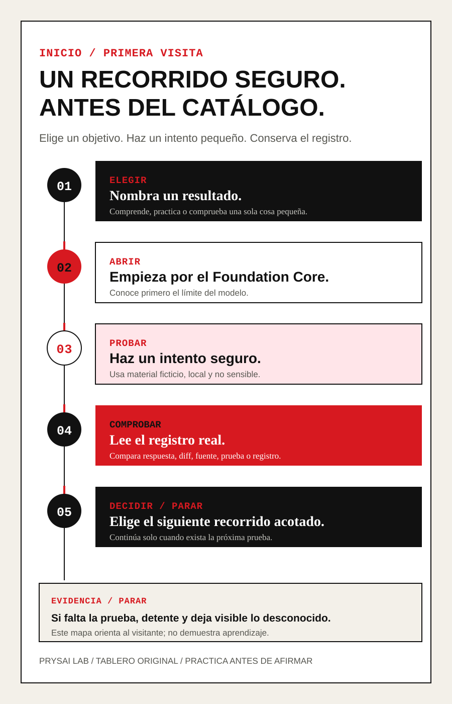

# Prysai LLM Playbook: de la primera tarea al trabajo fiable

Licencia: el texto del curso y los materiales didácticos están bajo CC BY 4.0; los scripts y las herramientas bajo Apache-2.0, salvo que un archivo indique otra cosa. Ver [`LICENSE`](LICENSE), [`LICENSE-CODE`](LICENSE-CODE) y el [límite de licencia (locale-neutral)](docs/sources/licensing.md).
> Manual práctico de LLM: de la primera tarea al trabajo fiable.

<!-- language-switcher:start -->
**Idiomas:** [English](README-EN.md) | [简体中文](README-ZH.md) | [Español](README-ES.md) | [日本語](README-JA.md) | [한국어](README-KO.md) | [Deutsch](README-DE.md) | [繁體中文](README-ZHTW.md) | [Français](README-FR.md)
<!-- language-switcher:end -->

## Empieza como un libro: comprende antes de practicar

Si es tu primera visita, no elijas todavía entre tarjetas, Skills o productos. Sigue esta ruta en español:

1. [Conceptos de LLM](book/guides/llm-fundamentals-ES.md)
2. [Primera tarea universal de LLM](book/routes/universal-core-foundations-ES.md)
3. [Primera modificación segura](book/routes/first-safe-change-ES.md)

### Mira el recorrido de un vistazo



Esta lámina de cinco pasos reúne el recorrido en una sola línea: elegir un objetivo, abrir los fundamentos, hacer un intento seguro, revisar el registro y continuar o detenerse. Es una ayuda visual para orientarse, no una prueba de aprendizaje.

El núcleo de fundamentos en inglés es la fuente canónica que se está
retraduciendo; esta entrada en español mantiene una ruta completamente en
español hasta que la nueva traducción pueda revisarse.

Los ciclos de español, actualización de trabajo e investigación son **prácticas de aplicación opcionales** después de esta ruta; no son la primera lección sobre LLM ni prometen eficiencia, fluidez o mejora de capacidad.

## Qué te llevas de la ruta

El valor de este proyecto no está en sumar más términos de IA, sino en dejar
algo que puedas revisar y llevar a la siguiente tarea. La ruta de fundamentos
de cinco unidades está diseñada para producir tres resultados escritos por el
estudiante:

- **Una ficha de tarea acotada:** objetivo, contexto aportado, ayuda permitida,
  límites, comprobación y condición de parada;
- **Un registro del resultado comprobado:** qué propuso o cambió el modelo, qué
  revisaste, qué evidencia conservaste y qué sigue siendo desconocido;
- **Un intento de transferencia:** aplicar el mismo método a una tarea nueva y
  decidir con claridad si continuar, corregir o detenerse.

Son objetivos de trabajo, no resultados de aprendizaje medidos. El proyecto
sigue en `candidate`; la finalización, la transferencia y la retención del
aprendizaje siguen en `not_run`.

## Empieza con una tarea de texto segura, sin instalación

Si hoy solo quieres probar un chat de texto, abre la
[ruta universal de primera tarea](book/routes/universal-core-foundations-ES.md).
Usa un aviso ficticio, escribe una petición con resultado, material, forma de
respuesta, comprobación y límite de parada, y revisa tú mismo la respuesta.
No necesitas una cuenta especial, código, archivos, una red, datos privados ni
una acción real. Esta traducción está `in-progress`; no es una revisión
lingüística independiente ni evidencia de aprendizaje, y no afirma que los
productos de LLM se comporten igual.

Prysai LLM Playbook no es un directorio que se limite a
enumerar skills ni un manual que solo explique pasos de instalación. Es un
sistema de aprendizaje y práctica de Codex GPT, organizado como libro,
curso y laboratorio: primero ayuda al lector a entender la relación entre
GPT, los modelos, Codex, el contexto, las herramientas, las Skills y los
Agents; después convierte esa comprensión en acción mediante experimentos;
por último, transforma los métodos personales en capacidades de equipo que
se pueden evaluar, reutilizar y actualizar.

La ruta acompaña a cualquier persona desde «he oído hablar de GPT» hasta el
uso seguro de Codex, la ejecución estable de tareas reales, la comprensión de
por qué un Agent actúa de cierta manera, la elección y el diseño de Skills
adecuadas y la creación de un sistema de trabajo propio que pueda compartir
con un equipo.

## Qué problema resolvemos

Muchas personas consiguen que la IA genere algo que parece correcto, pero no
logran que complete una tarea real de forma estable. El problema normalmente
no es «no saber escribir un prompt», sino no tener un sistema de trabajo
completo:

- no distinguen GPT, Codex, el modelo, el contexto, las herramientas y las
  Skills;
- no saben cuándo conviene preguntar, cuándo entregar archivos y cuándo
  pedirle a Codex que inspeccione primero;
- no saben convertir un objetivo impreciso en tareas ejecutables;
- no saben controlar permisos, verificar resultados ni responder a un fallo;
- han instalado muchas Skills, pero no saben por qué son útiles, cuándo
  combinarlas ni cuándo no deberían usarlas;
- pueden tener éxito en una prueba personal, pero no convertir el método en
  un proceso reutilizable, revisable y mantenible para un equipo.

Esta ruta de aprendizaje aborda esos problemas en una línea continua:

```text
Conocer GPT → conocer Codex → prepararse con seguridad → expresar la tarea
       → gestionar el contexto → usar herramientas → elegir y combinar Skills
       → entender la lógica del Agent → planificar/ejecutar/verificar/entregar
       → practicar en dominios profesionales → colaborar a escala organizativa
```

La ruta avanza por dos ejes a la vez:

- **Eje de comprensión:** entender cómo funcionan GPT y los modelos, y cómo
  el contexto, las herramientas, las Skills, los Agents, los permisos y la
  verificación cambian el resultado.
- **Eje de capacidad:** empezar con experimentos pequeños y practicar de
  forma gradual la expresión de tareas, el diseño de flujos de trabajo, la
  selección de Skills, la revisión de resultados y la gobernanza del equipo.

## Forma del proyecto

| Capa | Producto | Función |
|---|---|---|
| Libro | `book/` | Construir conceptos, métodos y criterio mediante capítulos conectados |
| Curso | Objetivos y recorrido de cada capítulo | Indicar qué aprender primero y por qué |
| Laboratorio | `book/labs/` | Practicar con tareas reales y producir evidencia comprobable |
| Paquetes de capacidad | `skills/` | Convertir métodos maduros en instrucciones de trabajo ejecutables por Codex |
| Evaluación | `docs/quality/` | Determinar si el contenido, las Skills y el aprendizaje funcionan de verdad |
| Normas de organización | `docs/governance/` | Gestionar permisos, fuentes, versiones, actualizaciones y contribuciones |

## Cómo decide el sistema que alguien ha aprendido

El estudiante no puede limitarse a entregar un resultado que parezca terminado.
Cada capacidad importante necesita evidencia de explicación, de operación, de
criterio y de revisión; cada Skill necesita activación, límites, fallos,
fuentes y una comprobación de contexto fresco. El número de directorios o de
instalaciones no demuestra dominio.

## Estado actual

La fuente canónica en inglés contiene 22 capítulos `candidate`, 18 Labs
`draft`, 26 Skills (25 propias y 1 externa revisada) `candidate` y 40 fixtures de evaluación
`candidate`. Las comprobaciones estructurales existen, pero no sustituyen
resultados de aprendizaje, transferencia, evaluación repetida ni revisión
independiente. Los 22 capítulos y 18 Labs españoles tienen archivos candidatos
y rutas en el mismo idioma, pero siguen `in-progress`: esa cobertura estructural
no constituye una revisión lingüística independiente, adaptación cultural ni
evidencia de aprendizaje. Los materiales externos no entran en la ruta
principal sin revisar antes su fuente, licencia y contenido.

Los identificadores de estado `candidate`, `draft` y `not_run` se mantienen
sin traducir para que sigan siendo inequívocos en los archivos y validadores.
No deben interpretarse como `verified` ni como `production-ready`: describen
el estado declarado de trabajo, no una garantía de funcionamiento, calidad de
traducción o verificación en navegador.

## Límites importantes

- El contenido original de los mantenedores y las fuentes externas se
  registran por separado; la información de propiedad y gobernanza está en
  el registro de fuentes.
- Los nombres de modelos, precios, puntos de entrada, cuotas y funciones
  concretas son hechos volátiles: deben incluir una fuente autorizada, la
  fecha de acceso, el alcance y la próxima revisión.
- «GPT-5.6 Luna ofrece la mejor relación calidad-precio» es actualmente una
  hipótesis de producto que requiere una evaluación reproducible; no es una
  conclusión permanente.
- No se incorpora directamente a la distribución ningún material cuyo
  permiso o licencia no esté claro.
- Aprender a usar Codex no significa instalar muchas Skills; significa
  producir resultados estables y verificables dentro de límites claros.
- Este proyecto de aprendizaje y práctica es independiente. No es
  documentación oficial de OpenAI ni una página oficial del producto.

## Entradas disponibles en español

- [Guía de lectura en español](book/README-ES.md)
- [Prefacio en español](book/preface-ES.md)
- [Índice del libro en español](book/table-of-contents-ES.md)
- [Primera tarea universal de LLM](book/routes/universal-core-foundations-ES.md)
- [Tarjetas de práctica para principiantes](book/communication-clinic-ES.md): siete mensajes copiables para una práctica breve de idioma, actualización, decisión, comprobación de fuentes o límite antes de compartir. Son una ruta `draft / not_run`, no una promesa de fluidez, eficiencia o aprendizaje demostrado.
- [Índice de Labs en español](book/labs/README-ES.md): dieciocho ejercicios de bajo riesgo, cada uno con un archivo `-ES` y una ruta en español.

El vocabulario, la gobernanza, el registro de fuentes, las evaluaciones, la
investigación y la documentación de Skills todavía no tienen archivos en
español. Para mantener esta ruta en un solo idioma, esta entrada no los enlaza
con páginas de la fuente original; se abrirán aquí cuando exista una traducción
revisada.

## Nota sobre el nombre

El nombre externo previsto actualmente es `Prysai LLM Playbook — From First
Task to Reliable Work`, con el nombre chino «Prysai 大模型实战手册：从第一个任务到可靠交付». La ruta del
repositorio de GitHub conserva por ahora su slug actual; el nombre de los
metadatos del repositorio y la migración de enlaces antiguos se tratarán
cuando se confirme el nombre definitivo. La organización propietaria, la
responsabilidad de mantenimiento y las puertas de publicación están
registradas en los documentos de gobernanza y fuentes, no en el título del
producto.
