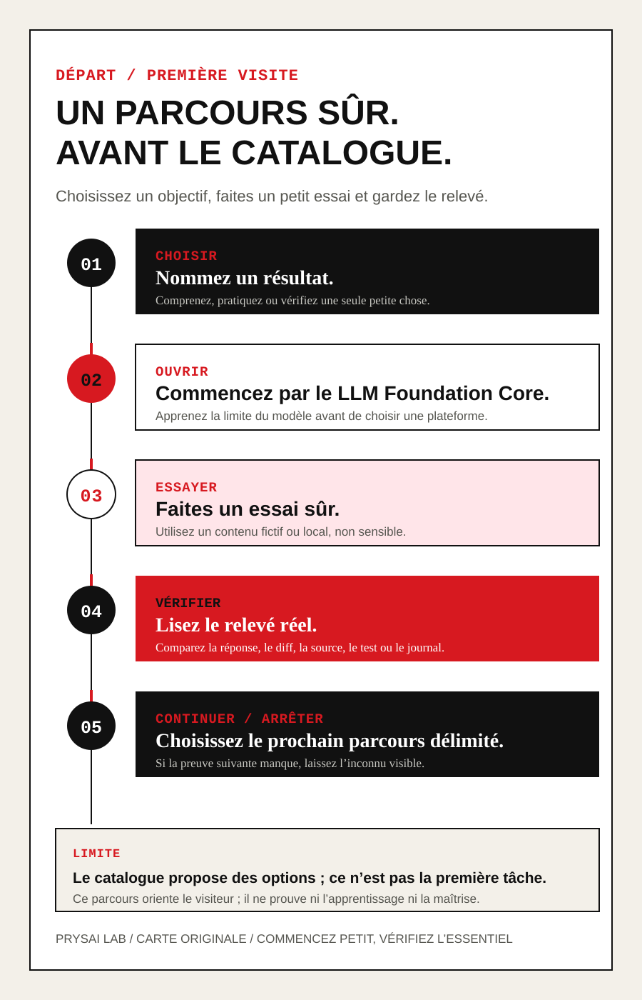

<!-- content_id: project-readme | locale: FR | language: fr | default_locale: EN | translation_status: in-progress | translated_from: EN | source_revision: worktree-2026-08-21-fr-bootstrap -->

# Prysai LLM Playbook — De la première tâche à un travail fiable

> Comprenez d’abord ce qu’un LLM peut réellement étayer — et ce qu’il ne peut pas.
> Essayez ensuite un petit résultat, vérifiez-le, puis choisissez une route Codex
> ou une autre plateforme.

**Statut :** `candidate`. Les contrôles structurels existent ; les essais
d’apprenants, le transfert et la relecture française indépendante restent
`not_run` ou en attente. Cette page n’est pas une traduction vérifiée.

<!-- language-switcher:start -->
**Langues :** [English](README-EN.md) | [简体中文](README-ZH.md) | [Español](README-ES.md) | [日本語](README-JA.md) | [한국어](README-KO.md) | [Deutsch](README-DE.md) | [繁體中文](README-ZHTW.md) | [Français](README-FR.md)
<!-- language-switcher:end -->

## Commencer ici

1. [Comprendre les bases des LLM](book/guides/llm-fundamentals-FR.md)
2. [Route universelle de première tâche](book/routes/universal-core-foundations-FR.md)
3. [Première modification sûre](book/routes/first-safe-change-FR.md)

### Voir le parcours d’un coup d’œil

Cette planche en cinq étapes réunit le parcours en une seule ligne : choisir un objectif, ouvrir les fondamentaux, faire un essai sûr, lire le relevé, puis continuer ou s’arrêter. Elle sert à s’orienter et ne constitue pas une preuve d’apprentissage.

La [pratique d’application facultative](book/communication-clinic-FR.md) vient
après les fondations. Elle ne remplace pas l’apprentissage de ce qu’est un LLM.

## Ce que vous gardez après le parcours

La valeur de ce projet ne tient pas à une nouvelle liste de termes liés à l’IA ;
elle tient à ce qu’il vous aide à produire quelque chose de vérifiable. Le parcours
fondamental en cinq unités vise trois livrables rédigés par l’apprenant :

- **Une fiche de tâche délimitée :** objectif, contexte fourni, aide autorisée,
  limites, vérification et condition d’arrêt ;
- **Un relevé du résultat vérifié :** ce que le modèle a proposé ou modifié, ce
  que vous avez contrôlé, les éléments de preuve conservés et ce qui reste
  inconnu ;
- **Un essai de transfert :** appliquer la même méthode à une nouvelle tâche et
  décider clairement de continuer, de corriger ou de s’arrêter.

Ce sont des objectifs de travail, pas des résultats d’apprentissage mesurés. Le
projet reste `candidate` ; les preuves de réussite, de transfert et de
retenue à long terme restent `not_run`.

Le [site de lecture guidée](https://docs.prysai.com/llm-playbook/?lang=fr) suit
la même route en cinq unités. Vous pouvez commencer sans Codex, Git, terminal,
fichier privé ni installation. Une page absente reste absente : Reader ne
bascule pas silencieusement vers l’anglais.

## Ce que contient le dépôt

Le projet est un livre et un espace de pratique sur les LLM, GPT, Codex, outils,
Skills, Agents et la vérification des résultats. Il contient actuellement :

- 22 chapitres `candidate` ;
- 18 Labs `draft / not_run` ;
- 26 Skills `candidate` (25 méthodes Prysai et 1 Skill externe examinée) ;
- 40 fixtures d’évaluation `candidate / not_run` ;
- huit locales sont enregistrées : EN, ZH, ES, JA, KO, DE, ZHTW et FR.

Les 22 chapitres et 18 Labs disposent d’un fichier candidat en français, avec
des liens qui restent dans la même langue. Les Skills, recherches, registres et
autres pages complémentaires gardent leur propre statut de traduction. Une
couverture de fichiers ne vaut ni relecture française native, ni exécution par
des apprenants, ni validation de publication.

## Le principe de travail

Le Playbook propose une boucle simple : définir la tâche, limiter l’action,
inspecter le résultat, conserver une preuve et dire ce qui reste inconnu. Une
réponse fluide n’est pas une preuve d’exactitude, et une structure complète
n’est pas une preuve d’apprentissage. Les cartes de langue, de travail et de
recherche sont des exercices textuels facultatifs ; elles ne promettent ni
fluidité en quelques jours, ni gain de productivité, ni équivalence entre
plateformes.

## Entrées françaises

- [Guide du livre](book/README-FR.md)
- [Préface](book/preface-FR.md)
- [Table des matières](book/table-of-contents-FR.md)
- [Première tâche universelle](book/routes/universal-core-foundations-FR.md)
- [Première modification sûre](book/routes/first-safe-change-FR.md)
- [Index des Labs](book/labs/README-FR.md)
- [Cartes de pratique pour débutants](book/communication-clinic-FR.md)

## Licence et limites

Le texte pédagogique et les supports sont sous CC BY 4.0 ; les scripts et
outils sont sous Apache-2.0 sauf indication contraire. Voir
[`LICENSE`](LICENSE), [`LICENSE-CODE`](LICENSE-CODE) et le registre de licences.

Le projet enseigne une méthode de travail vérifiable. Il ne promet ni
exactitude automatique, ni maîtrise d’une langue en quelques jours, ni
équivalence entre plateformes.

La traduction française est `in-progress` et le contenu reste `candidate`.
La couverture structurelle ne signifie pas que les textes sont certifiés
« niveau natif », ni que les résultats d’apprentissage ou la fiabilité des
Skills ont été démontrés. Consultez la [bibliothèque française des preuves](book/evidence-library-FR.md#method-and-status)
pour les limites actuelles et les règles de lecture des sources. Les documents
de gouvernance internes restent dans leur langue de maintenance et ne
constituent pas une traduction française publiée.
