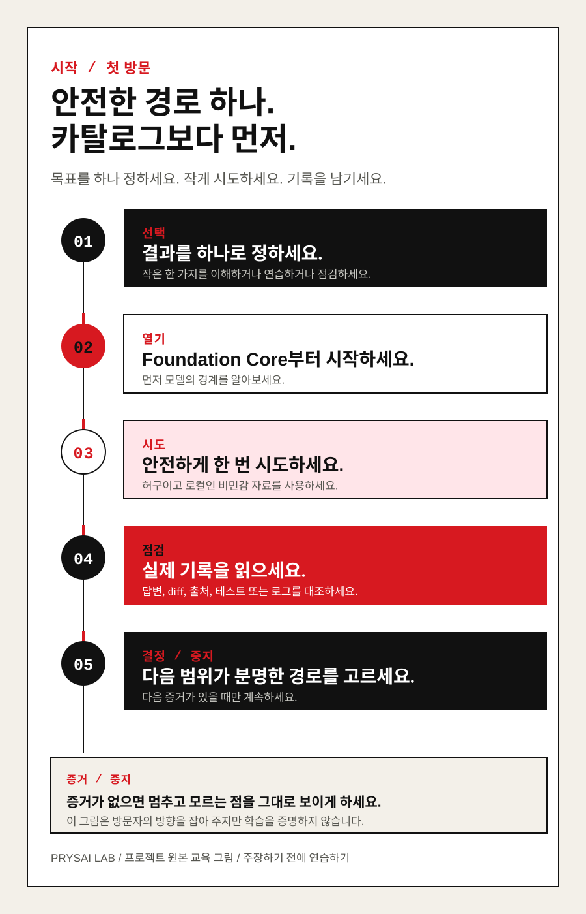

# Prysai LLM Playbook — 첫 번째 작업부터 신뢰할 수 있는 업무까지

라이선스: 강의 본문과 교육 자료는 CC BY 4.0, 스크립트와 도구는 Apache-2.0입니다(파일이 달리 명시하지 않는 한). [`LICENSE`](LICENSE), [`LICENSE-CODE`](LICENSE-CODE) 및 [라이선스 경계(locale-neutral)](docs/sources/licensing.md)를 참조하세요.
> LLM 실전 플레이북: 첫 번째 작업에서 신뢰할 수 있는 업무까지

<!-- language-switcher:start -->
**언어:** [English](README-EN.md) | [简体中文](README-ZH.md) | [Español](README-ES.md) | [日本語](README-JA.md) | [한국어](README-KO.md) | [Deutsch](README-DE.md) | [繁體中文](README-ZHTW.md) | [Français](README-FR.md)
<!-- language-switcher:end -->

## 교과서 순서로 시작하세요: 이해한 뒤에 연습합니다

처음 방문했다면 카드, Skill, 제품 중에서 고르지 마세요. 먼저 한국어 주 학습 경로를 따르세요.

1. [LLM 개념](book/guides/llm-fundamentals-KO.md)
2. [첫 범용 LLM 작업](book/routes/universal-core-foundations-KO.md)
3. [첫 번째 안전한 변경](book/routes/first-safe-change-KO.md)

### 먼저 경로를 그림으로 확인하세요



이 다섯 단계 그림은 목표 정하기 → 기초 코어 열기 → 안전하게 한 번 시도하기 → 기록 확인하기 → 계속하거나 멈추기의 흐름을 한눈에 보여 줍니다. 읽기 전에 방향을 잡는 데 쓰는 그림이며, 학습 효과를 증명하지는 않습니다.

영어 기초 코어가 현재의 정식 원문이며 한국어판은 재번역과 검토를 기다리고 있습니다.
그동안 이 입구는 한국어 파일만으로 읽을 수 있는 경로를 유지합니다.

스페인어, 업무 업데이트, 리서치 확인 카드는 이 경로 뒤에 하는 **선택 응용 연습**입니다. LLM을 이해하는 첫 수업이 아니며 효율, 유창성, 역량 향상을 약속하지 않습니다.

## 이 경로를 마치고 남기는 것

이 프로젝트의 가치는 AI 용어 목록을 늘리는 데 있지 않습니다. 나중에
다른 사람이 확인할 수 있고 다음 작업에도 가져갈 수 있는 결과물을 남기는
데 있습니다. 5개 단위 기초 경로는 학습자가 다음 세 가지를 직접 작성하도록
설계되었습니다.

- **범위가 정해진 작업 카드:** 목표, 제공한 맥락, 허용된 도움, 제한, 점검 방법,
  중단 조건을 적습니다.
- **점검 결과 기록:** 모델이 제안하거나 바꾼 내용, 직접 확인한 것, 남겨 둔 증거,
  아직 모르는 것을 기록합니다.
- **전이 시도:** 같은 방법을 새 작업에 적용하고 계속할지, 고칠지, 멈출지 분명히
  결정합니다.

이는 설계 목표이지 측정된 학습 결과가 아닙니다. 프로젝트는 여전히
`candidate`이며 학습 완료, 전이, 장기 유지의 증거는 `not_run`입니다.

## 설치보다 안전한 텍스트 과제부터 시작하세요

오늘은 일반 텍스트 채팅만 써 보고 싶다면
[범용 첫 과제 경로](book/routes/universal-core-foundations-KO.md)를 먼저 여세요.
가상의 안내문만 사용해 결과, 자료, 응답 형식, 확인, 중단 지점이 있는 요청 하나를
만들고 답변을 직접 점검합니다. 특별한 계정, 코드, 파일, 네트워크, 개인 자료나 실제
작업은 필요하지 않습니다. 이것은 `in-progress` 번역이며, 독립 언어 검토나 학습
성과의 증거가 아니고 LLM 제품들이 같은 방식으로 동작한다는 주장도 아닙니다.

이 문서는 `Prysai LLM Playbook` 프로젝트의 한국어 핵심 입구입니다. 프로젝트의 기본 공개 언어는 영어(`EN`)이며, 한국어(`KO`)에는 22개 장과 18개 Lab의 후보 파일 및 같은 언어 경로가 있습니다. 이것은 한국어 전체 보조 자료, 번역 품질 또는 브라우저 동작이 검증되었다는 뜻은 아닙니다.

## 한국어 이관 상태

- 파일 언어: 한국어(`KO`)
- 파일명 규칙: 모든 번역 파일은 확장자 앞에 대문자 `-KO`를 붙입니다.
- 기본 언어: 영어(`EN`)
- 목표 언어: 영어(`EN`), 간체 중국어(`ZH`), 스페인어(`ES`), 일본어(`JA`), 한국어(`KO`), 독일어(`DE`), 번체 중국어(`ZHTW`), 프랑스어(`FR`)
- 현재 이관 범위: 프로젝트와 책의 한국어 입구, 서문, 목차, 두 가지 초보 경로, 22개 장, 18개 Lab 및 시작 카드
- 번역 상태: `in-progress` — 구조와 링크를 확인했지만, 한국어 전문 감수와 독립적인 브라우저 검증은 아직 완료되지 않았습니다.
- 다른 문서: 한국어 `-KO` 파일이 아직 없으면, 이 읽기 경로에서는 원문으로 연결하지 않습니다.

같은 내용을 가리키는 번역 파일은 안정적인 파일명 줄기(stem)를 공유하고 locale suffix만 다르게 갖습니다. 한국어 페이지에서 한국어 대상 파일이 존재하는 경우에는 반드시 그 `-KO` 파일을 우선합니다. 이 규칙의 세부 거버넌스 기록은 아직 한국어로 제공되지 않으므로, 이 입구에서는 원문 페이지로 연결하지 않습니다.

## 이 프로젝트가 해결하려는 문제

많은 사람은 AI가 보기 좋은 결과물을 만들게 할 수 있지만, 실제 작업을 안정적으로 끝내게 하지는 못합니다. 문제는 대개 “프롬프트 한 문장을 쓸 줄 모른다”는 데 있지 않습니다. 더 큰 문제는 처음부터 끝까지 이어지는 작업 시스템이 없다는 것입니다.

- GPT, Codex, 모델, 컨텍스트, 도구, Skill이 각각 무엇인지 모릅니다.
- 언제 질문해야 하는지, 언제 파일을 제공해야 하는지, 언제 Codex에게 먼저 검사하게 해야 하는지 모릅니다.
- 모호한 목표를 실행 가능한 작업으로 분해하지 못합니다.
- 권한을 제한하고 결과를 검증하며 실패를 처리하는 방법을 모릅니다.
- 많은 Skill을 설치했지만 어떤 이유로 유용한지, 언제 조합해야 하는지, 언제 사용하지 말아야 하는지 모릅니다.
- 개인 실험에서는 성공해도 팀이 재사용하고 감사하고 계속 업데이트할 수 있는 절차로 만들지 못합니다.

이 학습 경로는 다음의 하나의 흐름으로 문제를 다룹니다.

```text
GPT 이해 → Codex 이해 → 안전한 준비 → 작업 표현 → 컨텍스트 관리
       → 도구 사용 → Skill 선택과 조합 → Agent 논리 이해
       → 계획/실행/검증/인계 → 전문 영역 실습 → 조직 차원의 협업
```

이 경로에는 두 축이 함께 진행됩니다.

- **이해 축:** GPT와 모델이 어떻게 작동하는지, 컨텍스트·도구·Skill·Agent·권한·검증이 결과를 어떻게 바꾸는지 이해합니다.
- **역량 축:** 작은 실험에서 시작해 작업 표현, 워크플로 설계, Skill 선택, 결과 검토, 팀 거버넌스를 단계적으로 연습합니다.

## 프로젝트의 형태

| 층위 | 산출물 | 역할 |
|---|---|---|
| 책 | `book/` | 연결된 장을 통해 개념, 방법, 판단력을 세웁니다. |
| 과정 | 각 장의 학습 목표와 경로 | 무엇을 먼저 배우고 왜 배우는지 보여 줍니다. |
| 실험실 | `book/labs/` | 실제 작업을 사용해 연습하고 검사 가능한 증거를 남깁니다. |
| 역량 패키지 | `skills/` | 숙련된 방법을 Codex가 실행할 수 있는 작업 지침으로 바꿉니다. |
| 평가 | `docs/quality/` | 콘텐츠, Skill, 학습 결과가 실제로 유효한지 판단합니다. |
| 조직 규범 | `docs/governance/` | 권한, 출처, 버전, 업데이트와 기여를 관리합니다. |

## 무엇을 학습 완료로 볼 것인가

학습자는 그럴듯하게 완성된 출력물 하나만 제출해서는 안 됩니다. 각 핵심 역량에는 설명 증거, 작업 증거, 판단 증거, 검토 증거가 필요합니다. 각 Skill에도 트리거, 경계, 실패 양상, 출처와 최신 컨텍스트를 사용하기 전의 점검이 필요합니다. 문서 수나 설치한 Skill 수는 숙련의 기준이 아닙니다.

## 현재 상태

영어 정식 소스에는 `candidate` 22장, `draft` 18개 Lab, `candidate` 상태의 Skill 26개(자체 방법 25개와 검토된 외부 Skill 1개), `candidate` 평가 fixture 40개가 있습니다. 구조 검사가 통과해도 학습, 전이, 반복 평가, 독립 검토 결과를 대신하지는 않습니다.

한국어 22개 장과 18개 Lab에는 후보 파일과 같은 언어 경로가 있으며 모두 `in-progress`입니다. 이 구조적 범위는 완전한 한국어 과정, 독립적인 언어 검토, 문화적 적합성 또는 학습 성과를 뜻하지 않습니다. 외부 자료는 출처, 라이선스, 내용 검토 없이 주 학습 경로에 직접 넣지 않습니다.

이 한국어 파일들은 위 상태를 바꾸지 않습니다. 40개 과정 단위의 경로는 갖췄지만, 보조 자료의 번역 범위, 번역 검토, 런타임 또는 브라우저 검증의 완료를 의미하지 않습니다.

## 한국어로 읽을 수 있는 입구

- [한국어 책 입구](book/README-KO.md)
- [한국어 서문](book/preface-KO.md)
- [한국어 책 목차](book/table-of-contents-KO.md)
- [첫 범용 LLM 작업](book/routes/universal-core-foundations-KO.md)
- [초보자 연습 카드](book/communication-clinic-KO.md): 언어, 업무 업데이트, 판단, 출처 확인, 공유 전 경계를 위한 바로 복사할 수 있는 일곱 가지 짧은 메시지입니다. `draft / not_run` 경로이며 유창함, 효율 또는 학습 성과를 약속하지 않습니다.
- [한국어 Lab 목차](book/labs/README-KO.md): 저위험 실습 열여덟 개를 각각 한국어 `-KO` 파일과 경로로 열 수 있습니다.

용어집, 거버넌스, 출처 대장, 평가, 연구, Skill 설명은 아직 한국어 파일로
제공되지 않습니다. 이 읽기 경로를 한 언어로 유지하기 위해 여기서는 원문 페이지로
연결하지 않습니다. 번역과 검토가 끝난 자료만 이 입구에 추가합니다.

## 중요한 경계

- 프로젝트 유지자가 작성한 내용과 외부 출처는 분리해 기록합니다. 조직 소속과 거버넌스 정보는 출처 대장에서 관리합니다.
- 모델 이름, 가격, 진입점, 사용량 한도와 구체적 기능은 변하기 쉬운 사실입니다. 출처와 재검토 날짜가 있어야 합니다.
- “GPT-5.6 Luna의 비용 대비 성능이 가장 높다”는 현재 반복 가능한 평가가 필요한 제품 가설이지, 영구적인 결론이 아닙니다.
- 명확한 라이선스가 없는 자료는 배포판에 직접 복사하지 않습니다.
- Codex 사용을 배웠다는 기준은 몇 개의 Skill을 설치했는지가 아니라, 분명한 경계 안에서 검증된 결과를 안정적으로 만들어 내는지입니다.
- 이 프로젝트는 독립적으로 유지되는 학습·실습 프로젝트이며, OpenAI의 공식 문서나 공식 제품 페이지가 아닙니다.
- 파일 존재, 링크 검사 통과, 번역 작성만으로 내용 정확성, 번역 품질, 브라우저 동작 또는 모델 실행이 검증되었다고 말하지 않습니다.

## 이름에 관하여

현재 외부 이름은 `Prysai LLM Playbook — From First Task to Reliable Work`이며, 중국어 보조 이름은 “Prysai 大模型实战手册：从第一个任务到可靠交付”입니다. GitHub 저장소 경로는 현재 slug를 유지하고 있습니다. 저장소 메타데이터와 이전 링크는 별도로 처리합니다. 조직 소속, 유지 책임과 배포 게이트는 거버넌스·출처 문서에 기록하며 제품 제목에 넣지 않습니다.
