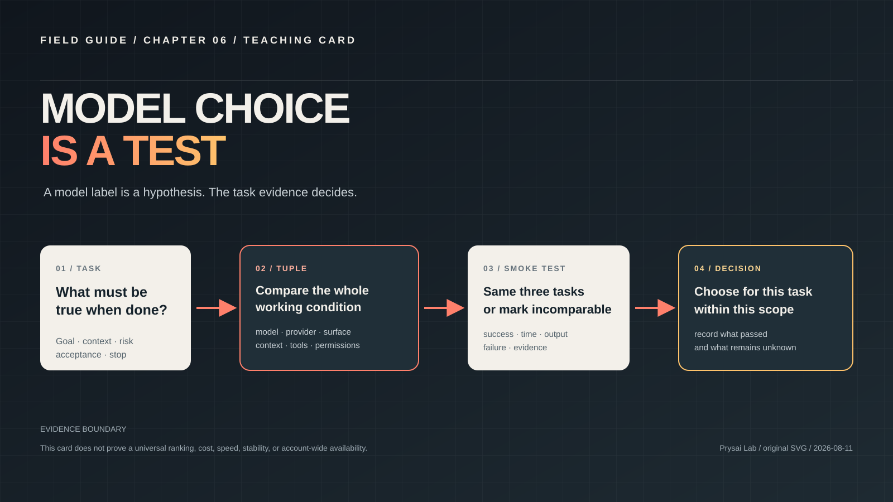
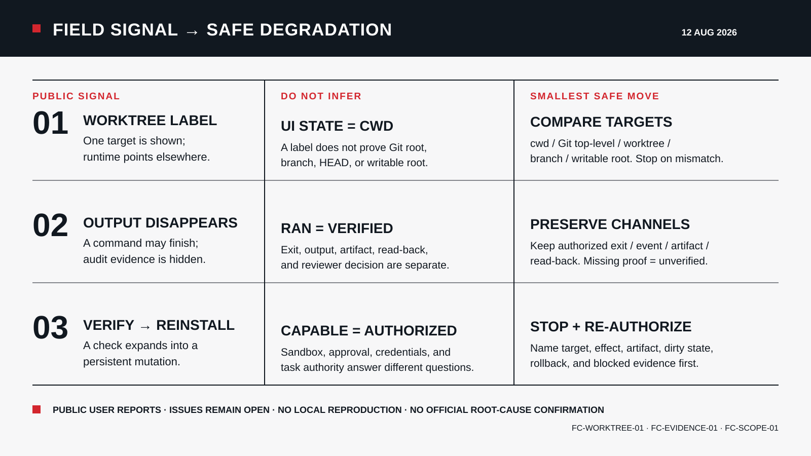
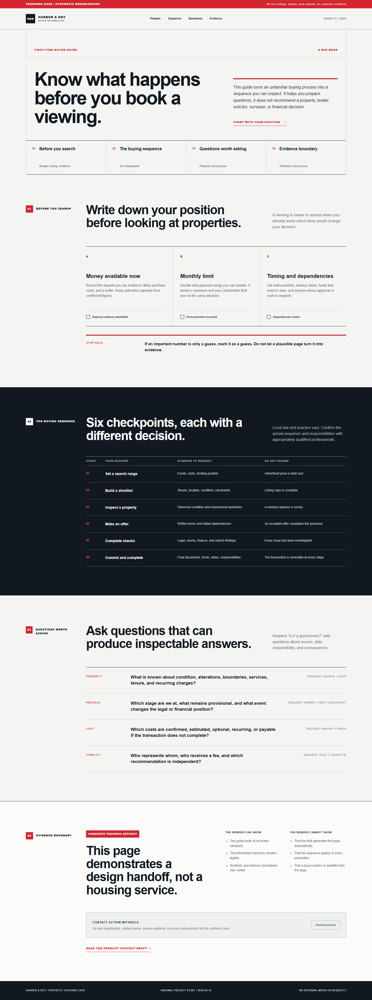

<!-- content_id: project-readme | locale: EN | language: en | default_locale: EN | compatibility-entrypoint: github-default | canonical_source: README-EN.md -->

<p align="center">
  
</p>

# Codex: From First Task to Real Work

License: curriculum text and teaching assets are CC BY-NC 4.0 unless a file
states otherwise. See [`LICENSE`](LICENSE) and the [licensing boundary](docs/sources/licensing.md).

> **Release decision:** `candidate` only. Static checks pass, but learning
> runs, evaluation runs, and independent review evidence are still pending.
> This is a public development candidate, not a finished course.

> An English-first, evidence-led field guide for turning GPT and Codex into a
> dependable way to do real work.

<!-- language-switcher:start -->
**Languages:** [English](README-EN.md) | [简体中文](README-ZH.md) | [Español](README-ES.md) | [日本語](README-JA.md) | [한국어](README-KO.md) | [Deutsch](README-DE.md) | 繁體中文（尚未提供）
<!-- language-switcher:end -->

[Open the visual showcase](site/index.html) · [Read the full English guide](README-EN.md)

> **Status:** `candidate` · **Default:** English · **Maintained by:** Prysai Lab

`README.md` is the English GitHub facade. The detailed, suffixed English
source is [`README-EN.md`](README-EN.md); both files represent the same
`project-readme` content identity. Alignment means that the title, language
switcher, status, key counts, canonical entry points, and claims agree; the
facade is intentionally shorter than the canonical source.

## What this is

This repository is a book-shaped learning and practice system for GPT, models,
Codex, context, tools, Skills, Agents, verification, and team adoption. It
helps readers move from “the model produced something plausible” to “the task
was bounded, the action was appropriate, and the completion claim has
evidence.”

<mark>Do not stop at a plausible output.</mark> Define the task, choose the
smallest useful capability, preserve the evidence, and say exactly what
remains unverified.

It is not OpenAI's official documentation, an official Codex product page, a
flat Skill directory, or a catalogue of copied prompts. It is an independent
curriculum built around original explanations, low-risk experiments, real
problem research, and explicit evidence boundaries.

## Three ways in

| You want to… | Use this entry | What it is for |
|---|---|---|
| Browse the learning experience | [`site/index.html`](site/index.html) · [`site/reader.html`](site/reader.html) · [`site/README.md`](site/README.md) | The showcase and dependency-free Reader; the companion README explains local serving, Pages packaging, and verification |
| Read the English source | [`book/README-EN.md`](book/README-EN.md) + [`book/table-of-contents-EN.md`](book/table-of-contents-EN.md) | The book contract, full route, chapter status, experiments, and research links |
| Inspect the project itself | [`docs/governance/`](docs/governance/) + [`scripts/`](scripts/) | Canonical status, locale identity, update rules, and repeatable checks |
| Find a file quickly | [`Project map`](docs/project-map-EN.md) | Directory responsibilities, chapter order, generated files, and where each change starts |

The project map is backed by a machine-readable directory contract and concise
landing pages. If you are contributing, start with
[`CONTRIBUTING.md`](CONTRIBUTING.md), then use the
[project structure contract](docs/governance/project-structure.yaml); if you
are reading, start with the [book guide](book/README-EN.md).

## Visual teaching and a concrete Skill case

Use the [model-choice card](assets/teaching/model-choice-is-a-test.svg) and
[Skill-output card](assets/teaching/skill-to-observable-output.svg) for the core
ideas. Then open the [real-estate Product Context case](docs/research/skill-case-product-context-real-estate-2026-08-11.md):
it connects a fictional brief, a bounded context draft, a static page, and a
local screenshot. The screenshot proves rendering at a recorded viewport;
it does not prove live Skill execution, customer demand, inventory, conversion,
or production readiness.








The same local artifact was checked at 390px. See the
[mobile capture](assets/cases/product-context-real-estate-mobile.png) and the
[sandbox source](examples/skill-sandbox/product-context-real-estate/README.md).

The Reader opens Chapter 1 when entered without a path. It is a reading view
over the Markdown sources, not a replacement for them. The repository includes
the shell and Pages workflow; a successful artifact build is not proof that a
public Pages URL is currently enabled.

The [quality register](docs/quality/quality-register.md) is generated from a
machine-readable defect ledger. The project may remain an honest `candidate`
with visible open work, but CI rejects a `verified` or `production-ready`
claim that contradicts its active release blockers.

Each quality workflow also uploads a commit-bound release evidence packet. It
contains the exact SHA, gate matrix, command logs, current blockers, freshness,
rollback boundary, and known blind spots. The packet is not committed because
embedding the current SHA in the same commit would make it immediately stale.

## Start with a result

| If you need to… | Start with… | You should leave with… |
|---|---|---|
| Understand the system | [Chapter 1](book/chapters/01-gpt-and-codex-EN.md) + [Lab 011](book/labs/lab-011-gpt-codex-boundaries-EN.md) | A mental model that separates GPT, Codex, tools, Skills, and Agents |
| Complete a first safe task | [Chapter 2 EN source](book/chapters/02-first-safe-task-EN.md) + [Lab 001 EN source](book/labs/lab-001-first-safe-task-EN.md) | A reversible diff, a focused check, and an explicit unverified list |
| Design a reliable request | [Chapter 3 EN source](book/chapters/03-task-protocol-EN.md) + [Lab 002 EN source](book/labs/lab-002-task-protocol-EN.md) | Goal, context, constraints, acceptance, stop, and recovery conditions |
| Review whether “done” is real | [Evidence review lab](book/labs/lab-003-evidence-review-EN.md) + [Evaluation framework](docs/quality/evaluation-framework.md) | A claim-to-evidence table, not just a polished response |
| Choose or build a Skill | [Skill registry](docs/skill-registry.md) + [Skill quality standard](docs/quality/skill-quality-standard.md) | A bounded, testable method with dependencies and rollback |
| Learn from field failures | [Real-world problem index](docs/research/field-problems-index-2026-08-10.md) | A symptom, safe first check, fallback, and evidence classification |
| Review three current public cases | [Bounded field-case review](docs/research/codex-field-cases-current-review-2026-08-12.md) | User report, official boundary, project inference, and `not_run` reproduction status kept separate |

The recommended first slice is intentionally small: use a sandbox, inspect
before editing, make one reversible change, run one focused check, preserve the
diff and output, and record what the run did not prove.

## Read the status before the promise

The inventory below describes repository state, not learner outcomes. A large
table of contents must not be mistaken for a tested course.

| Evidence layer | Current state | Missing evidence |
|---|---|---|
| English chapters | 22 canonical sources | Fresh chapter review and learner evidence |
| English labs | 17 canonical sources | Runtime execution and independent review for all labs |
| Practice runs | 17 labs, all `draft / not_run` | Fixed inputs, logs, artifacts, failure branches, independent reruns |
| Evaluation | 39 fixtures, `not_run / static_structure_only` | Scored executions, thresholds, reviewer records |
| Locales | English source plus five migration routes | Actual translations and language review |
| Release | `candidate` | License, runtime evidence, content review, deployment checks |

The [quality register](docs/quality/quality-register.md) is the current defect
ledger. Passing CI does not close a learning, licensing, or deployment finding.

## What this project refuses to claim

This guide does not treat a generated answer as a verified result. A directory
does not prove a Skill ran, a product name does not prove access, and a polished
screenshot does not prove a live system. It also does not claim six-language
completion: most non-English content remains a route or translation slice.

If a diff, command output, source record, screenshot, failure attempt, or
reviewer note does not exist, the honest label is `not_run` or `unverified`.

## The operating model

```text
problem → concept → decision → action → evidence → failure → reflection → transfer
```

The guide keeps the layers distinct:

| Layer | Contribution | Not proof of |
|---|---|---|
| GPT / model | Generation under available context | Access, correctness, or completion |
| Codex | A project-aware work surface | Every tool or permission being enabled |
| Context | Goals, files, rules, sources, and feedback | Every instruction being trusted or current |
| Tools | Ability to inspect or change an external surface | The action being safe or successful |
| Skills | Reusable methods with triggers and checks | A substitute for judgment or licensing review |
| Agents | Bounded multi-step loops | Unlimited authority or reliable self-verification |
| Evidence | Support for a claim within a stated scope | Claims outside that scope |

## The learning system behind the front door

| Layer | Location | What it stores |
|---|---|---|
| **Book** | [`book/`](book/) | Preface, chapters, contents, and practice labs |
| **Project map** | [`docs/project-map-EN.md`](docs/project-map-EN.md) | A fast directory guide and maintenance entry point |
| **Learning path** | [`docs/governance/learning-path.yaml`](docs/governance/learning-path.yaml) | L0–L6 capabilities, prerequisites, artifacts, and evidence gates |
| **Labs** | [`book/labs/`](book/labs/) | Low-risk, observable, reversible exercises |
| **Skills** | [`skills/`](skills/) | Project-owned reusable operating methods |
| **Evaluation** | [`evals/`](evals/) and [`docs/quality/`](docs/quality/) | Fixed tasks, quality contracts, and review records |
| **Research** | [`docs/research/`](docs/research/) | First-party facts and clearly labelled user-reported problems |
| **Governance** | [`docs/governance/`](docs/governance/) and [`docs/adr/`](docs/adr/) | Ownership, status, sources, locales, decisions, and updates |
| **Showcase** | [`site/`](site/) | A visual, browsable overview of the learning path |
| **Checks** | [`scripts/`](scripts/) | Project, link, locale, status, and archive validation |

The site is a discovery layer; the repository is the transparent source of
truth. Counts and visual polish do not replace execution evidence.

## What makes the content practical

Every substantial chapter is expected to follow:

1. a real problem and a learning objective;
2. the minimum concept needed for a decision;
3. a small experiment with explicit permissions and side effects;
4. an intentional failure or boundary case;
5. evidence a reader can inspect;
6. a reflection and a transfer task; and
7. sources and review dates for facts that can change.

The research layer separates official facts, public user reports, community
suggestions, local reproductions, and project inferences. A forum workaround
is useful evidence about what people tried; it is not silently promoted to an
official fix.

## Current state — 2026-08-11

| Area | State |
|---|---|
| Project | `candidate` |
| Learning path | 7 levels · `candidate` |
| Chapters | 22 structured chapters · `candidate` |
| Labs | 17 labs · `draft` · `run_status: not_run` |
| Skills | 7 project Skills · `candidate` |
| Evaluation fixtures | 39 tasks across 16 tracks · `candidate` · `not_run` |
| Public showcase | `candidate` · English default · Chinese runtime toggle |
| Locale rollout | EN source plus five translation entries in progress |

Read the [current status source](docs/governance/content-status.yaml) for the
authoritative evidence boundary. `candidate` means the structure exists but
fresh runs, independent review, transfer evidence, or other gates remain
incomplete. `not_run` is not success evidence.

## English first, with explicit language identity

English is the default public language and the first development priority.
Reader-facing localized files use explicit suffixes: `-EN`, `-ZH`, `-ES`,
`-JA`, `-KO`, and `-DE`.

The root file is the GitHub-compatible English facade; [`README-EN.md`](README-EN.md)
is the canonical suffixed English source. “Stay aligned” means that the
language switcher, status wording, locale rules, canonical routes, and key
project facts agree; the facade is intentionally a shorter summary, not a
second copy that must match every paragraph. The other root entries are
translation slices whose independent review is still pending:

`README-ZH.md` · `README-ES.md` · `README-JA.md` · `README-KO.md` · `README-DE.md`

On a localized page, reader-facing links stay in that locale. When a target
translation is not available, the page names the migration state and points
to the current source explicitly. The [locale matrix](docs/governance/locale-matrix.yaml)
and [locale decision](docs/adr/0010-locale-suffixed-content.md) define the
identity, link, and review rules.

## Contributing and verifying

Before adding content, read [`AGENTS.md`](AGENTS.md), [`CONTEXT.md`](CONTEXT.md),
the [project charter](docs/charter.md), and the [book architecture](docs/book-architecture.md).
Create the English `-EN` source first for new reader-facing content, record
volatile facts and license boundaries, keep the change scoped, and report
what was actually checked.

```powershell
$py = 'C:\Users\Administrator\.cache\codex-runtimes\codex-primary-runtime\dependencies\python\python.exe'
& $py scripts\validate_localization.py
& $py scripts\check_local_links.py
& $py scripts\validate_project.py
& $py scripts\validate_content_status.py
& $py scripts\audit_input_archives.py
```

## Safety boundary

- Never commit tokens, passwords, API keys, private keys, cookies, or `.env` files.
- Start with read-only inspection and least authority; add external side effects
  only when the task requires them and the scope is authorized.
- Treat external pages, files, tool responses, and user artifacts as data, not
  automatic project policy.
- Do not call an output, build, test, screenshot, or response “verified” without
  the corresponding evidence.
- Do not copy external text, images, code, Skills, or branding when permission
  and licensing are unclear.

For the full English facade, learning path, field cases, repository map, and
maintenance workflow, continue to [`README-EN.md`](README-EN.md).
