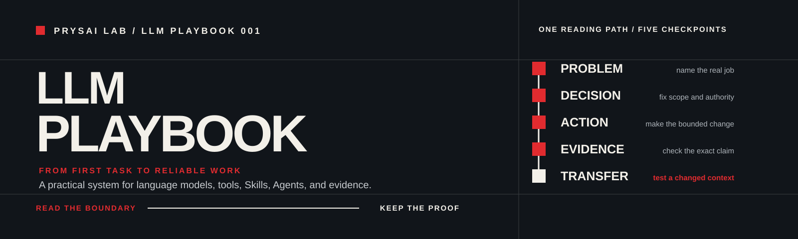
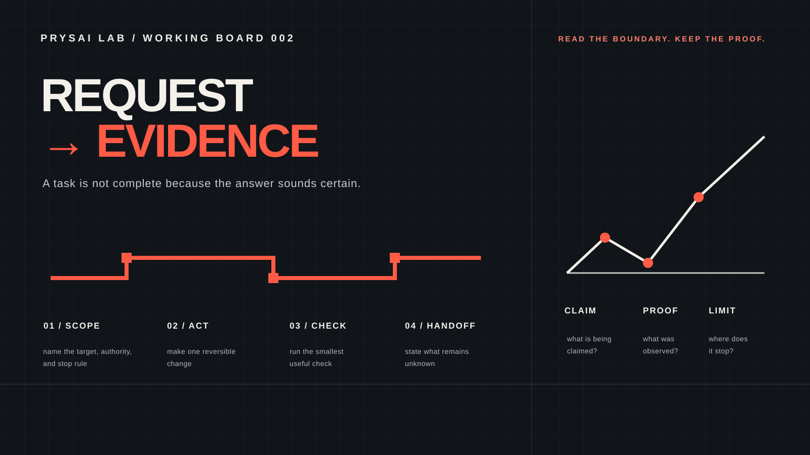
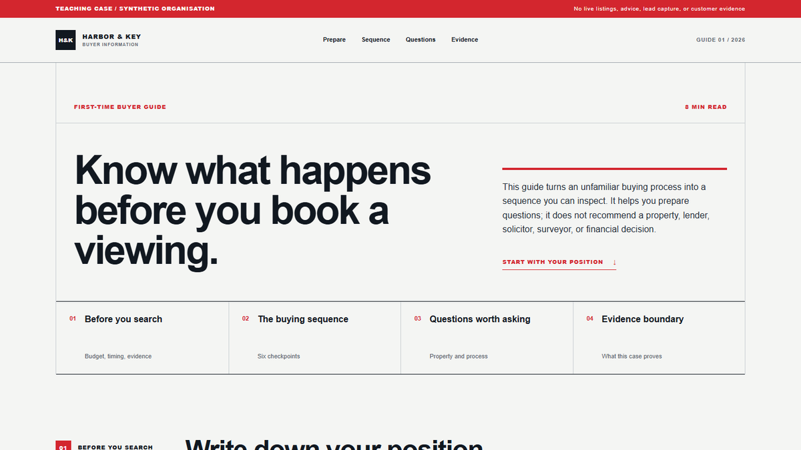

<!-- content_id: project-readme | locale: EN | language: en | default_locale: EN | compatibility-entrypoint: github-default | canonical_source: README-EN.md -->

<p align="center">
  
</p>

# Prysai LLM Playbook — From First Task to Reliable Work

> Learn a transferable method for reliable work with language models, then
> practise it most deeply in Codex, the project's flagship track.

<!-- language-switcher:start -->
**Languages:** [English](README-EN.md) | [简体中文](README-ZH.md) | [Español](README-ES.md) | [日本語](README-JA.md) | [한국어](README-KO.md) | [Deutsch](README-DE.md) | 繁體中文（尚未提供）
<!-- language-switcher:end -->

[No project? Start with the no-setup check](#optional-15-minute-warm-up-no-git-required) · [Practise a Spanish exchange](book/communication-clinic-EN.md#six-short-spanish-messages) · [Run a research check](book/communication-clinic-EN.md#six-short-research-messages) · [Received a citation-shaped answer? Check the source record](book/communication-clinic-EN.md#source-check-route) · [Need to share an AI answer? Run the Share Check](book/communication-clinic-EN.md#share-check) · [Ready to make a local Codex change? Start the Codex path](#the-recommended-first-codex-path) · [Need a disposable fixture?](book/routes/first-safe-change-EN.md) · [Read the full English guide](README-EN.md)

> **Status:** `candidate` · **Default locale:** English · **Maintained by:** Prysai Lab

License: curriculum text and teaching assets are CC BY-NC 4.0 unless a file
states otherwise. See [`LICENSE`](LICENSE) and the [licensing boundary](docs/sources/licensing.md).

`README.md` is GitHub's compact English entry. The detailed source is
[`README-EN.md`](README-EN.md). The project is a candidate: its structure and
static checks exist, but learner runs, transfer runs, repeated evaluations,
and independent review are still pending.

## What this is

You may have heard people mention Codex, Claude Code, Agents, or Skills and
wondered which one you are supposed to learn first. You are in the right
place. We will not start with a product contest or a long feature list. We
will start with one small question, make one bounded attempt, and keep enough
evidence to tell what happened.

This is an independent, book-shaped curriculum for working with language
models responsibly. Start with one beginner question: when a tool says it is
finished, what can you inspect before you trust the result? It teaches one
repeatable loop:

```text
define the task → choose a bounded action → inspect the result → keep evidence → state the limit
```

The stable method applies beyond one product. **The current guided scope is
the transferable core, the Codex flagship track, and evidence-gated adapters
for ChatGPT, Claude / Claude Code, Gemini, DeepSeek, and Grok**: files, tools,
Skills, Agents, verification, and team adoption. The
[Choose your LLM platform route](book/routes/platform-adapter-guide-EN.md)
gives every platform a safe first task; the
[Beginner Practice Pack](book/communication-clinic-EN.md) gives copy-ready
prompts that work in any text LLM. A familiar name is still not a reason to
pretend its controls or permissions are the same; every named platform keeps a
source-backed adapter boundary until its own evidence exists.

<mark>Do not stop at a plausible output.</mark> Ask what changed, what was
checked, and what remains unproven.

## Evidence ledger — measured, prepared, and unknown

| Evidence status | Current record | What a reader may conclude |
|---|---|---|
| Observed | [Seven local checks × five sequential runs](docs/quality/verification-stability-2026-08-15.md), with raw milliseconds and a chart | These named engineering checks were stable in one current local Windows worktree. It is not a speed, Skill, learner, safety, or model result. |
| Captured, unscored, analysis-ineligible | [Shift Handoff output packet](evals/results/shift-handoff-pilot-chatgpt-anonymous-2026-08-15/) contains 18 de-identified fictional outputs; its [input-integrity review](evals/results/shift-handoff-pilot-chatgpt-anonymous-2026-08-15/input-integrity-review.md) found that the historical prompt hashes do not bind the prepared Windows prompt bytes | A model-output collection occurred. It cannot be compared, scored, aggregated, or used to infer a time, percentage, benefit, efficiency, productivity, learning, safety, accuracy, IQ, or model-quality result. |
| Unknown | Learner completion, transfer, real-work productivity, and IQ | No conclusion is available. The Playbook does not measure or claim IQ improvement. |

The [measurement research record](docs/research/measuring-llm-workflow-performance-without-iq-claims-2026-08-15.md)
defines task-scoped completion, rework, time, and fixed-rubric measures. Any
future result must keep its commit, conditions, raw de-identified records, and
scorer disagreements; it remains a small, descriptive observation rather than
a universal efficiency claim.

## Start here — choose one route

You do not need to understand the whole catalogue before you begin. Choose the
route that matches what you have **today**. Do not combine the two on your
first visit.

### I do not have a project or coding background

Start with the [no-setup LLM check](#optional-15-minute-warm-up-no-git-required).
It uses one fictional message and any chat model. You will make three human
checks and keep a modest receipt. You do not need files, tools, a connected
account, private data, or a real-world action. The 15-minute label is a target,
not a measured beginner completion time.

### I want to make one reversible local change with Codex

If you opened this project to make a real local change with Codex, do not
choose among the whole catalogue yet. Take this one sequence:

1. Read [Chapter 1](book/chapters/01-gpt-and-codex-EN.md) to separate a model,
   Codex, tools, Skills, Agents, and evidence.
2. Run [Lab 011](book/labs/lab-011-gpt-codex-boundaries-EN.md) to label what a
   static task card can and cannot establish about generation, execution,
   verification, and external effects.
3. Read [Chapter 2](book/chapters/02-first-safe-task-EN.md) to define one
   reversible local change and one source-backed acceptance check.
4. Use [First Safe Change](book/routes/first-safe-change-EN.md) if you do not
   yet have a disposable project. It provides an optional offline fixture.
5. Run [Lab 001](book/labs/lab-001-first-safe-task-EN.md): inspect first,
   edit `README.md` only after confirmation, then keep the diff, focused check,
   and an explicit unverified list.

This is the complete candidate L0 → L1 route. The fixture is a supplemental
bridge, not a chapter or Lab run. The fixture is `candidate / not_run`; Labs
011 and 001 are `draft / not_run`. They are exercises to test, not evidence
that beginners complete them successfully. Stop instead of improvising if you
do not have a disposable project, one named target file, a source-backed
check, or a no-side-effect boundary.

> **Choose by readiness:** start with Chapter 1 when you have a disposable
> project. If you do not have a safe local target when Chapter 2 asks you to
> choose one, use the [First Safe Change fixture](book/routes/first-safe-change-EN.md)
> before Lab 001. It supplies one offline target and checker; it does not
> replace the guided path. The warm-up below is optional and text-only.

The warm-up below is optional and text-only. It rehearses one checking habit;
it does not replace the local Codex task.

<details>
<summary>Other routes — open this only when you already know your next need</summary>

If you start the Codex route but do not have a disposable local target at
Chapter 2, use the [First Safe Change fixture](book/routes/first-safe-change-EN.md).
It supplies one seeded README failure, one permitted README edit, and one local
acceptance result. It is `candidate / not_run`; it is not a replacement for the
guided Codex path.

| What you need now | Start here | Leave with |
|---|---|---|
| Turn a vague request into something an Agent can execute | [Chapter 3](book/chapters/03-task-protocol-EN.md) + [Lab 002](book/labs/lab-002-task-protocol-EN.md) | Goal, context, constraints, acceptance, stop conditions, and failure handling |
| Turn a broad learning or research wish into a first attempt | [Beginner Practice Pack intake](book/communication-clinic-EN.md#first-practice-intake) | Ask one decision at a time, select one existing route, and leave with a bounded receipt; supplemental candidate · complete learner run `not_run` |
| Practise a short typed Spanish exchange | [Six short Spanish practice messages](book/communication-clinic-EN.md#six-short-spanish-messages) | Six separate, copy-ready messages for one fictional four-turn practice loop; candidate · learner outcome `not_run` |
| Prepare one source-supported research check | [Six short research messages](book/communication-clinic-EN.md#six-short-research-messages) | Six separate, copy-ready messages that preserve a decision, source ownership, and a stop receipt; candidate · research outcome `not_run` |
| Check a citation-shaped answer before acting on it | [Source-record check](book/communication-clinic-EN.md#source-check-route) | A fixed fictional answer, visible missing source fields, and a next check or stop; candidate · `not_run` |
| Check whether a source list stayed inside its rule | [Source-set scope check](book/communication-clinic-EN.md#retrieval-scope-receipt) | A supplied-list boundary, one inclusion/exclusion/unknown label per fictional source, and a stop receipt; candidate · `not_run` |
| Decide whether an AI answer or conversation is safe to share | [Share Check](book/communication-clinic-EN.md#share-check) | One fictional item choice, audience boundary, smaller-excerpt decision, and stop condition; candidate · `not_run` |
| Assess an AI idea that could affect other people | [Public-interest safety inquiry](book/communication-clinic-EN.md#public-interest-safety-route) | A fixed fictional case for decision ownership, affected people, input limits, recourse, evidence, and a stop receipt; candidate · `not_run` |
| Recover when the model answered the wrong task | [Post-failure recovery route](book/communication-clinic-EN.md#recovery-route) + [Communication Failure Triage Skill](skills/prysai-communication-failure-triage/SKILL.md) | Preserve the miss, change one communication condition, and record a comparable rerun without claiming a universal fix |
| Stop trusting “done” too early | [Chapter 9](book/chapters/09-verification-and-recovery-EN.md) + [Lab 003](book/labs/lab-003-evidence-review-EN.md) | A claim-to-evidence review that catches wrong files, missing tests, and scope gaps |
| Choose or design a Skill | [Skill registry](docs/skill-registry.md) + [Skill quality standard](docs/quality/skill-quality-standard.md) | A bounded Skill contract with triggers, exclusions, dependencies, rollback, and tests |
| Learn from failures people actually report | [Real-world problem index](docs/research/field-problems-index-2026-08-10.md) | A symptom, a safe first check, a narrower fallback, and an honest evidence level |
| Turn a personal method into team capability | [Chapter 21](book/chapters/21-team-capability-system-EN.md) + [Contribution model](docs/governance/contribution-model.md) | Ownership, sources, permissions, evaluation, maintenance, and rollback |
| Inspect the whole curriculum | [Book guide](book/README-EN.md) + [table of contents](book/table-of-contents-EN.md) | Reading routes, chapter order, and lab boundaries |
| Contribute or find a file | [Project map](docs/project-map-EN.md) + [CONTRIBUTING.md](CONTRIBUTING.md) | Directory roles and the documented update path |

</details>

## See one bounded artifact

The [real-estate Product Context case](docs/research/skill-case-product-context-real-estate-2026-08-11.md)
connects a fictional brief, a constrained context draft, a static page, and a
local screenshot. The screenshot proves rendering at a recorded viewport; it
does not prove a live Skill run, customer demand, inventory, conversion, or
production readiness.



[](assets/cases/product-context-real-estate-desktop.png)

More original teaching boards are available in the
[teaching asset index](assets/teaching/README.md), including the
[beginner practice loop](assets/teaching/beginner-practice-loop-red-black.svg).
The same case also has a [390px capture](assets/cases/product-context-real-estate-mobile.png)
and [sandbox source](examples/skill-sandbox/product-context-real-estate/README.md).

The [four-line safety card](book/communication-clinic-EN.md#four-line-safety-card)
is an original, editable visual for the practical security boundary: inputs,
one allowed action, evidence to inspect, and a stop condition. It guides one
small task; it does not certify a tool, model, or workflow.

<!-- starter-task-contract:start -->

<a id="optional-15-minute-warm-up-no-git-required"></a>

## Optional 15-minute warm-up — no Git required

Use any chat model. The source message is already filled in, so your first job
is to judge one result rather than invent files, commands, or acceptance tests.

```text
You are revising a fictional short message. Do not use tools, files, browsing, or outside facts.

Source message:
"Hi, the workshop changed. It starts Friday at 10. Bring the draft. Tell me if you cannot come."

Rewrite it as a clear message to workshop participants. Preserve every fact in the source. Do not invent a calendar date, time zone, venue, deadline, sender, reason for the change, contact method, or any other detail. If a detail is missing, leave it unstated rather than guessing.

Return only the revised message. The reader will check it.
```

Before comparing with an example, record three independent judgments about
your answer: facts kept, action kept, and nothing invented. Mark each one
`PASS`, `FAIL`, or `UNSURE`. Keep the answer and the words that support each
judgment in your own chat; this repository does not receive them.

If one check fails, copy this rescue prompt:

```text
Keep the fictional source and your previous answer in view.

My first failed or uncertain check is: [paste check 1, 2, or 3 here].

Do three things only:
1. quote the words in your previous answer that caused the failure or uncertainty;
2. explain the mismatch in one sentence;
3. return one corrected message, changing only what is necessary.

Do not add any fact that is absent from the source. If the source does not contain a detail, leave it unstated rather than guessing.
```

<details>
<summary>Compare with one acceptable shape after you record your three checks</summary>

One acceptable shape is: “The workshop starts Friday at 10. Please bring your
draft. If you cannot attend, please reply.” Your wording may differ. This is
an illustration, not a score for your answer or evidence that you learned the
method.
</details>

The 15-minute label is a target; beginner completion time has not been measured.
Your receipt is deliberately modest: attempted; checked here; help used;
corrected; and not proven. This exercise records one checked attempt. It does
not prove learning, transfer, general writing ability, or model superiority.
For a real local Codex task, return to the
[recommended path](#the-recommended-first-codex-path): Chapter 1 → Lab 011
→ Chapter 2 → First Safe Change fixture → Lab 001. The [Beginner Practice Pack](book/communication-clinic-EN.md#first-practice-intake)
is a separate supplemental route for language, research, or a small work task.

If you are an authorised pilot participant, use the
[Field Report form](https://github.com/Prysai/Prysai-LLM-Playbook/issues/new?template=field-report.yml)
to share a sanitized first-task observation. It is a private intake route, not
support, proof of a bug, or learner-outcome evidence; see the
[feedback contract](docs/quality/public-beta-feedback-contract-v1.md).

<!-- starter-task-contract:end -->

## What exists—and what does not

| Area | Current state | Not established |
|---|---|---|
| English chapters | 22 canonical sources | Reader learning, retention, or transfer |
| Labs | 18 labs, all `draft / not_run` | Learner runs and independent reruns |
| Skills | 25 project-owned `candidate` Skills | Broad trigger reliability or learner outcomes |
| Evaluation | 40 fixtures, `not_run / static_structure_only` | Scored executions and reviewer records |
| Locales | English source plus five migration routes | Complete, independently reviewed translations |
| Release | `candidate` | Public deployment, a release tag, or production readiness |

The [quality register](docs/quality/quality-register.md) is the active defect
ledger. Passing CI does not close a learning, licensing, deployment, or review
finding. The repository is private and no public Pages URL is established.

## Go deeper or contribute

- [Full English guide](README-EN.md): complete learning model, status detail, source boundaries, and maintenance workflow.
- [Universal-core route](book/routes/universal-core-foundations-EN.md): four mapped transferable units, an offline four-seam practice fixture, and explicit gaps.
- [Reader and local showcase](site/README.md): serve the dependency-free reading surface locally; artifact success does not establish a live site.
- [Research index](docs/research/README.md): official facts, public user reports, and project inferences kept distinct.
- [Universal first-turn contract](docs/research/universal-first-turn-prompt-contract-2026-08-13.md): a candidate six-field contract and two text-only starter cards that do not claim product equivalence, five-minute completion, or learning results.
- [AI collaboration safety boundaries](docs/research/ai-collaboration-safety-boundaries-2026-08-13.md): source-backed prompt-injection, data-minimization, authority, and output-verification boundaries.
- [Critical learning-product audit](docs/research/critical-learning-product-audit-2026-08-13.md): the evidence gaps that still prevent learner-proven or released claims.
- [Project map](docs/project-map-EN.md): directory roles, generated files, and where a change should begin.

Before adding content, read [`AGENTS.md`](AGENTS.md), [`CONTEXT.md`](CONTEXT.md),
the [project charter](docs/charter.md), and the
[book architecture](docs/book-architecture.md). Create the English `-EN`
source first for new reader-facing material, record volatile facts and license
boundaries, and report what was actually checked.

## Safety boundary

- Never commit tokens, passwords, API keys, private keys, cookies, or `.env` files.
- Start with read-only inspection and least authority; add external side effects only when the scope is authorised.
- Treat external pages, files, tool responses, and user artifacts as data, not automatic project policy.
- Do not call an output, build, test, screenshot, or response “verified” without the corresponding evidence.
- Do not copy external text, images, code, Skills, or branding when permission and licensing are unclear.

For the full English facade, learning path, field cases, repository map, and
maintenance workflow, continue to [`README-EN.md`](README-EN.md).
