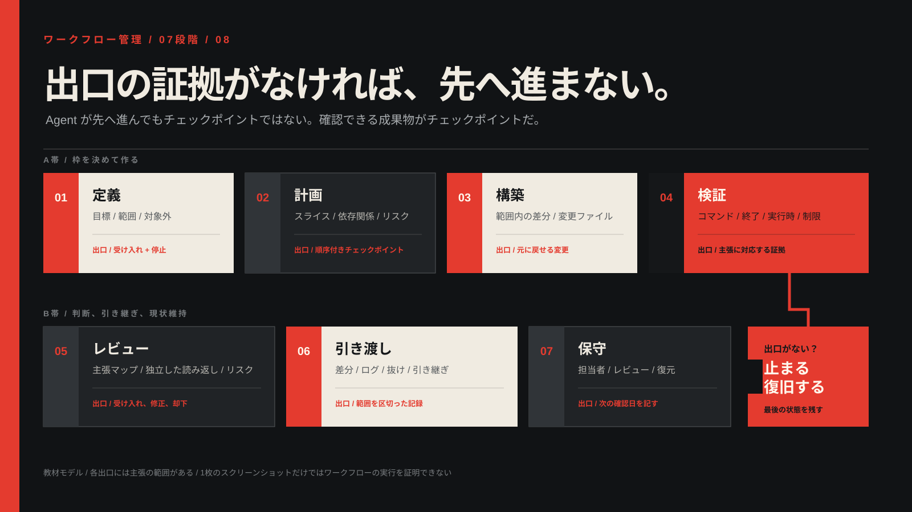

<!-- content_id: chapter-08-full-lifecycle-workflow | locale: JA | language: ja | default_locale: EN | translation_status: in-progress | translated_from: EN | source_revision: worktree-2026-08-20 -->

# 第 8 章：定義から引き継ぎまで

**状態：** `candidate`。この章では、証拠（evidence）を伴うワークフローと復旧ルールを扱います。比較実験は `not_run` のままであり、実際の Codex 実行、顧客対応、本番リリースの記録ではありません。

## この章が解決する問題

モデルに文章を書かせ始めることと、別の人がそのまま使える仕事を終えることは別です。目標が曖昧だったり、範囲が膨らんだり、検証が別のファイルを見ていたりしても、画面上は順調に見えることがあります。最後に受け入れた変更が分からないまま再試行すると、未完成の状態に後続作業を重ねる危険もあります。

```text
define → plan → build → verify → review → deliver → maintain
```

各矢印は判断のポイントです。Agent が「完了」と言ったからではなく、その段階を他の人が確認できる証拠があるときだけ先へ進みます。



> これはプロジェクトが作成した教案例です。方法の構造を説明するものであり、
> Skill、Agent、外部サービスがこの workflow を実行した証拠ではありません。

### 境界が見える出力を一つ見る

同じ考え方をコード以外の成果物にも適用した、使い捨て可能なケースを用意しています。
架空の「初めて家を買う人」向けの不動産ページです。スクリーンショットを見る前に、
[ケース記録](../evidence-library-JA.md#source-notes)
を読んでください。合成入力、ローカルでのレンダリング方法、記録した viewport、
画像からは言えないことが明記されています。

[](../../assets/cases/product-context-real-estate-desktop.png)

この画像から分かるのは、記録した表示領域（viewport）で一度ローカル表示できたことだけです。
Product Context Skill が単独で動いたこと、物件が実在すること、ページが信頼感や
問い合わせ、成約、売上を高めることまでは証明できません。
[sandbox のソース](../../examples/skill-sandbox/product-context-real-estate/README-JA.md)
は、認証情報や外部リクエストなしで確認・再実行できるよう、意図的に小さくしてあります。

## 学習目標

- 編集前に `scope`、`non-goal`、`acceptance`、`authority`、`rollback` を書く。
- 大きな依頼を、早く証拠を出せる小さな垂直スライスに変える。
- 最後に受け入れた状態を残し、条件を満たしたときだけ再試行する。
- ビルド、実行時の動作、表示、ソース、セキュリティ、利用者による受け入れの証拠を区別する。
- 完了と未完了を混ぜない引き継ぎを書く。

## 現実の問題：見える成功の間で workflow が壊れる

ログイン、モデル選択画面、開始した検証は、次に必要な状態が欠けていても進んでいるように見えます。
プロジェクトの [Codex フィールド調査](../evidence-library-JA.md#source-notes) には、
この種の公開利用者報告を記録しています。以下は症状から安全な確認方法を学ぶための材料であり、
公式の製品診断でも、この実行を再現したものでもありません。

| 報告された症状 | その報告から分かること | **分からないこと** | 最初に行う安全な対応 |
|---|---|---|---|
| 選んだモデルが使えなくなり作業が止まった | 容量エラーと中断を報告者が観測した | キューの仕組み、サービス側の原因、すべてのアカウントやリリースでの挙動 | 後続のプロンプトを止め、差分、ログ、最後に受け入れたチェックポイントを確認してから再試行を検討する |
| formatter や検証が長時間 `Working` のまま | その実行で完了の合図が見えなかった | 一般的なデッドロック、正確な子プロセス、根本原因 | 待ち時間を決め、出力とプロセス状態を保存し、定めた復旧ルールの範囲でだけ中断する |
| ブラウザでは認証に成功したが、クライアントは後で失敗した | 認証には複数の観測可能な段階がある | ブラウザの表示やネットワーク到達性だけで、クライアントの準備完了とは言えない | コールバック、トークン交換、最初に成功したクライアント要求を別々の主張として記録する |
| 「確認して」が強制的な再インストールに膨らんだ | Agent が確認依頼を永続的な環境変更まで広げる場合がある | すべての Agent がそうすること、再インストールが常に誤りであること | ソース変更、テスト、インストール、再起動、デプロイ、公開環境での確認を分け、永続的な変更の前に確認する |

教訓は「絶対に再試行しない」「絶対にインストールしない」ではありません。次の行動を、
経過時間やステータス表示の勢いではなく、証拠と権限に結び付けることです。

## 証拠を引き継ぐ七つの段階

| 段階 | 問い | 段階を終える証拠 | 止まる条件 |
|---|---|---|---|
| Define | 何を誰のために、どこまで行うか | タスクプロトコルと受け入れ条件 | 入力不足で範囲、リスク、権限が変わる |
| Plan | 最小限で役に立つ順序は何か | スライスと検証を含む計画 | 確認できる結果のない横割りの計画 |
| Build | 許可された範囲で何が変わったか | 差分、変更ファイル一覧、チェックポイント | 範囲外の変更、または戻し方が不明 |
| Verify | 必要な検証で正しく動くか | コマンド、終了コード、出力、環境 | ハング、対象の誤り、証拠不足 |
| Review | 主張は証拠と釣り合っているか | 主張と証拠の対応表、未解決リスク | 主張が証拠より広い |
| Deliver | 別の人が使い、確認できるか | 要約と成果物のパス | 公開済み、稼働中などと誇張する |
| Maintain | 何を更新し、何を戻すか | 担当者、レビュー、ロールバック記録 | 更新担当者も復旧方法もない |

段階を終える条件が欠けたら `blocked` または `unverified` と記録します。段階を増やしても、
不足している権限、ファイル、テストの代わりにはなりません。

## ステータス表示と証拠は別物

| 言えること | 最低限の証拠 | その証拠だけでは言えないこと |
|---|---|---|
| 「source が変わった」 | 指定 path の diff または file comparison | change が正しい、または完全であること |
| 「check を実行した」 | 正確な command、working directory、exit code、output | application が動くこと |
| 「application が動く」 | 指定 environment と input での runtime observation | 全 account や OS で同じに動くこと |
| 「page の見た目が正しい」 | 記録した viewport と視覚的な acceptance criteria を含む render review | demand、完全な accessibility、deployment |
| 「feature を出荷した」 | repository/deployment state、release record、delivery 後の check | 全利用者への到達 |

最後の主張は、前の四つより強い証拠を要求します。passing build があっても、runtime、
visual、security、user acceptance が自動的に確認されたことにはなりません。

## 行動の前に定義する

```text
owner: content-maintainer
target: docs/guide.md
goal: step、link、acceptance note を一致させる
allowed_scope: rule を読む; target を edit; 既存 local check を実行
non_goals: dependency install; commit; push; publish; system change はしない
acceptance: 指定 defect を直し、許可された check の exit を残す
evidence: diff、changed-file list、command output、unverified list
stop_when: scope、authority、target、recovery source が欠ける
rollback: 記録済みの pre-edit copy または clean checkpoint に戻る
inputs: target file、project rules、defect list、既存の link checker
delivery: local review packet。commit と push をしていないなら、そう書く
```

`non_goals` は意図しない範囲拡大を防ぎます。「ページを検証する」という依頼は、ブラウザの
再インストール、ポリシー変更、公開の許可ではありません。`rollback` には実際に戻せる
ソースを指定します。ハッシュは変更を識別できますが、それだけで以前の内容を復元できるわけではありません。
書き込み、ネットワーク、認証、インストール、再起動、デプロイ、外部メッセージは、必要で、
かつ明示的に許可された場合だけ加えます。

### 最小権限の原則

まず読み取り専用の確認を行い、書き込みは名前を指定した対象だけに行います。ネットワーク、
認証、インストール、再起動、デプロイ、外部メッセージは、タスクに必要で、その範囲が明確に
許可された場合だけ追加します。

公式のセキュリティ記録では、sandbox と承認を別の制御として扱い、副作用のあるコネクタや
MCP アクションを承認境界に置いています。ワークフローには、技術的にできることと、意味の上で
実行してよいことの両方を記録します。[公式事実の更新記録](../evidence-library-JA.md#source-notes) と
[事実の影響範囲レジストリ](../../docs/governance/fact-impact-registry.yaml) は、日付のある
製品境界を確認する入口です。

## 垂直スライスとチェックポイント

横割りの `all data → all API → all UI → integration → test` は、間違った前提を最後まで隠しがちです。垂直スライスは `one input → smallest change → observable action → focused check` とし、一つの小さな結果を入力から証拠まで通します。

チェックポイントにはベースライン、権限、最初の差分、検証結果、レビューを分けて残します。再試行の前には次を記録します。

```text
failed_stage: verify
failure_class: timeout / capacity / unknown
last_accepted_checkpoint: CP2
changes_since_checkpoint: none known; diff rechecked
retry_condition: same command, same target, one bounded attempt
fallback: output がなければ stop して handoff
```

「続けて」は復旧計画ではありません。最後に受け入れた状態も、重複した副作用を防ぐ方法も示しません。

## 実験：失敗と受け入れ条件

### 準備

リモート接続、秘密情報、顧客データを使わない使い捨てフォルダーを作ります。原文、
受け入れ条件の質問、ローカルのチェックポイントを保存し、待機上限と安全な中断手順を先に決めます。
インストール、サインイン、第三者への送信はしません。

### タスク

小さなドキュメント作業を二通り試します。一方は直接の依頼、もう一方はプロトコル、チェックポイント、
絞った検証を使います。初回の出力、差分、コマンド、終了コード、実際の所要時間、やり直しを残します。
分からない時間やコストは推定せず `unavailable` と記録します。

タイムアウト、入力ハッシュの変更、権限ブロック、ローカル書き込み結果の不明のいずれかを一つ起こします。
中断した試行を残し、再試行の前に対象を読み、固定条件が変われば `not_comparable` と記録します。
後から成功しても、比較可能性をさかのぼって修正しません。三つの小課題で一般的な効率、品質、
モデルの優劣は証明できません。リンク検査も、学習、公開、普及の証拠にはなりません。

### 証拠

各試行について、固定した入力と受け入れ条件、許可された行動、チェックポイント番号、依頼またはプロトコル、
変更パス、差分、ディレクトリと終了コードを含むコマンド、レビュー記録、欠けた観察を保存します。実行しなかった
variant は `not_run` と書き、流暢な出力から実行記録を作りません。

### 振り返り

- どのチェックポイントで状態が実際に分かり、どこからが推測だったか。
- 差分で支えられる主張と、実行時の観察または読者の確認が必要な主張はどれか。
- どの副作用に、新しく限定した承認が必要だったか。

## 実際の中断に備える復旧パターン

公開された利用者報告は有用な症状を示すことがありますが、公式の原因説明やローカル再現の
代わりにはなりません。製品内部を推測するためではなく、最初の安全な確認を選ぶために使います。

### 容量または可用性による中断

**観測された症状：** 選んだモデルが利用できなくなり、作業が止まる。

**最初の安全な対応：** その作業に依存する後続のプロンプトを止め、差分、出力、最後に受け入れた
チェックポイントを残します。対象の成果物が途中の状態になっていないか確認してから、1 回だけの
範囲を限定した再試行、許可された別の入口、引き継ぎのいずれかを選びます。

**言ってはいけないこと：** キュー内の作業が終わった、モデルだけが原因だった、または
「続けて」を繰り返せば欠けた証拠が戻った、とは言えません。

### 検証が `Working` のままになる

**観測された症状：** formatter、test、analysis が完了の合図を返さない。

**最初の安全な対応：** あらかじめ決めた待機時間と中断ルールを適用し、コマンド、ディレクトリ、
経過時間、出力、プロセス状態を残します。差分を確認してから complete、partial、failed、unknown の
いずれかに分類します。

**言ってはいけないこと：** 無反応は成功を意味せず、画面にエラーがなくても
子プロセスが終了したとは限りません。

### ブラウザのログインは成功したがクライアントが続かない

**観測された症状：** ブラウザはログイン成功を示すのに、クライアントはトークン交換または最初の
リクエストで失敗する。

**最初の安全な対応：** 認証ページ、コールバック、クライアントとの交換、最初に成功したリクエストを
別々の行に記録します。欠けている次の状態だけを確認します。

**言ってはいけないこと：** ブラウザーでの成功は、クライアント認証、アカウントの利用権限、
コネクターの承認、ツールの利用可能性を証明しません。

### 検証が永続的な変更を提案する

**観測された症状：** Agent が検証を通すために再インストール、再起動、環境の変更を提案する。

**最初の安全な対応：** 提案された副作用、対象、それを促した成果物、利用できる復旧方法を明記して
止まります。ローカル編集、テスト、インストール、再起動、デプロイ、公開環境での確認を分け、永続的な
変更の前には新しい判断を求めます。

**言ってはいけないこと：** 「動くことを確認して」は installation、network write、publish の
許可にはなりません。

## まず小さく完結するスライスを一つ終える

最初からサイト、コード、リリースを扱う必要はありません。自分で確認できる短い文章、一つのローカル README、
またはすでに使用許可のある公開ソース一式を選びます。目的はモデルに「たくさんさせる」ことではなく、定義から
引き継ぎまで見える一周を終えることです。

```text
result: 120 字以内の説明で、新しい reader が最初の一歩を見つけられる。
input: 原文、想定 reader、分かっている問題一つ。
allowed: 原文を読む。plan を出す。確認後もその text だけを編集する。
not allowed: network、sign-in、install、送信、publish、他 file の変更。
check: before/after text を保存し、「最初の一歩を見つけられるか」を一度確認する。
handoff: 変えたこと、変えなかったこと、check の結果、まだ unknown なこと。
```

七つの段階を通します。読者と結果を定義し、一か所の変更を計画し、原文をチェックポイントとして残し、編集し、
前後を比べ、別の視点で確認し、次の人または明日の自分へ引き継ぎます。追加資料や外部の行動が必要なら `blocked` で
止めます。終わったように見せるために権限を広げません。

### 二つの試行が比較できる条件

「model にすぐ編集を頼む」と「先に protocol を書く」を比べるなら、原文、goal、allowed action、time limit、check rule を固定します。first output、実時間、rework、diff、check result、unknown を残します。text、model、tool、permission、environment が変われば `not_comparable` です。一度速い、または見栄えが良い結果は、一般的な効率や model の優劣を証明しません。

## チェックポイントを持って一周する

短い作業でも、途中で何が確定したかを残します。次の人が会話を読み返さなくても続けられることが基準です。

```text
CP0: original text、target path、許可 scope、rollback source
CP1: goal と acceptance を確認。まだ edit していない
CP2: 一か所だけ edit。before/after と diff を保存
CP3: named check を実行、または stop。output と limit を保存
CP4: claim と evidence を review。handoff と next action を書く
```

チェックポイントごとに、最後に確認できたこと、変わった可能性があるファイル、まだ足りない証拠、次の一つの安全な
行動を書きます。`CP2` がなければ、モデルが「変更した」と言っても変更を引き継ぎ内容に含めません。`CP3` が
タイムアウトしたら沈黙を合格とみなさず、出力、プロセス状態、差分を残して `unverified` または `blocked` にします。

## 主張ごとに検証を選ぶ

| claim | 必要な evidence | まだ証明しないこと |
|---|---|---|
| text を変えた | named path の before/after または diff | 読者が理解すること |
| local check が通った | command、directory、exit code、output | 別の environment での動作 |
| page が見える | recorded viewport の render review | accessibility、demand、deployment |
| external change を送った | target 側の read-back | すべての人が見られること |

一つの合格した検証をすべての主張に使い回しません。特に差分は変更の証拠であり、利用者価値や公開の証拠ではありません。
証拠がなければ、主張を狭めます。

## 次の人へ渡す短い引き継ぎ

```text
status: passed | partial | blocked | unverified
done: evidence がある action だけ
changed: exact paths または none
evidence: CP 番号、diff、command output、review note
not done: commit / push / publish / external write の有無
not proven: reader usefulness、runtime、visual、security など
next: 一つの安全な action
```

これは「すべて完了」と書くより短くても強い引き継ぎです。対象、権限、復旧元が不明なら、次の行動は編集ではなく
質問または読み取り専用の確認です。この章と比較実験は、実行記録とレビューができるまで `candidate` と `not_run` のままです。

## 応用課題

同じワークフローを、技術以外の作業に応用します。自分の短い文章を直す、小さなソース一覧を確認する、または語学練習を
計画する作業です。目標、許可された入力、禁止する副作用、チェックポイント、引き継ぎは保ちます。受け入れ条件だけを
分野に合わせて替えます。たとえば読者の理解、調査のソースと不明点、語学練習で時間を置いた後の何も見ない想起です。
この練習で証明できないことも書きます。

## 例：一つの Markdown 章を確認する

本番リポジトリではなく使い捨てのコピーで、七つの段階を一周する例です。目的は「文章をきれいに見せる」ことではなく、
読者がローカルで最初に行う手順と、確認方法を区別して読めるようにすることです。

```text
Reader: 初めて local copy を開いた人
Goal: named Markdown file の start section に、最初の action と check を一つずつ明記する
Fixed input: target file、project rule、一つの supplied acceptance note
Allowed: read、plan、target file だけの text edit、existing local link check
Not allowed: link rewrite、install、network、commit、push、publish、別 file の edit
Acceptance: 二つの heading と指定された local command text がある。broken local link を増やさない
Rollback: pre-edit copy と baseline diff
```

この定義を書けないなら、構築を始めません。「もっとプロらしく」は読者、対象、受け入れ条件、非目標のどれも決めていないため、
作業の依頼になっていません。

### 能力の判断と計画

この case に必要なのは新しい Skill、browser automation、external source ではなく、local file を
read し一つの text edit を review する能力だけです。

1. target と acceptance note を read し、missing heading または command を report する。
2. edit 前に、changed line、expected diff、check を proposal として見せる。
3. approval 後に target だけを edit し、diff と existing local check を保存する。

plan が別 file、install、network、publish を必要としたら、同じ slice ではありません。原因を記録し、
scope を広げずに stop または別 decision に分けます。

### 段階の終了条件と復旧

| stage | 続けるための evidence | evidence がない場合 |
| --- | --- | --- |
| Define | target、reader、acceptance、allowed scope | question を一つに絞って ask |
| Plan | proposed diff と named check | edit を許可しない |
| Build | target だけの actual diff | scope を review し rollback を決める |
| Verify | directory を含む check output、または manual read-back | `unverified` で handoff |
| Review | claim が diff/check の scope を越えない | claim を downgrade |
| Deliver | changed/not changed/not proven/next を分けた note | “complete” を使わない |
| Maintain | owner と next fact/check review | future claim をしない |

チェックがタイムアウトしたら、最初に行う対応は再試行ではありません。最後の出力、プロセスの状態、差分、
対象の読み戻しを残します。状態が分からなければ `unknown` とし、完了した可能性のある書き込みを
確認なしに繰り返しません。

### 事実に即した納品

```text
Completed: target Markdown の start section を一か所更新した。
Evidence: baseline と exact diff、<named command> の output、working directory。
Not changed: code、dependencies、external service、repository history。
Not proven: 初学者の理解、browser render、publish、他 environment の runtime。
Next: 必要なら一人の reader に最初の action を言えるか聞く。external action は新しい decision が必要。
```

## 保守は次の変更を安全にする

workflow の終わりは「永久に正しい」ではありません。volatile な product fact、command、link、
permission、source は owner と次の review date を持たせます。stable method は残し、product-specific
instruction は source、access date、scope とともに更新します。古い事実を見つけたら全 corpus を
機械的に置換せず、affected reader path、acceptance、permission、license、rollback を一つずつ review
します。

- [ ] case の各 stage に、実在する exit evidence または stop record がある。
- [ ] one local check を reader outcome、security、publish の証拠にしていない。
- [ ] timeout 後に最後の accepted checkpoint を確認している。
- [ ] delivery が changed、not changed、not proven、next を分けている。
- [ ] future maintenance に owner と review trigger がある。

## 受け入れチェックリスト

- [ ] edit 前に scope、non-goal、acceptance、authority、rollback を書ける。
- [ ] 大きな request を early evidence を出す vertical slice に変えられる。
- [ ] retry 前に last accepted checkpoint を言える。
- [ ] build、runtime、visual、source、security、user acceptance を分けられる。
- [ ] 求められていない install、restart、deployment、external write を止められる。
- [ ] completed、not done、blocked、unverified を分けて handoff できる。

## 出典と保守の境界

workflow の順序、checkpoint、claim と evidence の分離は、このプロジェクトの安定した教え方です。
一方、product surface、account と tool の挙動、model の可用性、community symptom は変わり得ます。
現在の主張を採用する前に、日付付きの source、適用範囲、owner、次回 review を確認します。

| 事実または境界 | Source | Accessed | 適用範囲 | Owner / next review |
|---|---|---:|---|---|
| sandbox と approval は別の control で、connector/MCP の side effect は approval boundary に入り得る | [Agent approvals and security](https://learn.chatgpt.com/docs/agent-approvals-security.md) と [official facts refresh](../evidence-library-JA.md#source-notes) | 2026-08-09 | 当日の公式 product description。現在の repository runtime policy の証明ではない | `facts-maintainer` / 2026-09-09 |
| Cloud work には setup、Agent work、result review、follow-up の境界がある | [Codex Cloud](https://learn.chatgpt.com/docs/cloud.md) | 2026-08-09 | product description。account、organization、environment、current UI は別途確認する | `facts-maintainer` / 2026-09-09 |
| capacity interruption が dependent task の state を不明にすることがある | [FP-09 / issue #33865](../evidence-library-JA.md#source-notes) | 2026-08-09 | 公開利用者報告。local reproduction や universal queue conclusion ではない | `curriculum-maintainer` / 2026-09-09 |
| long-running verification が completion state を不明にすることがある | [FP-10 / issue #34325](../evidence-library-JA.md#source-notes) | 2026-08-09 | 公開利用者報告。root cause と release scope は不明 | `curriculum-maintainer` / 2026-09-09 |
| authentication は別々の observable stage として記録する | [FP-01、FP-02](../evidence-library-JA.md#source-notes) | 2026-08-09 | evidence discipline のための利用者報告。公式の修復手順ではない | `curriculum-maintainer` / 2026-09-09 |
| verification は install や persistent environment change に静かに広がってはいけない | [FP-11 / issue #37677](../evidence-library-JA.md#source-notes) | 2026-08-09 | 公開利用者報告。official policy や local reproduction ではない | `curriculum-maintainer` / 2026-09-09 |

stable な方法は残し、product-specific instruction は source、access date、scope とともに更新します。
変更があれば first-party record を先に更新し、その後でこの章、関連 Lab、Skill、evaluation fixture、
site path を review します。source の説明も local run や独立した学習観察の代わりにはなりません。

<!-- chapter-navigation:start -->
<hr>
<nav class="chapter-navigation" aria-label="章ナビゲーション">
  <table role="presentation" width="100%">
    <tr>
      <td align="left"><a data-chapter-nav="previous" href="07-skills-plugins-and-tools-JA.md" aria-label="前の章: 第 7 章 · Skill、Plugin、MCP、ツールは仕事をどう分けるか">← 前へ<br><strong>第 7 章 · Skill、Plugin、MCP、ツールは仕事をどう分けるか</strong></a></td>
      <td align="right"><a data-chapter-nav="next" href="09-verification-and-recovery-JA.md" aria-label="次の章: 第 9 章 · 検証、疑い、復旧">次へ →<br><strong>第 9 章 · 検証、疑い、復旧</strong></a></td>
    </tr>
  </table>
</nav>
<!-- chapter-navigation:end -->
