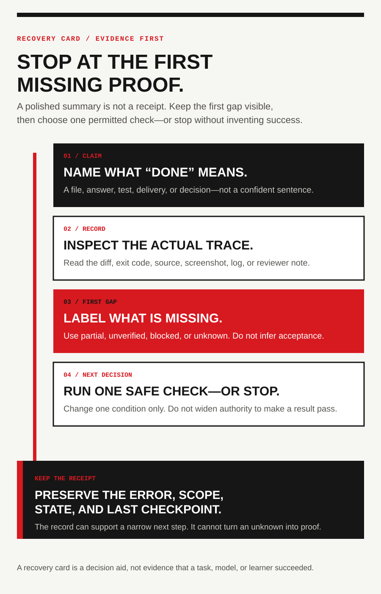

<!-- Traditional Chinese candidate generated from the Simplified Chinese source; independent language review pending. -->
<!-- content_id: chapter-09-verification-and-recovery | locale: ZHTW | language: zh-TW | default_locale: EN | translation_status: in-progress | translated_from: EN | source_revision: worktree-2026-08-11 -->

# 第 9 章：驗證、懷疑與恢復

**狀態：** candidate。**實驗狀態：** not_run。本章教授如何讓完成宣告匹配證據，
以及工作流變得不確定時如何恢復。公開報告和示例都是教學輸入，不是本地復現、
官方根因、客戶工作或生產證據。

## 本章要解決的問題

Agent 可以為錯誤、超出範圍、從未執行，或在錯誤環境檢查的結果寫出極具說服力的
完成摘要。可靠的響應不是盲信，也不是永遠懷疑；而是把摘要拆成宣告，併為每條宣告
分配在其宣告範圍內足以支援它的最小證據。

> 這是專案自有教學卡。它解釋審查方法；不證明某個 Skill、Agent、工具或外部服務
> 曾執行任何動作。

## 學習目標

完成本章後，你應該能夠：

- 把完成摘要拆為獨立宣告，併為每條選擇最小充分證據；
- 區分 error、unverified、unknown、partial、not_observed 和 verified；
- 找到能力鏈中最後確認的階段與第一處無證據階段；
- 當一次執行失敗時保留狀態、縮小範圍、增加一項有用檢查，或清晰停止；以及
- 寫出不誇大的交付說明，列出已完成工作、剩餘缺口和下一項安全檢查。

## 現實入口：重新取得控制，不等於證明結果正確

專案的 [Codex 現場研究](../evidence-library-ZHTW.md#source-notes) 記錄了容量中斷、
命令持續停在 Working，以及驗證擴大為持久重灌的報告。後續
[跟進研究](../evidence-library-ZHTW.md#source-notes)還記錄了會話可用
但目標工具未註冊，以及長請求最終報錯並重試的情形。

這些報告有用，是因為它們暴露了工作流可觀察的斷點；但它們不建立普遍服務原因、
所有賬戶的修復方式或本地復現。用它們練習一個關鍵區分：恢復一次執行的控制權，
不等於證明預期結果正確。

| 報告症狀 | 報告支援什麼 | 它不能證明什麼 | 第一個安全響應 |
|---|---|---|---|
| 所選模型不可用，任務停止 | 有報告者看到了容量錯誤和中斷任務 | 佇列語義、服務端原因，或每個賬戶/版本行為 | 凍結後續提示；重試前檢查 diff、日誌和最後接受的檢查點 |
| 格式化或驗證持續 Working | 該次執行沒有完成訊號 | 普遍死鎖、確切子程序或根因 | 設定有界等待，儲存輸出和程序狀態，只按恢復規則中斷 |
| 會話可用但預期工具缺失 | 會話與工具庫存不符合任務預期 | 每個提供商/版本暴露相同工具集 | 記錄實際工具清單；在檔案、瀏覽器或外部服務動作前停止 |
| 驗證變成強制重灌 | “檢查結果”可能被理解成許可改動持久環境 | 重灌永遠錯誤，或報告覆蓋所有 Agent | 分開記錄原始碼、測試、安裝、重啟、部署和線上驗證 |

下一步應由證據和授權決定，而不是由等待時間或狀態標籤的自信程度決定。

## 三份 Windows 報告：訊號不是證據

下列案例來自 2026-08-12 訪問的公開 GitHub 報告。它們是教學輸入，
不是本地復現、官方診斷或普遍 Windows 行為。

| 公開症狀 | 它可教什麼 | 第一個有界檢查 | 停在何處之前 |
|---|---|---|---|
| CLI 輸出超出終端視口後無法從滾動緩衝區找回（[#35335](https://github.com/openai/codex/issues/35335)） | 視口是呈現，不是持久證據 | 將響應儲存或重新生成到具名檔案；記錄 CLI、終端和提示範圍 | 把缺失視口斷言為 Agent 或倉庫資料丟失 |
| 非 BMP 字元貼上到 TUI 編輯框後消失（[#37578](https://github.com/openai/codex/issues/37578)） | 編輯框回顯不等於輸入完整性 | 在傳送有後果的請求前，用無害夾具比較預期與實際接收字串 | 編輯、提交或傳送未被保留的輸入 |
| 很長的檢查點引用讓 Windows Git 報 bad ref 或 Filename too long（[#37559](https://github.com/openai/codex/issues/37559)） | 內部 Agent 狀態不等於普通專案狀態 | 在獲批診斷範圍內記錄 git status、git show-ref、git fsck --full、git worktree list 與精確 ref 路徑 | 未備份、未授權就刪除 .git 材料、改 Git 配置、抓取或修復引用 |

詳見[Windows 輸入與證據現場問題](../evidence-library-ZHTW.md#source-notes)。
實用規則是：**重試前先捕獲最小持久產物**——輸出檔案、收到輸入的比較、diff、雜湊、
命令日誌或脫敏交接。社群變通方法可以幫助分診，卻不是官方修復，也不授權持久環境改動。

### 現場案例：命令完成，宣告仍可能不可審查

有界案例 [FC-EVIDENCE-01](../evidence-library-ZHTW.md#source-notes)
使用 issue #34951 區分執行與審計證據。該 issue 仍公開、沒有維護者診斷，也未在此復現。
若必需輸出隱藏或缺失，只保留已經授權的退出碼、事件、diff、產物、雜湊或回讀證據；
把審計宣告標為 unverified，並寫明缺失通道。不要只為找回呈現輸出而重跑有後果動作、
削弱安全控制，或把成功形狀的狀態推斷為真實結果。

## 1. 讓宣告匹配證據

先寫出你想說的那一句話，再問：第二個人要檢查什麼，才能在已宣告的範圍內接受它？

| 宣告 | 支撐該範圍的最低證據 | 仍在宣告之外的內容 |
|---|---|---|
| 檔案改了 | diff、具名路徑或雜湊 | 改動正確或完整 |
| 檢查透過 | 精確命令、工作目錄、退出碼和相關輸出 | 另一環境也會同樣行為 |
| 應用執行 | 實際啟動和一次具名關鍵路徑觀察 | 視覺質量、安全、使用者價值或生產就緒 |
| 頁面看起來正確 | 指定視口的瀏覽器或截圖審查 | 無障礙、所有斷點、後端行為或轉化 |
| 事實來自官方來源 | 權威 URL、訪問日期、範圍和複核負責人 | 當前賬戶或執行時有同樣能力 |
| 沒有暴露秘密 | 限定改動掃描、環境檢查與邊界說明 | 未知外部系統從未收到秘密 |
| 結果幫助使用者 | 已定義樣本、任務和使用者驗收記錄 | 普遍市場成功或未來結果 |
| 結果可用於生產 | 質量、安全、維護、釋出和回滾門禁 | 未測試環境或無人負責的未來改動 |

### 在 Lab 013 之前：寫宣告—證據表

在進入 [Lab 013：可審計的豎向切片](../labs/lab-013-l3-vertical-slice-ZHTW.md) 前，
將“完成”拆成可檢查的行。每行只可由其宣告範圍內的證據支撐：

~~~text
assertion: 我到底在宣告什麼？
scope: 該宣告覆蓋的檔案、命令、執行、版本或環境
evidence: 路徑、命令輸出、日誌、截圖、來源或審查記錄
status: verified / partial / unverified / blocked / not_run
gap_or_next_check: 缺什麼，以及增加證據的最小方式
~~~

不要用一次 diff 證明測試透過，也不要用登入頁面證明令牌交換或外部動作成功。證據缺失時，
按情況標為 unverified、blocked 或 not_run，保留缺口並進入恢復流程。

## 2. 用懷疑來選擇下一項檢查

對一個重要決策，寫出一條短宣告，然後暫時把它從自己的推理中拿掉：

- 哪個前提沒有證據？
- 哪個邊界條件沒有覆蓋？
- 結果會不會來自 mock、快取、過期檔案或錯誤環境？
- 若宣告為假，最先會在哪裡可見？
- 哪一項最小額外檢查可能改變決策？

目標不是無窮懷疑，而是在交付前讓昂貴錯誤變得便宜可見。一項好檢查只改變一個相關
條件，產生可觀察結果，並帶有停止規則。

### 狀態標籤不是出口檢查

| 宣告 | 最低證據 |
|---|---|
| “原始碼改了。” | 指定路徑的 diff 或檔案比較 |
| “檢查跑過了。” | 精確命令、工作目錄、退出碼和輸出 |
| “應用能用。” | 指定環境和輸入下的執行時觀察 |
| “頁面看起來正確。” | 指定視口的渲染檢查與視覺標準 |
| “功能已交付。” | 倉庫或部署狀態、釋出記錄和交付後檢查 |

最後一句嚴格強於前四句。構建透過有價值，但不會自動成為執行時、視覺、安全或使用者驗收
證據。

## 3. 按有界順序恢復

當事情失敗或變得不清楚時，按此順序：

1. 保留精確錯誤和當前狀態；
2. 分類可能邊界：輸入、理解、環境、實現、能力、許可權或驗證；
3. 縮小範圍並復現最小可觀察斷點；
4. 做一次最小修復，或增加一項定向檢查；
5. 重跑受影響路徑並記錄新證據；
6. 失敗仍不清楚時，停止並交付精確阻塞說明；
7. 只有證據支援時，才擴大許可權、範圍或重試預算。

不要用“再跑一次”“多給許可權”或“讓模型更努力想”替代診斷。

### 能力鏈：每一層成功都需要自己的證明

公開報告反覆出現一個誤導順序：工具名出現在列表、網頁可讀、提供商接受配置，
而真實發現呼叫、點選或更高層能力依然失敗。可見工具名只證明名字可見；不證明註冊、
可發現、執行或副作用成功。

~~~text
工具或 Skill 可見
  → 一次只讀發現呼叫可執行
  → 可讀取目標狀態
  → 目標動作返回成功
  → 確認預期外部狀態變化
~~~

每步需要獨立證據。讀 DOM 不證明點選成功；解析配置不證明後端能力可用；一次成功啟動
不證明下一個視窗、版本或賬戶有同樣能力。誠實交接可以寫“只讀檢查已驗證；提交未驗證”，
這比“工具能用”更有價值。

### 斷點卡：在第一層無證據處停止

不要先猜根因。找最後透過的斷言，和第一條失敗或未觀察到的斷言。為單次執行儲存：

~~~yaml
run_id: "唯一執行標識"
surface: "實際工作面及版本"
expected_capability: "本次執行所需的最小能力"
chain:
  - stage: "入口/會話可用"
    observation: "可觀察事件或錯誤"
    status: "passed | failed | not_observed"
  - stage: "工具已註冊且可發現"
    observation: "工具列表或只讀發現結果"
    status: "passed | failed | not_observed"
  - stage: "目標狀態可讀取"
    observation: "只讀目標、賬戶、路徑或視窗證據"
    status: "passed | failed | not_observed"
  - stage: "目標動作返回"
    observation: "結果、退出碼或錯誤類別"
    status: "passed | failed | not_observed"
  - stage: "預期副作用已確認"
    observation: "目標狀態、diff 或回讀結果"
    status: "passed | failed | not_observed"
last_confirmed_stage: "最後透過階段"
first_breakpoint: "第一處 failed 或 not_observed 階段"
safe_next_check: "只改變一個條件的最小檢查"
stop_condition: "何時不擴大許可權或副作用而停止"
~~~

工具名可見而只讀發現失敗，斷點就是“工具已註冊且可發現”；動作返回成功而目標狀態不變，
斷點就是“預期副作用已確認”。不要越過斷點做更高風險動作，也不要用後來的幸運成功
倒填早期證據。

### 長等待卻沒有事件：先記錄時間線

“介面仍顯示 Working”是一項觀察，不是根因。長請求至少記錄：

~~~text
request_started_at
first_event_at
each tool or network event
last_event_at
interrupt or error time
automatic retry start time
final state
~~~

到達預先同意的無事件閾值時：

1. 標為 no_event_observed；不要改寫成根因或健康任務；
2. 用已授權方式恢復控制，再檢查程序、工作樹、目標狀態和最後檢查點；
3. 第一次請求可能已有副作用時，按 unverified 或 blocked 停止；
4. 只有動作冪等、狀態已複查，且重試規則在執行前宣告或某條件已明確改變時，
   才允許一次有限重試；
5. 將客戶端自動重試記錄為獨立事件。第二次成功只證明第二次，不能把第一次無事件
   改寫為初次透過。

HTTP 狀態、長上下文、網路等待、模型推理或上游服務故障可以是待測假設；沒有官方確認
或本地復現時，它們不是已建立根因。

## 4. 把恢復狀態與完成狀態分開

使用描述真實證據的狀態詞：

- practice：學習執行；不得複用為生產證據；
- candidate：結構或輸出有希望，但評估或來源審查未完成；
- verified：在宣告範圍、版本和任務集內有證據；
- production-ready：質量、安全、回滾、維護和釋出門禁均透過。

觀察狀態不同於完成狀態。not_observed 表示沒有看到預期事件，不是根因診斷；not_run
表示計劃實驗尚未執行，不是透過或失敗；partial、unverified 與 blocked 描述當前能支援
的最窄證據缺口。

恢復可以取得控制，卻不升級完成狀態。例如，中斷一個掛起程序並儲存 diff，可能形成有用
的 candidate 交接，而所請求的執行時結果仍是 unverified。

### Codex 現場差異：可見工作面，沒有可用能力

公開報告描述了可見的 Computer Use 和 node_repl 工作面，其只讀 list_apps() 或
list_windows() 呼叫會出現 spawn EPERM；瀏覽器彈窗與 DOM 可讀，但點選超時；以及
自定義提供商可接受配置，卻未必暴露預期的多 Agent 能力。這些是 2026-08-10 使用者報告，
不是本地復現或官方根因。參見[網頁現場研究](../evidence-library-ZHTW.md#source-notes)
中的 WF-08—WF-11。這個命名產品例子不屬於上面的通用所有者範圍。

## 實驗：審計一條完成宣告

**實驗狀態：** not_run。

### 準備

準備脫敏完成摘要、diff、測試輸出、來源連結和一項刻意缺失的證據。不要連線生產服務
或改動外部系統。把每句完成宣告拆為獨立主張，並在審查前決定允許的狀態詞。

### 任務

使用 [Lab 003](../labs/lab-003-evidence-review-ZHTW.md) 把摘要變成宣告表。為每一行寫範圍、
證據、狀態與下一步；隨後刻意加入“全部測試透過”一類無證據句子，觀察審查是否拒絕它，
而不是接受摘要的語氣。

### 證據與覆盤

儲存宣告表、每項宣告的證據路徑、缺口類別、審查決定和恢復或補充計劃。至少包括一條
事實宣告、一條執行時宣告和一條使用者效果宣告，說明為什麼一份弱證據不能代替三者。
記錄最容易藏在漂亮摘要裡的宣告、最小卻最能降低風險的檢查，以及為什麼 unverified
不等於 wrong；再把下次交付說明的一句話改寫成與證據相稱的狀態。

## 刻意失敗與邊界案例

在可丟棄副本中開始一項小而可逆的改動。跑檢查前寫一份稱“完成”且“全部測試透過”的
交接；然後揭示測試輸出從未產生，或擬議恢復需要安裝、重啟、網路呼叫，或寫入原範圍外。

只有學習者做到以下各項，練習才透過：

- 把無證據宣告標為 unverified 或 not_run；
- 保留部分 diff、錯誤、範圍和最後檢查點；
- 拒絕從 diff 推斷執行時或使用者驗收；以及
- 選擇一項安全檢查或清晰停止，而不是堆疊編輯或靜默擴大許可權。

## 遷移練習

將宣告表用於研究結論或營銷實驗報告。至少寫一條事實宣告、一條執行宣告和一條使用者效果
宣告；解釋為什麼三者不能共享一份弱證據，併為最缺支援的宣告命名最小後續檢查。

## 來源與維護邊界

證據紀律和狀態詞彙是穩定方法；命令、入口、模型行為、提供商行為和公開 issue 狀態是
易變事實。具體操作應對照[評測框架](../evidence-library-ZHTW.md#method-and-status)、
[官方基線](../evidence-library-ZHTW.md#source-notes)和
[網頁現場研究](../evidence-library-ZHTW.md#source-notes)。

| 事實或邊界 | 來源 | 訪問日期 | 適用範圍 | 負責人 / 下次複核 |
|---|---|---:|---|---|
| 容量中斷會讓依賴任務狀態不明 | [FP-09 / issue #33865](../evidence-library-ZHTW.md#source-notes) | 2026-08-09 | 公開使用者報告；沒有本地復現或普遍佇列結論 | curriculum-maintainer / 2026-09-09 |
| 長時間驗證會讓完成狀態不明 | [FP-10 / issue #34325](../evidence-library-ZHTW.md#source-notes) | 2026-08-09 | 公開使用者報告；根因和版本範圍未知 | curriculum-maintainer / 2026-09-09 |
| 認證、工具可用性、執行與外部結果是獨立宣告 | [FP-01—FP-02](../evidence-library-ZHTW.md#source-notes) 與 [WF-08—WF-11](../evidence-library-ZHTW.md#source-notes) | 2026-08-09 / 2026-08-10 | 報告症狀的證據紀律；不是官方修復建議 | curriculum-maintainer / 2026-09-09 |
| 驗證不得靜默擴大為安裝或持久環境改動 | [FP-11 / issue #37677](../evidence-library-ZHTW.md#source-notes) | 2026-08-09 | 公開使用者報告；不是官方策略或本地復現 | curriculum-maintainer / 2026-09-09 |
| Agent 交接、工具註冊、工作區許可權和重試可能在不同階段失敗 | [FUP-01—FUP-05](../evidence-library-ZHTW.md#source-notes) | 2026-08-10 | 公開報告；賬戶、版本、提供商和本地執行時差異仍重要 | curriculum-maintainer / 2026-09-09 |

本章用這些報告來教授證據在哪裡中斷；不會把一條 issue、變通方法、標籤或社群回答變成
產品保證。

## 驗收清單

- [ ] 我能為來源、測試、執行時、視覺、安全和使用者效果宣告選擇不同證據。
- [ ] 我能區分錯誤、無證據結果與僅僅未知的結果。
- [ ] 我能定位能力鏈的最後確認階段和第一處斷點。
- [ ] 我能選擇有邊界的恢復動作，而不是重複未改變的失敗。
- [ ] 我能解釋恢復為何不自動升級完成狀態。
- [ ] 我能寫出包含已完成、未完成、未知、風險、證據路徑和下一項安全檢查的交付說明。
- [ ] 我能說明本章仍是 candidate，實驗仍是 not_run，直到存在執行記錄和審查證據。

本繁體中文譯文是可讀的 in-progress 翻譯切片，獨立語言審校尚未完成；它不是已驗證譯文，
也不表示課程已經透過獨立中文審校或學習者驗證。

<!-- chapter-navigation:start -->

<nav class="chapter-navigation" aria-label="章節導覽">
  <table role="presentation" width="100%">
    <tr>
      <td align="left"><a data-chapter-nav="previous" href="08-full-lifecycle-workflow-ZHTW.md" aria-label="上一章: 第 8 章 · The complete lifecycle from definition to delivery">← 上一章 <strong>第 8 章 · The complete lifecycle from definition to delivery</strong></a></td>
      <td align="right"><a data-chapter-nav="next" href="10-planning-and-slicing-ZHTW.md" aria-label="下一章: 第 10 章 · Planning and vertical slicing">下一章 → <strong>第 10 章 · Planning and vertical slicing</strong></a></td>
    </tr>
  </table>
</nav>
<!-- chapter-navigation:end -->
