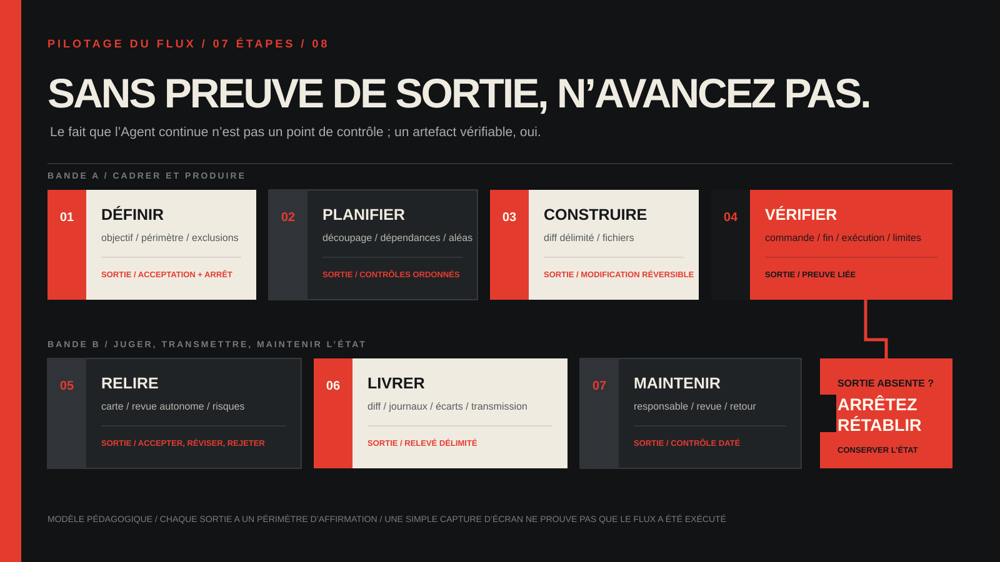

<!-- content_id: chapter-10-planning-and-slicing | locale: FR | language: fr | default_locale: EN | translation_status: in-progress | translated_from: EN | source_revision: worktree-2026-08-22-fr-slicing-restoration -->

# Chapitre 10 : Planifier et découper en tranches

**Statut :** `candidate` · **Expérience :** `not_run`

Ce chapitre propose une méthode de planification fondée sur des résultats
observables. L’expérience reste un exercice local non exécuté par le projet.

## Le problème que résout ce chapitre

« Refaire le site », « finir la fonctionnalité » ou « rendre le workflow prêt
pour la production » sont des intentions, pas encore des plans. Ils cachent le
premier résultat visible, les dépendances, la frontière de données, la différence
entre partiel et utilisable, ainsi que la conduite à tenir quand une commande se
bloque ou que la demande change.

Un Agent peut produire une longue liste bien rangée et repousser la première
preuve jusqu’à la fin. L’unité utile n’est donc pas une ligne de todo, mais une
**tranche de livraison bornée et observable** : un petit changement qui produit
un résultat, conserve sa preuve, dit ce qu’il ne prouve pas et laisse un relais
sûr à la tranche suivante.



> Cette carte appartient au projet. Elle illustre une méthode de planification ;
> elle ne prouve pas l’exécution d’un Agent, d’un Skill ou d’un service.

## Objectifs d’apprentissage

À la fin du chapitre, vous devriez pouvoir :

- transformer un résultat vague en trois à sept tranches avec dépendances
  explicites ;
- distinguer un plan horizontal, un plan par fichiers, une tranche verticale et
  une sonde de découverte ;
- écrire une fiche de tranche avec résultat, entrées, actions permises,
  exclusions, preuve, budget, arrêt et relais ;
- placer un checkpoint avant un effet irréversible et récupérer après une
  interruption sans faire confiance à la conversation précédente ;
- concevoir un retry étroit et idempotent plutôt que continuer aveuglément ;
- remettre un état honnête : fait, bloqué, non vérifié, non prouvé et prochaine
  action.

## Entrée du problème réel : le plan doit survivre à l’interruption

Les rapports de terrain du projet décrivent une interruption de capacité, une
commande de validation restée longtemps en `Working` et le besoin d’externaliser
TODO, état et décision lorsqu’une conversation devient trop longue. Ce sont des
rapports publics, pas des diagnostics universels ni des reproductions locales.

| Symptôme rapporté | Ce que l’on peut soutenir | Ce que cela ne prouve pas | Réponse de planification |
|---|---|---|---|
| Le modèle devient indisponible pendant une tâche longue | Un run a été interrompu et l’état partiel est incertain | La cause du service ou le comportement de chaque compte | Geler les nouvelles instructions, relire worktree, sortie et checkpoint avant un retry |
| Formateur ou validation reste en `Working` | Aucun signal de fin utile n’a été observé dans ce run | Un deadlock universel ou le processus fautif | Fixer un seuil sans progrès et garder stdout, stderr, code et fichiers modifiés |
| Une tâche complexe demande un TODO visible | Un échange public rapporte que l’état externe aide le suivi | Que ce format améliore chaque modèle ou tâche | Exiger décision, diff, contrôle et prochaine action ; un spinner n’est pas une preuve |

Un plan n’est pas une promesse de réussite. C’est une surface de contrôle qui
permet de faire pause, inspecter et décider sans deviner.

<a id="core-evidence-bearing-slice"></a>

## Le mécanisme : passer du résultat aux tranches qui portent des preuves

### 1. Nommer le résultat avant de nommer le travail

Commencez par une phrase qu’un lecteur, un reviewer ou un système aval pourrait
observer :

> Un nouveau contributeur lit une page, lance un contrôle local sans réseau et
> voit clairement `PASS` ou `FAIL`.

Réécrivez-la en fiche :

```text
Résultat : ce qu’une personne peut maintenant faire ou inspecter
Entrées : fichiers, données, hypothèses et préconditions
Actions autorisées : surface exacte et types de mutation permis
Hors objectif : travail séduisant volontairement reporté
Preuve : fichier, diff, sortie, test, capture ou revue attendue
Risque : secrets, appels externes, persistance, suppression ou irréversibilité
```

Si le résultat n’est observable qu’après toutes les fonctions futures, réduisez-
le d’abord. « API, interface, migrations, analytics et déploiement terminés »
est un jalon de release, pas une première tranche.

### 2. Dessiner les dépendances comme des faits

Une dépendance signifie : « cet état ou cette preuve doit être présent avant que
l’action suivante produise un résultat interprétable ». Pour chaque élément,
posez quatre questions :

1. **Dépend de :** quel état précis doit déjà exister ?
2. **Fournit à :** quel fichier, champ, sortie ou décision passe à la suite ?
3. **Bloqué par :** quelle entrée manquante ne peut pas être devinée ?
4. **Contrôle de dépendance :** quelle lecture seule confirme la précondition au
   moindre coût ?

```text
Tranche A : un enregistrement fixe se lit localement
  fournit : forme des données et contrôle de lecture réussi
Tranche B : un endpoint en lecture renvoie cet enregistrement
  dépend de : A ; fournit : réponse API observable
Tranche C : un écran rend la réponse
  dépend de : B ; fournit : chemin visible par le lecteur
Tranche D : le chemin est vérifié dans un build jetable
  dépend de : C ; fournit : artefact et diff relisible
```

Les flèches représentent des preuves et des interfaces, pas une mémoire cachée
de l’Agent. Si une dépendance n’est pas contrôlée, marquez-la `assumed` au lieu
de la traiter silencieusement comme vraie.

### 3. Choisir la bonne forme de plan

| Forme | Utile pour | Échec fréquent | À choisir quand… |
|---|---|---|---|
| Horizontal | Montrer toutes les couches, propriétaires ou prérequis de release | Le premier résultat est repoussé après de nombreux travaux | Vous faites une carte de capacité ou une revue de propriété |
| Par fichiers/ordre | Localiser les éditions et garder un petit diff | Le plan suit le dépôt plutôt que la valeur | Le changement est déjà compris et local |
| Vertical | Prouver un chemin mince de l’entrée au résultat | La première tranche devient discrètement toute la fonctionnalité | Vous cherchez un retour tôt, un essai réversible ou un relais |

Une tranche verticale traverse les seules frontières nécessaires pour démontrer
un résultat et laisse de côté polissage, rôles futurs, données de production et
abstractions prématurées. Utilisez plutôt une **sonde** si la question est
encore inconnue : elle produit une décision — continuer, réduire ou arrêter — et
ne doit pas être présentée comme un travail terminé.

### 4. Utiliser une fiche de tranche

```text
slice_id: S-01
outcome: un résultat observable pour un lecteur ou une équipe
depends_on: état, fichier ou preuve exacte à confirmer d’abord
provides_to: entrée ou décision de la tranche suivante
inputs: fichiers, fixtures, versions et hypothèses nommés
allowed_actions: chemins et classes d’action autorisés
non_goals: ce qui ne sera pas changé, installé, publié ou inféré
change_budget: fichiers, commandes, retries et effets externes attendus
acceptance_evidence: preuve exacte exigée pour dire PASS
failure_signal: erreur, absence de sortie, délai ou dérive de portée visible
stop_condition: moment où l’on conserve l’état et demande une décision
recovery: seul retry idempotent ou rollback sûr prévu
handoff: statut, preuves, risques restants et prochaine action
```

Les fichiers sont des preuves d’implémentation ; ils ne sont pas automatiquement
une preuve de livraison.

### 5. Fixer un budget et un checkpoint

Avant l’exécution, définissez les fichiers, commandes, nombre de retries ou délai
sans progrès, réseau/credential/installation autorisés, confirmation humaine et
artefact à conserver si la tranche s’arrête. Ce budget borne les effets de bord,
pas le nombre de tokens. Si un fichier hors budget, une nouvelle dépendance, un
credential de production ou un autre dépôt devient nécessaire, arrêtez et
réécrivez le plan.

À chaque checkpoint, notez au minimum :

```text
objectif et tranche courante :
actions terminées et preuves :
worktree / branche / cible :
fichiers modifiés et comparaison à la baseline :
dernière commande, sortie et code :
permission et état des effets externes :
hypothèses ou blocages ouverts :
prochaine action unique :
```

Le checkpoint doit vivre hors de la mémoire courte de l’Agent. Une note Markdown
ou un registre approuvé suffit ; n’y mettez jamais de secret, cookie ou credential.

### 6. Décider si la tranche est réellement petite

Elle est probablement trop grande si son titre contient plusieurs résultats
indépendants, mélange migration et release, exige plusieurs autorités
d’acceptation ou ne possède pas de premier point de rupture. Elle est trop petite
si elle crée un fichier isolé que personne ne peut lire, exécuter, relire ou
relier à un comportement observable.

Le test pratique est : « un reviewer absent de la conversation peut-il dire ce
qui a changé, comment c’était contrôlé, ce qui n’est pas prouvé et ce qu’il peut
faire ensuite sans danger ? »

<a id="core-evidence-bearing-slice-end"></a>

## Prompt de planification réutilisable

Remplacez les valeurs entre crochets ; ne collez pas ce formulaire tel quel dans
une tâche de production.

```text
Objectif : livrer une tranche observable pour [lecteur ou relecteur].
Contexte et entrées : [chemin absolu, fichiers, baseline et hypothèses].
Actions autorisées : [lecture/édition/contrôle et chemins exacts].
Budget : [fichiers, commandes, délai et retries].
Hors objectif : [fonctionnalités, installation, réseau, déploiement exclus].
Confirmation humaine avant : [effet irréversible ou externe].
Dépend de : [précondition et contrôle de dépendance].
Fournit à : [entrée exacte de la tranche suivante].
Preuve d’acceptation : [diff, sortie, test, rendu ou revue].
Signal d’échec : [erreur, absence de sortie, délai d’attente ou dérive].
Règle : inspecter baseline, écrire checkpoint, agir au minimum, relire l’état
après chaque action et arrêter si budget, cible, preuve ou autorité changent.
Livraison : statut, fichiers, preuves, tentatives, inconnues, rollback, prochaine action.
```

Ce prompt ne rend pas un Agent fiable par magie ; il transforme une conversation
en contrat qu’une autre personne peut auditer.

## Expérience : trois plans, une tranche sûre

**Statut :** `not_run`. Cette expérience n’utilise ni réseau, installation,
credential, commit, push, déploiement ni données de production.

### Préparation

Dans un répertoire temporaire, créez un `README.md` :

```markdown
## Slice Lab

Point de départ. La page n’explique pas encore ce qui a changé ni comment le vérifier.
```

Le but est que le lecteur trouve `What changed` et `How to verify`. Contrôle
PowerShell en lecture seule :

```powershell
$text = Get-Content -Raw README.md
$required = '# Slice Lab', '## What changed', '## How to verify'
$missing = $required | Where-Object { $text -notmatch [regex]::Escape($_) }
if ($missing) { $missing | ForEach-Object { "MISSING: $_" }; exit 1 }
'PASS: required headings found'; exit 0
```

Notez la commande réellement utilisée et son code retour.

### Tâche

Écrivez trois plans de sept éléments maximum : horizontal (rédaction, outils,
revue, release), par ordre de fichiers, puis vertical. Chaque élément possède un
résultat, une dépendance, une preuve et un arrêt. Exécutez seulement le premier
élément vertical : ajoutez les deux titres et une phrase honnête sous chacun.
N’ajoutez ni style, ni lien, ni système de build.

### Preuve

Conservez un `slice-record.md` :

```text
baseline: README.md avant édition
chosen_plan: vertical
changed_files: README.md seulement
check: commande exacte
result: sortie et code retour
acceptance: passed | failed | not_observed
not_proven: style, build, déploiement, acceptation utilisateur
next_slice: une action bornée
```

L’artefact attendu n’est pas un README « magnifique », mais une petite édition
et assez de preuves pour décider de la suite.

### Échec et limite

Supprimez `## How to verify` ou faites lire au contrôle un chemin absent. Lancez
le contrôle une fois et conservez la sortie non nulle. Classez le signal :

| Signal | Classe | Première récupération |
|---|---|---|
| Titre obligatoire absent | Échec d’acceptation | Restaurer seulement le titre, puis relancer le même contrôle |
| Mauvais fichier | Entrée ou test incorrect | Relire le chemin et corriger le test si le contrat l’autorise |
| Aucune sortie dans le délai | État inconnu | Arrêter, garder heure, processus, état et diff |
| Install, réseau ou chemin élargi requis | Portée/autorité | Demander une nouvelle décision, sans réparer l’environnement en silence |

Un contrôle raté prouve seulement que ce contrôle n’a pas passé pour cette
entrée ; il ne prouve pas que tout le dépôt ou l’Agent est en cause.

### Réflexion

Quelle inconnue est apparue le plus tôt ? Quelle tranche était encore trop
grande ? Quel checkpoint utiliseriez-vous après un délai d’attente ? Un résultat plus
rapide n’est pas, à lui seul, une preuve d’efficacité générale.

## Récupération et arrêt dans le travail réel

Après une interruption :

1. geler les nouveaux effets de bord ;
2. lire checkpoint, statut Git, diff, sortie et chemin réel ;
3. classer le point de rupture : entrée, portée, validation, infrastructure,
   permission ou inconnu ;
4. choisir une sonde en lecture ou un retry idempotent ;
5. mettre à jour le checkpoint ;
6. remettre un relais si la cause reste inconnue ou si le budget est épuisé.

**Sans nouvelle preuve, nouvelle autorité ou cible stable, pas de continuation
automatique.** Conservez la preuve d’échec avant un rollback et confirmez sa
source de retour.

## L’artefact attendu : un relais exécutable par une autre personne

Une tranche complète laisse une fiche, un checkpoint, un diff (ou une mention
« aucun changement »), une vérification avec environnement et code retour, un
enregistrement d’échec et cette note :

```text
status: passed | partial | blocked | unverified
done: affirmations soutenues par les preuves
changed: chemins exacts ou aucun
evidence: chemins d’artefacts
not_proven: runtime, externe, visuel, sécurité ou utilisateur absents
risks: effets ou hypothèses restants
next: une action bornée
owner: personne ou équipe
```

Sans ce relais, la personne suivante reconstruit l’état à partir du transcript et
peut répéter une action déjà exécutée.

## Transfert

Produisez trois à sept fiches pour une tâche sans code :

- **Recherche :** question étroite, tableau de sources, incertitude et conclusion
  bornée ;
- **Marketing :** contexte approuvé, brouillon pour une audience et essai
  relisible, sans publication ni données live ;
- **Skill :** déclencheur, entrées, actions permises, sortie, échec et date de
  revue, sans installer un Skill non audité.

Demandez à un reviewer qui n’a pas vu la conversation de relever une hypothèse
cachée et une preuve manquante. Corrigez les fiches, pas sa mémoire.

## Liste de contrôle d’acceptation

- [ ] Je peux dire le premier résultat observable en une phrase.
- [ ] Je distingue plan horizontal, plan par fichiers, tranche verticale et sonde.
- [ ] Chaque tranche possède `depends_on`, `provides_to`, un contrôle de
      dépendance et un hors objectif nommé.
- [ ] La preuve est plus forte que « l’Agent a dit terminé ».
- [ ] Le budget et le checkpoint sont écrits avant un effet irréversible.
- [ ] Je reconnais une tranche trop grande ou trop petite.
- [ ] Je peux arrêter après un délai d’attente, une dérive de portée, une autorité manquante ou une cible
      inconnue sans empiler des éditions.
- [ ] Je sais récupérer un résultat partiel en changeant une seule variable.
- [ ] Mon relais sépare `done`, `partial`, `blocked`, `unverified`, `not_proven`
      et `next`.
- [ ] L’expérience reste `not_run` jusqu’à un run et une relecture enregistrés.

## Sources et limite de mise à jour

La méthode est une synthèse du projet. Les rapports publics sont des entrées pour
analyser les frontières, pas des instructions copiées, des causes officielles ou
des vérifications locales.

| Sujet | Source et date | Portée | Responsable / prochaine revue |
|---|---|---|---|
| Protocole avec objectif, contexte, contraintes, acceptation, arrêt, récupération et livraison | [Prompt patterns for real work](../evidence-library-FR.md#source-notes), 2026-08-11 | Synthèse du projet, pas format imposé par un fournisseur | `curriculum-maintainer` / 2026-09-11 |
| Interruptions et validations longues rendent l’état incertain | [Field problems and prompt patterns P2](../evidence-library-FR.md#source-notes), 2026-08-11 | Rapports publics ; pas de cause universelle ni reproduction locale | `curriculum-maintainer` / 2026-09-11 |
| Checkpoints, tranches verticales et relais complet | [Content value upgrade plan P2](../evidence-library-FR.md#source-notes), 2026-08-11 | Recommandation pédagogique ; expérience `not_run` | `curriculum-maintainer` / 2026-09-11 |
| Surfaces, permissions et états Codex | [OpenAI Codex baseline](../evidence-library-FR.md#source-notes) et [documentation officielle](https://developers.openai.com/codex/), revue 2026-08-11 | Faits volatils ; revalider avant de recopier un libellé ou une commande | `curriculum-maintainer` / 2026-09-11 |

Ne copiez pas le texte, les captures, le code ou les instructions de Skill des
rapports liés. Cette traduction reste `in-progress / candidate / not_run` jusqu’à
une relecture francophone et un run borné.

## Pratiquer la frontière de récupération

Utilisez le [Lab 014 : réconcilier une tâche reprise](../labs/lab-014-resume-reconciliation-FR.md)
après une interruption ou un changement de branche ou de permission. Le Lab
exige une sonde de l’état courant avant toute action reprise.

<!-- chapter-navigation:start -->
<hr>
<nav class="chapter-navigation" aria-label="Navigation entre les chapitres">
  <table role="presentation" width="100%">
    <tr>
      <td align="left"><a data-chapter-nav="previous" href="09-verification-and-recovery-FR.md" aria-label="Chapitre précédent: Chapitre 9 · Vérification et récupération">← Précédent<br><strong>Chapitre 9 · Vérification et récupération</strong></a></td>
      <td align="right"><a data-chapter-nav="next" href="11-designing-a-skill-FR.md" aria-label="Chapitre suivant: Chapitre 11 · Concevoir un Skill utile">Suivant →<br><strong>Chapitre 11 · Concevoir un Skill utile</strong></a></td>
    </tr>
  </table>
</nav>
<!-- chapter-navigation:end -->
