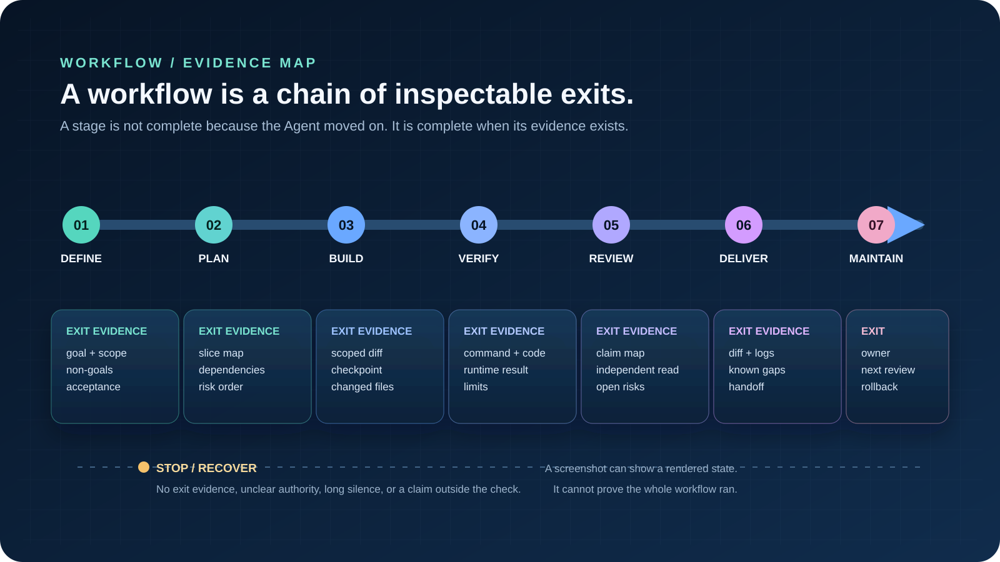

<!-- content_id: chapter-10-planning-and-slicing | locale: ZH | language: zh-CN | default_locale: EN | translation_status: in-progress | translated_from: EN | source_revision: worktree-2026-08-11 -->

# 第 10 章：规划与竖向切片

**状态：** candidate。**实验状态：** not_run。本章是英文规范源的简体中文候选译文。
实验是可在本地执行的低风险练习；本次内容编辑没有替学习者运行它。

## 本章要解决的问题

“做完整个功能”“完成网站”或“让工作流达到生产可用”听起来像目标，却还不是可执行的
计划。它们把多种不确定性藏在一句话里：

- 用户最先应该观察到什么；
- 下一步有意义前，哪个假设必须成立；
- 哪些文件、服务或人员在许可边界内；
- 如何区分部分结果和可交付结果；以及
- 命令卡住、模型不可用或需求中途改变时，该做什么。

Agent 可以写出很长、很有条理的计划，却把第一项有意义的证据推到最后。它也可能完成
一个技术上很小的任务，却留下无法使用的交接：文件改了，但没有人知道要跑什么、还有什么
没被证明，或者重试会不会重复一次副作用。

因此，有用的工作单位不是待办事项里的一行，而是一条有边界、可观察的交付切片：一个小改动
产生结果，记录证据，声明限制，并给下一条切片留下安全接口。

> 这是项目自有教学卡。它说明一种规划方法；不证明 Agent、Skill、命令或外部服务
> 曾经运行。

## 学习目标

完成本章后，你应当能够：

- 把模糊结果改写为三到七条带明确依赖的交付切片；
- 区分横向技术计划、竖向切片和低成本发现探针；
- 写出含结果、输入、允许动作、非目标、证据、变更预算、停止条件和交接接口的切片卡；
- 在不可逆动作前设置检查点，并保留足以从中断或上下文丢失中恢复的状态；
- 设计一个狭窄、幂等的重试，而不是对半成品盲目继续；以及
- 向他人诚实交接已完成、已受阻，以及现有证据仍不能证明的内容。

## 现实问题入口：计划必须经得起中断

项目的现场研究记录了长时间、多步骤 Agent 工作的一些警讯：有公开 Codex 报告描述任务
遇到容量错误后，后续继续操作面对未完成工作树的不确定性；另一份报告描述格式化或验证命令
长时间停在 Working，始终没有完成信号；Hacker News 的讨论则反映，当复杂任务超过一段对话
的承载范围时，外化计划、待办和状态的实际需求。

这些是报告，不是普适的产品诊断。它们不能证明队列语义、根因、每个账户的修复方法，或某个
发布版本的保证。它们在这里有价值，是因为即使原因未知，规划问题依然成立：人在决定是否继续
前，能否知道最后一次确认了什么？

| 报告症状 | 证据能支持什么 | 它不能证明什么 | 规划响应 |
|---|---|---|---|
| 长任务中模型不可用 | 报告者观察到运行中断和不明确的部分状态 | 服务端原因、队列行为或所有账户的表现 | 冻结新指令；重试一个切片前检查工作树、最后输出和检查点 |
| 格式化或验证持续停在 Working | 报告者在该次运行未看到有效完成信号 | 普遍死锁或准确的子进程根因 | 设置无进展阈值，保存标准输出、错误、退出码和变更文件 |
| 复杂任务需要可见待办或计划 | 社区讨论认为外部状态能让长任务更容易追踪 | 可见计划一定改善每一种模型或任务 | 要求决策摘要、diff、检查结果和下一项动作；不要把转圈当作交付证据 |

这一区分很重要。计划不是 Agent 必定完成的承诺；它是一个控制面，让人能暂停、检查并在不猜测
的情况下做下一次决定。

## 方法：从结果走向携带证据的切片

### 1. 先命名结果，再命名工作

先写一句用户、审查者或下游系统可以观察到的话：

> 新贡献者能阅读一页内容，在无需网络的情况下运行一项本地检查，并看到明确的通过或失败结果。

这句话比“搭建文档流水线”更强，因为它给计划一个要保护的对象。再把它改写成结果卡：

~~~text
结果：某人现在能做什么或检查什么
输入：文件、数据、假设和前置条件
允许动作：准确的操作面与允许的变更类型
非目标：刻意推迟的、看似吸引人的工作
证据：文件、diff、命令输出、测试、截图或审查记录
风险：秘密、外部调用、持久化、删除或不可逆改动
~~~

如果结果必须等全部未来功能完成后才可观察，应先设计更小的结果。“API、界面、迁移、分析和
部署全部完成”是发布里程碑，不是第一条切片。

### 2. 把依赖画成事实，不是愿望清单

依赖的含义是：“下一项动作能产生有意义结果之前，这件事必须为真。”它不只是
“这个项目在工单里排得更靠前”。

对每个候选项都问四个问题：

1. **依赖于：** 哪个准确状态或证据必须先存在？
2. **提供给：** 下一条切片会获得哪个文件、字段、命令结果或决定？
3. **受阻于：** 哪个缺失输入不能安全地猜测？
4. **依赖检查：** 哪项最便宜的只读检查能证明前置条件存在？

这会把“数据库 → API → 界面 → 部署”这类模糊序列改成可检查的内容：

~~~text
切片 A：固定示例记录可在本地读取
  提供：示例数据形状和一项通过的读取检查
切片 B：一个只读端点返回该记录
  依赖于：A；提供：可观察的 API 响应
切片 C：一个界面渲染端点响应
  依赖于：B；提供：用户可见路径
切片 D：该路径在可丢弃构建中被检查
  依赖于：C；提供：构建输出和可审查 diff
~~~

箭头描述的是证据和接口，不是隐藏的 Agent 记忆。若某个依赖未被检查，应标为
assumed，而不是悄悄当作已成立。

### 3. 选择正确的计划形状

三种计划形状都有用，但回答的问题不同：

| 计划形状 | 擅长解决什么 | 典型失败 | 适用场景 |
|---|---|---|---|
| 横向 | 展示全部技术层、责任归属或发布前置项 | 第一个真实用户结果被推迟到很多层完成后 | 需要能力地图或责任审查 |
| 按文件/顺序 | 定位编辑，让小改动易于审查 | 计划跟着仓库顺序走，而非用户价值 | 改动已理解且确实局部 |
| 竖向 | 证明从输入到可观察结果的一条细路径 | 第一条切片被做得太大，悄悄变成“整个功能” | 需要早期反馈、可逆实验或交接 |

<mark class="highlight-text highlight-cyan">竖向切片不是“后端的一小块”。</mark>
它只跨越展示一个结果所需的最少边界。它可以同时触及文档、脚本和测试，但应排除无关润色、
额外角色、生产数据和未来抽象。

当主要问题仍未知时，使用**探针**。探针是低成本、只读或可逆的调查，例如检查依赖是否存在、
渲染一个样本，或确认一次无害工具调用能到达目标面。不要把探针伪装成产品工作；它的产物应是
一个决定：继续、收窄或停止。

### 4. 使用切片卡，而不是一堆任务

把这个简明结构复制到任务记录中：

~~~text
slice_id：S-01
outcome：一项用户或团队可观察的结果
depends_on：先必须存在的准确状态、文件或证据
provides_to：下一条切片的准确输入
inputs：具名文件、夹具、版本和假设
allowed_actions：此切片允许的路径和动作类别
non_goals：不会改动、安装、发布或推断的内容
change_budget：预期文件、命令和外部影响
acceptance_evidence：称切片通过所需的准确证明
failure_signal：失败或卡住会呈现什么可观察信号
stop_condition：何时保留状态并请求决定
recovery：一次最小且安全的重试或回滚路径
handoff：状态、证据路径、剩余风险和下一项动作
~~~

这些字段防止一种常见替换：把“某人能够做 X”替换成“Agent 编辑了 Y 和 Z 文件”。
文件是实现证据，不会自动成为交付证据。

### 5. 设置变更预算和检查点

执行前，估计一个刻意狭窄的预算：

- 允许变动的文件；
- 允许运行的命令；
- 最大重试次数或无进展等待时间；
- 是否允许网络、凭据、安装或持久状态；
- 不可逆动作前所需的人类确认；以及
- 切片停止时要保留的产物。

预算不是 token 用量预测，而是副作用边界。若切片需要预算外文件、新依赖、生产凭据或
另一个仓库，应停止并更新计划。“验证时需要”不会静默授予安装或部署权限。

每个检查点至少记录：

~~~text
目标与当前切片：
已完成动作与证据：
工作树 / 分支 / 目标路径：
变更文件与基线比较：
最后命令、输出和退出状态：
权限与外部副作用状态：
开放假设或阻塞项：
下一项单一动作：
~~~

检查点必须存在于 Agent 的短期对话状态之外。一份小 Markdown 文件、Issue 记录或已批准的
任务记录已经足够。不要把秘密、Cookie、token 或私有凭据写进去。

### 6. 判断切片是否真的足够小

当标题包含多个独立用户结果、混合实现/迁移/发布、需要多种验收权威，或能在多个层面失败却
没有第一处断点时，切片多半太大。若第一份有用证据只能在末尾出现，应拆分它。

当切片创建一个无法阅读、运行、审查或接入可观察行为的孤立文件，或者只是后续切片所需的
私有重构时，它多半太小。除非该重构本身是刻意探针，否则应与最近的可观察切片合并。

实用测试是：

> 一个没有参与原对话的审查者，能否查看产物并回答：“改了什么、如何检查、未证明什么、
> 接下来可以安全做什么？”

如果不能，切片需要更好的接口或更小的结果。

## 可复用的规划提示词

把下列内容作为起点。替换示例值；不要原封不动粘贴到生产任务中。

~~~text
目标
交付一条竖向切片：[一名具名用户或审查者可观察的结果]。

上下文与输入
- 仓库/工作区：[绝对路径或已批准的操作面]
- 相关文件和夹具：[准确路径]
- 基线：[分支/提交/哈希/状态或保存的副本]
- 已知假设：[尚未确认的事实]

范围契约
- 允许动作：[读/编辑/运行/检查，以及准确路径]
- 变更预算：[文件、命令、重试/时间上限]
- 非目标：[排除的功能、安装、网络调用、部署或清理]
- 以下动作前需要人工确认：[不可逆或外部动作]

切片设计
- depends_on：[前置条件及其廉价检查]
- provides_to：[下一条切片的准确输入]
- acceptance_evidence：[diff、命令输出、测试、渲染或审查记录]
- failure_signal：[可观察错误、缺失输出、超时或范围漂移]

执行规则
1. 编辑前检查基线，并报告任何已有改动。
2. 第一次变更前写切片卡和检查点。
3. 做能产生既定证据的最小动作。
4. 每次动作后报告变更状态；不要从转圈、token 数或自己的完成摘要推断成功。
5. 若依赖缺失、目标路径不一致、命令在[时间上限]内没有有效事件，或预算超出，停止并保留
   检查点。不要安装、发布、删除或扩大权限。
6. 恢复时重读目标，对比基线和 diff，并且只以一个改变的变量重试一次幂等动作。

交付
返回：状态（passed / blocked / unverified）、变更文件、准确证据、失败尝试、剩余未知项、
回滚或恢复路径，以及下一项单一动作。若缺少验收证据，不要称切片完成。
~~~

提示词本身不会让 Agent 可靠。它的价值在于把对话式请求变成另一个人可以审查的契约。

## 小实验：三种计划，一条安全切片

本实验不使用网络、安装、凭据、提交、推送、部署或生产数据。请使用临时目录，而非包含他人
修改的工作树。

### 准备

创建一个临时文件夹，其中的 README.md 只包含：

~~~markdown
## Slice Lab

起点：页面还没有说明改了什么或如何检查。
~~~

验收目标刻意很小：读者必须能看到“改了什么”和“如何验证”两个小节。本地检查为只读搜索。
在 PowerShell 中：

~~~powershell
$text = Get-Content -Raw README.md
$required = '# Slice Lab', '## What changed', '## How to verify'
$missing = $required | Where-Object { $text -notmatch [regex]::Escape($_) }
if ($missing) { $missing | ForEach-Object { "MISSING: $_" }; exit 1 }
'PASS: required headings found'; exit 0
~~~

在其他 Shell 中使用等效的无网络检查：任一标题缺失时返回非零状态。记录你实际使用的命令。

### 任务

为同一个目标各写一份不超过七项的计划：

1. 按写作、工具、审查和发布分层的横向计划；
2. 按预计会触及的文件顺序排列的计划；
3. 先做最小可阅读、可检查页面的竖向计划。

每一项都必须有结果、依赖、证据和停止条件。随后只执行竖向计划的第一项：添加两个标题，
并在每个标题下写一句真实的话。不要添加样式、链接、构建系统或未来部分。

编辑前后记录目标路径与 diff，并运行一次本地检查。你的证据记录应让陌生人回答：

- 基线是什么？
- 哪份计划更早产出了第一个可观察结果？
- 改了哪些文件？
- 跑了哪条准确命令，它的退出状态是什么？
- 哪些内容被刻意排除在范围外？

### 预期证据

在临时目录中保存一个小型 slice-record.md（或等效且获批的记录）：

~~~text
baseline：编辑前的 README.md
chosen_plan：vertical
changed_files：仅 README.md
check：[准确命令]
result：[准确输出和退出状态]
acceptance：passed / failed / not_observed
not_proven：样式、构建、部署、用户验收
next_slice：[一项有边界的下一步]
~~~

预期产物不是“一份漂亮的 README”，而是一项小而可审查的变更，以及足以判断下一条切片是否
安全的证据。

## 故意失败：让断点可见

现在制造一次受控失败：从 README.md 删除 “## How to verify”，或让检查读取一个不存在的
路径。运行检查一次并保存非零输出。不要为了让错误消失而添加依赖、改变权限，或重写整页。

可观察信号应是以下之一：

- MISSING: ## How to verify，且退出状态非零；或
- 目标路径错误时出现明确的找不到文件错误。

恢复前先分类：

| 信号 | 分类 | 第一项恢复动作 |
|---|---|---|
| 必需标题缺失 | 内容验收失败 | 只恢复缺失标题，然后重跑同一检查 |
| 检查指向错误文件 | 测试/输入失败 | 重读目标路径；只有切片契约允许时才修正检查 |
| 在所选阈值内没有输出 | 未知执行状态 | 停止等待；保存命令、时间、进程状态和 diff |
| 修复需要安装、网络调用或更宽路径 | 范围/授权失败 | 停止并请求新决定；不要静默“修复”环境 |

恢复后写下改了什么，以及失败**没有**证明什么。一项失败检查只证明该检查没有对这个输入通过；
它不证明整个仓库损坏、Agent 损坏，或应当进行更大的重写。

## 真实工作中的恢复与停止条件

长任务中断后，不要发送无条件的“继续”。按以下顺序：

1. **冻结新副作用。** 状态未明时，不要排队另一项写入、外部请求、安装、删除或部署。
2. **检查最后已知状态。** 读取检查点、git status、相关 diff、最后命令输出和真实目标路径。
3. **分类断点。** 标为缺失输入、范围漂移、验证失败、基础设施/超时、权限或未知。
4. **选择一项有界动作。** 优先只读探针，或对最小切片做幂等重试；一次只改变一个变量。
5. **更新检查点。** 记录新证据，以及下一条切片是否仍有效。
6. **停止或交接。** 若原因仍未知、重试预算耗尽或目标改变，交付受阻交接，而非继续堆叠编辑。

只有部分状态不安全、误导性强或携带成本过高时才回滚。回滚前保留失败证据；不要为了取得
看似干净的工作树而丢弃用户已有修改。若部分产物安全且有信息价值，保留它并标为 partial 或
unverified。

停止规则可以写得很直白：

> 没有新证据、没有新授权，或没有稳定目标，就不自动继续。

这条规则在上下文压缩、模型容量错误、长时间命令、工作树改变，或提示词提出另一个结果时格外
重要。对话摘要可能保留意图，却不一定保留准确文件状态、进程状态或外部副作用。

## 预期产物：另一个人能运行的交接

即使结果受阻，一条完整切片也留下这些产物：

1. **切片卡：** 结果、依赖、范围、证据、预算和停止条件。
2. **检查点：** 最后确认状态、目标身份、变更文件、命令结果和下一项动作。
3. **实现 diff 或明确的无变更记录：** 实际移动了什么。
4. **验证记录：** 准确命令、环境、退出状态、输出和检查范围。
5. **失败记录：** 失败输入、可观察信号、已尝试恢复，以及为何另一轮重试安全或不安全。
6. **交接说明：**

~~~text
status：passed / partial / blocked / unverified
done：[有证据支持的声明]
changed：[准确路径或 none]
evidence：[链接或产物路径]
not_proven：[未出现的运行时、外部、视觉、安全或用户声明]
risks：[剩余副作用或假设]
next：[一项有边界的动作]
owner：[个人或团队]
~~~

交接是切片的一部分，不是“真正工作”结束后补的文书。没有它，下一位必须从漫长聊天记录重建
状态，并可能重复已经发生的动作。

## 反思

离开本章前，写下一项仍然大到无法交给另一人的当前任务。哪条第一切片能产生最早的有意义
证据？哪项动作、输入或决定必须明确排除在范围外？如果在该切片后中断，什么记录能让别人
不靠猜测继续？

## 迁移任务

从另一个领域选择一项真实但低风险的任务，并写三到七张切片卡：

- **工程：** 添加一个只读端点和一个渲染固定夹具的界面。第一条切片排除认证、分析和部署。
- **研究：** 用来源表、不确定性列和边界清楚的结论回答一个窄问题。来源未核查前，不要把搜索
  结果称为已验证事实。
- **营销：** 把一份已批准的产品上下文改成一份面向特定受众的草稿和一项可审查实验。排除发布和
  实时受众数据。
- **Skill 设计：** 描述一个触发条件、输入结构、允许动作、预期输出、失败路径和复核日期。规划
  练习中不要安装或调用未经审查的外部 Skill。

让一名同事，或一个新鲜 Agent 上下文，在不听口头解释的情况下审查这些卡。他们的工作是找出
一个隐藏假设和一个缺失验收信号。修改切片卡，不要依赖审查者的记忆。

## 验收清单

- [ ] 我能用一句话说出第一项用户或审查者可观察的结果。
- [ ] 我能区分横向计划、文件顺序计划、竖向切片和发现探针。
- [ ] 每条切片都有 depends_on、provides_to、依赖检查和具名非目标。
- [ ] 每条切片都有强于“Agent 说它完成了”的证据规则。
- [ ] 我在任何不可逆动作前设定了文件/动作/变更预算和检查点。
- [ ] 我能识别计划何时因推迟第一份有意义证据而太大。
- [ ] 我能识别计划何时因没有可观察行为或可审查接口而太小。
- [ ] 我能在超时、范围改变、缺少授权或目标未知时停止，而不自动堆叠编辑。
- [ ] 我能通过重读状态、一次只改变一个变量，从部分结果恢复。
- [ ] 我能在交接中分开 done、partial、blocked、unverified、not_proven 和 next。
- [ ] 我能说明本章实验仍为 not_run，直到存在本地运行记录和审查证据。

## 来源与更新边界

本章的规划方法是项目自有综合。它刻意区分用户报告、官方产品事实、项目推断和本地复现。
下列公开案例用于边界分析，不是复制来的操作指令、官方根因结论或本地验证。

| 主题 | 来源与访问日期 | 证据边界 | 负责人 / 下次复核 |
|---|---|---|---|
| 任务协议应包含目标、上下文、约束、验收、停止、恢复和交付 | [真实工作提示模式](../../docs/research/prompt-patterns-for-real-work-2026-08-10.md)，访问于 2026-08-11 | 项目研究综合；不是厂商规定的提示格式 | curriculum-maintainer / 2026-09-11 |
| 容量中断和长时间验证会让状态不明确 | [现场问题与提示模式 P2](../../docs/research/field-problems-and-prompt-patterns-p2-2026-08-11.md) 与 [现场问题深度分析](../../docs/research/field-problems-deep-dive-2026-08-11.md)，访问于 2026-08-11 | 公开用户报告；不主张普遍原因、修复或本地复现 | curriculum-maintainer / 2026-09-11 |
| 外部检查点、竖向切片和完整交接是高价值课程补充 | [内容价值升级计划 P2](../../docs/research/content-value-upgrade-plan-p2-2026-08-11.md)，访问于 2026-08-11 | 项目规划建议；拟议实验仍为 not_run | curriculum-maintainer / 2026-09-11 |
| 当前 Codex 入口、权限、模型、命令参数和 UI 状态 | [OpenAI Codex 基线](../../docs/research/openai-codex-baseline.md) 与 [官方 Codex 文档](https://developers.openai.com/codex/)，复核于 2026-08-11 | 易变产品事实；复制命令或菜单名称前应重新核查官方来源 | curriculum-maintainer / 2026-09-11 |

不要复制链接报告中的文字、截图、代码或 Skill 指令。本章只把它们的发现作为研究输入，并以
原创文字记录项目的规划方法。实验命令刻意局限于本地且不联网；它们不建立每一个 Codex
工作面、操作系统、模型或提供商的行为结论。

## 练习恢复边界

当任务在中断、上下文丢失、分支改变或权限状态改变后返回时，进入
[实验 014：恢复任务前的状态对账](../labs/lab-014-resume-reconciliation-ZH.md)。该实验要求在恢复任何动作前先探测当前状态；它不会把旧计划当作环境未变的证据。

本简体中文译文是可读的 in-progress 翻译切片，独立语言审校尚未完成；它不是已验证译文，
也不代表完整中文课程。

<!-- chapter-navigation:start -->

<nav class="chapter-navigation" aria-label="章节导航">
  <table role="presentation" width="100%">
    <tr>
      <td align="left"><a data-chapter-nav="previous" href="09-verification-and-recovery-ZH.md" aria-label="上一章：第 9 章·验证、怀疑与恢复">← 上一章 <strong>第 9 章·验证、怀疑与恢复</strong></a></td>
      <td align="right"><a data-chapter-nav="next" href="11-designing-a-skill-ZH.md" aria-label="下一章：第 11 章·设计一个真正有用的 Skill">下一章 → <strong>第 11 章·设计一个真正有用的 Skill</strong></a></td>
    </tr>
  </table>
</nav>
<!-- chapter-navigation:end -->
