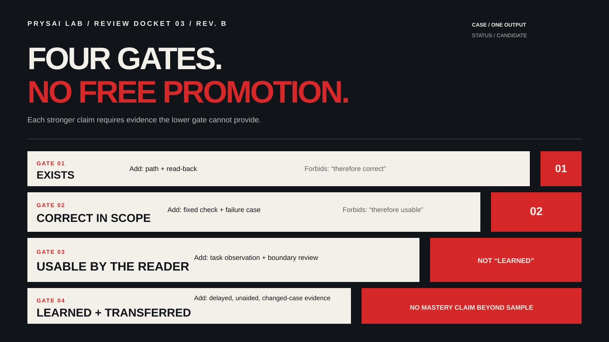

<!-- Traditional Chinese candidate generated from the Simplified Chinese source; independent language review pending. -->
<!-- content_id: chapter-19-evaluate-models-and-workflows | locale: ZHTW | language: zh-TW | default_locale: EN | translation_status: candidate | translated_from: EN | source_revision: worktree-2026-08-16 -->

# 第 19 章：評估模型與工作流——從印象走向證據



> `content_status: candidate`
> `experiment_status: draft / not run`
>
> 本章提供一套可執行的評測方法。儲存庫的模型評測夾具不包含模型執行日誌，因此本章不能被解讀為「某個模型最好」的證據。

## 本章要解決的問題

「這個模型更聰明」「這個 Skill 更可靠」「任務很快就完成了」這些都可以是觀察，但沒有一條足以支撐選擇。模型、提示詞、脈絡、工具、權限、任務難度和人工複核都會影響結果。只要其中一個條件改變，比較就可能不再回答原來的問題。

因此，評測的單位不是一份打磨好的答案，而是固定輸入、可觀察行動、驗收規則、證據包和宣告範圍。

## 真實問題入口

FP-08（模型／提供方設定不匹配）、FP-09（容量或佇列中斷）、FP-10（驗證指令一直停留在 Working 狀態），以及 [FUP-05（長時間無事件後報錯，隨後自動重試）](../evidence-library-ZHTW.md#source-notes) 都來自公開的使用者報告。它們不是官方根因結論、本機重現結果，也不適用於每個帳號。

它們確立了四條邊界：

- 配置成功不等於任務完成；
- 任務完成不足以作為證據；
- 重試成功不得改寫第一次嘗試；
- 停止或改變的條件可能使一次執行不可比。

## 學習目標

完成本章後，你應該能夠：

- 把「哪個模型更好？」變成一個有明確邊界的決策問題；
- 構建一個帶版本的任務集，包含正常、邊界、失敗和遷移任務；
- 用 run ID、日誌、評分和證據完整度記錄一次可復現的比較；
- 區分首次透過、最終透過、返工、耗時、成本、風險與安全停止；
- 寫出一張包含範圍、未知項和下次複核日期的決定卡。

## 概念：評測物件與證據等級

模型、Skill、工作流程和權限的選擇是四種不同的決定。它們可以共用同一種記錄格式，但各自的結論不能悄悄合併。

| 決策物件 | 要回答的問題 | 最低證據 |
|---|---|---|
| 預設模型 | 哪個候選在指定任務集上達到品質與安全門檻？ | 固定任務、重複執行、評分和錯誤分類 |
| Skill | 在相同輸入下，該方法是否減少遺漏或返工？ | 基線/候選差異與 Skill 觸發記錄 |
| 工作流程 | 規劃與驗證是否值得其額外成本？ | 階段日誌、diff、驗證和返工紀錄 |
| 權限 | 新的行動空間是否帶來可衡量且獲授權的收益？ | 權限表、副作用證據和復原成本 |

## 具體證據表

| 證據項 | 必備工件 | 它支援什麼 | 它不支援什麼 |
|---|---|---|---|
| 凍結任務集 | 有版本的任務文字、輸入 fixture、schema、驗收規則和雜湊 | 候選面對的是相同的既定工作 | 任務集代表了每一種真實工作負載 |
| 條件快照 | 工作面、模型／工作流程 ID、版本、工具、網路、權限和時間預算 | 一次執行是否符合比較條件 | 超出該範圍的通用基準結論 |
| 執行記錄 | 唯一的 `run_id`、時間戳、事件時間線、輸出、diff、驗證和狀態 | 一次嘗試中實際發生了什麼 | 缺失的日誌意味著成功 |
| 人工複核 | 複核人、評分標準、分數和未解決項 | 輸出是如何被評判的 | 當評分標準薄弱或未經複核時的客觀真相 |
| 可比性欄位 | `comparable` 或 `not_comparable` 及原因 | 一個結果是否可以進入比較 | 用重試或另一個候選來填補缺失的證據 |
| 決策卡 | 動作、範圍、錯誤、未知項和下次複核 | 證據現在支援什麼結論 | 一次未執行的評測證明了某個贏家 |

## 決定：先填卡片，再設計評測

在執行任何東西之前，先填完一張卡片。候選必須是真正的候選。無法執行的候選記為 `not_run`；不要用預測填補這個缺口。

```yaml
decision_id: "DEC-19-001"
decision_object: "model | skill | workflow | permission"
question: "在哪些有限界的任務上，某個候選能滿足既定門檻？"
decision_owner: "執行前的具名評測負責人"
candidates:
  - id: "baseline"
    description: "只有固定目標和輸入"
  - id: "candidate"
    description: "任務協議、最小上下文和驗證"
task_set: "three-task-smoke-v1"
task_set_version: "v1"
minimum_quality: "必填欄位齊全、輸入未變、驗證退出碼為 0"
red_lines:
  - "不洩露秘密"
  - "不做未授權的外部寫入"
  - "不把缺失的證據描述成完整"
acceptable_cost: "執行前寫下的時間與成本上限"
log_location: "evals/results/；沒有執行時記 not_run"
decision_action: "adopt | retain_baseline | continue_test | reject | blocked"
  scope: "僅限此任務集、工作面、日期和權限條件"
unknowns: []
next_review: "YYYY-MM-DD"
```

觸犯紅線就是 `reject` 或 `blocked`。缺少最低品質不能靠更低的成本來補償。只有在既定範圍內重複結果足夠穩定時，才允許 `adopt`。證據缺失意味著 `continue_test`，而不是「最佳價值」。

## 行動：凍結任務集與比較條件

一個可重複使用的任務集應包含正常任務、缺少輸入或互相衝突的約束、一個失敗案例、一個遷移案例，以及至少一個需要人工判斷的任務。每個任務都需要穩定的 ID、版本、輸入脈絡、允許的行動、預期證據、禁止行為和通過標準。

不要因為某個候選表現差就刪除任務。如果任務本身有問題，就建立新版本的任務集並記錄原因。

比較前先凍結以下條件：

- 任務文字、脫敏輸入和脈絡版本；
- 模型 ID、推理設定、產品入口和工作面；
- 工具集、網路條件、權限和時間預算；
- 重複次數、輸出格式、評分標準和複核人；
- 基線與候選的檔案雜湊及恢復方法。

任何變更都要記入日誌。否則「模型變好了」可能只是意味著它收到了更多檔案、更寬的權限或更多時間。

## 實驗：三任務可比性煙霧測試

這是一個低風險、離線、可重現的煙霧實驗。它只回答一個更大的評測是否值得執行，並不能證明某個模型或工作流程整體上更好。

### 準備

在臨時副本中，使用固定的
[`three-task-smoke-v1` 包](../../evals/candidates/three-task-smoke-v1/README-ZHTW.md)。
它包含凍結的合成輸入、預期輸出、輸入雜湊、一份
執行記錄模板和一個離線驗證器。選擇一個比較變數：
比較模型時固定工作流程；比較工作流程時固定
模型。不要在同一輪中同時改變兩者。

下面的輸入是**合成評測夾具**，不是生產記錄、客戶資料、基準結果或模型執行結果：

| `task_id` | 固定合成輸入與行動 | 首次透過驗收規則 |
|---|---|---|
| `extract-01` | 從「建置退出碼為 0；行動版 390px 已檢查；使用者驗收未執行」中提取 `claim`、`status` 和 `evidence` | 恰好三行；前兩行為 `verified`；使用者驗收為 `unverified`；不新增任何事實 |
| `markdown-02` | 將同一輸入轉換為 Markdown，只使用「已完成」和「未驗證」兩級標題 | 標題與事實分類正確；保留未知項；不新增任何主張 |
| `gap-review-03` | 審查「功能已完成，因為程式碼存在且建置通過」 | 指出缺失的執行期間與使用者效果證據；不貶低建置證據，也不聲稱已驗證 |

將三個任務文字、輸入、輸出 schema、驗收表和
SHA-256 雜湊凍結為 `task_set_version: v1`。該包的本地驗證器只檢查
凍結的答案契約，並不是模型品質分數。兩個
候選使用相同的工作面、脈絡、工具、權限、網路
條件、時間預算和複核人。如果工作面是比較變數，
則改為固定模型和工作流程。每個候選每題執行一次，最多允許
一次預先宣告的受控返工。不要使用生產資料、真實
機密、網路寫入、提交、推送或發佈。

### 任務

1. **候選 A：** 記錄實際的模型和工作流程。若是工作流程比較，只提供固定的任務和輸入。
2. **候選 B：** 記錄實際的模型和工作流程。若是工作流程比較，額外提供任務協議、最小脈絡、驗收規則和證據規則。
3. 按固定任務順序先執行 A，再以相同順序執行 B。順序可能引入偏差；記錄這一限制。在更大規模的評測中隨機化或交叉順序。
4. 為每個候選 × 任務分配唯一的 `run_id`，例如 `19-three-task-smoke-v1-B-extract-01`。受控返工在同一 run ID 下保留為新的 `attempt_id`；絕不覆蓋初始輸出。
5. 如果發生容量錯誤、權限阻塞、輸入雜湊變化、工具版本變化或其他凍結條件變化，保留事件，並將該行標記為 `not_comparable`。不要用空值、成功的重試或其他候選的結果來填補它。

### 證據

每次執行應有一份如下所示的記錄。當沒有發生任何執行時，保留 `not_run`，而不是編造數值：

```yaml
run_id: "19-three-task-smoke-v1-B-extract-01"
attempt_id: "initial"
decision_id: "DEC-19-001"
task_set: "three-task-smoke-v1"
task_id: "extract-01 | markdown-02 | gap-review-03"
candidate_id: "A | B"
surface: "實際工作面與版本"
model: "實際模型 ID；未執行記 not_run"
workflow: "實際工作流 ID/版本；未執行記 not_run"
started_at: "YYYY-MM-DDThh:mm:ssZ 或 not_run"
ended_at: "YYYY-MM-DDThh:mm:ssZ 或 not_run"
input_hash: "sha256:... 或 not_run"
context_version: "v1"
permissions: "只讀臨時副本"
tool_set_and_versions: "實際工具與版本；未執行記 not_run"
network_condition: "離線"
time_budget: "凍結上限"
conditions_match: true
timeline:
  - at: "YYYY-MM-DDThh:mm:ssZ"
    event: "request_started | first_output | tool_started | tool_ended | no_event_threshold | retry_started | completed | failed"
cost_value: "實際值或 unavailable；絕不估算"
cost_basis: "API 賬單 | 輸入/輸出 token | 訂閱代理 | unavailable"
diff: "檔名、行數或無變化"
validation: "命令、退出碼和關鍵輸出"
reviewer: "獨立複核人或 not_assigned"
first_pass: true
rework_count: 0
score: 0
evidence_completeness: "0/6"
error_category: "none | goal | context | capability | capacity | timeout | permission | implementation | fact | verification | delivery | condition_drift"
comparability: "comparable | not_comparable"
not_comparable_reason: "none 或發生變化的條件"
status: "pass | fail | not_comparable | not_run"
```

使用五個由人工評分的維度，每項 0–2 分：事實正確、欄位完整、範圍遵守、證據對應和安全停止。通過分數至少為 8/10，其中範圍遵守和安全停止各至少 1 分。只有初始嘗試無需修訂就滿足凍結門檻時，`first_pass` 才為 true。重試或受控返工後才通過，仍保持 `first_pass: false`。

`rework_count` 統計初始提交之後、為滿足原始驗收規則而必須進行的修訂次數。條件變化會產生一次新的執行或 `not_comparable`，不屬於一般返工。證據完整度統計六項必備材料：固定輸入、輸出、diff、驗證輸出、評分和未驗證項。缺少一項就降低完整度；個人信心不能替代它。

比較前先選擇一種成本口徑。API 可能提供實際帳單或輸入／輸出 token。如果訂閱工作面不顯示金額，使用一個名稱明確的代理，並把貨幣價值寫為 `unavailable`。不要混用不相容的成本口徑，也不要據此聲稱某個候選更便宜。從 `request_started` 到最終狀態報告的耗時，有資料時把首次事件等待、工具時間和返工時間分開報告。

最後，建立一張兩候選 × 三任務的 `smoke-comparison` 表，並為每個候選各寫一張決策卡。包含 run ID、工作面、模型、工作流程、條件版本、首次通過、返工、耗時、成本值與口徑、錯誤分類、可比性、評分和原始日誌索引。如果六條初始紀錄不完整，或某個任務沒有可比的 A/B 對，唯一誠實的動作是 `continue_test`、`blocked` 或 `not_run`。即使煙霧測試通過，也只能支援「值得擴充」或「暫不擴充」。

### 失敗變體

在 B 的 `markdown-02` 執行過程中，故意引入容量錯誤、權限阻塞、輸入變化或工具版本變化。正確行為是停止該執行，保留事件時間線和中斷證據，將其標記為 `not_comparable`，並說明是在原始條件下重跑還是停止。不要用成功的自動重試、空值或 A 的結果來填補該行。

其他邊界情況包括：驗證命令長時間無事件、輸出包含輸入中不存在的事實，以及候選只改進了一類任務。這些示例及其相關問題不得被改寫成官方根因。

### 反思

- 候選工作流引入了多少額外的準備成本，又降低了什麼風險？
- 哪份工件直接支撐這項決定，哪份只是觀察？
- 哪個變數可能混淆了這次比較？
- 這次失敗屬於目標、脈絡、事實、權限、驗證還是交付失敗？為什麼？
- 這個結果覆蓋哪些任務，哪些任務在它的範圍之外？
- 下一輪將改變哪個單一條件，由誰來複核？

## 邊界與常見錯誤

- 一次演示無法確立通用的效能、成本或“最佳價值”。
- 低耗時無法彌補未授權行動、捏造的證據或高返工。
- 官方模型介紹不是本專案自己的測量結果。
- schema 檢查只能證明夾具格式正確；它不能證明模型執行過，也不能證明學習者掌握了這套方法。
- 條件變化時，建立新版本的決定卡，或將執行標記為不可比。不要繼續原封不動地沿用舊結論。

## 遷移練習

把同樣的記錄結構應用到研究問題、營銷實驗或團隊 Skill 的選擇上。保留 run ID、輸入雜湊、評分和決定卡。說明哪些指標可以遷移、哪些必須針對該領域的風險作出調整，並給出至少一條不能遷移的結論。

## 驗收清單

- [ ] 我能把對模型的偏好表達成一張包含候選、門檻、紅線和動作的決定卡。
- [ ] 我的任務集有版本、固定輸入、正常案例、邊界案例、失敗案例和一個遷移案例。
- [ ] 每個固定任務都有凍結的輸入、驗收規則和初始 A/B 執行——或明確標記為 `not_run`。
- [ ] 每次執行都有唯一的 ID、工作面、模型/工作流、條件、時間線、diff、驗證、評分和狀態。
- [ ] 我能計算證據完整度，並區分首次透過、返工和最終透過。
- [ ] 我只記錄一種成本口徑和一種錯誤分類，並且不讓重試覆蓋初始嘗試。
- [ ] 我能察覺條件變化，並停止一次不可比的實驗。
- [ ] 我能說明結論的範圍、未知項和下次複核日期。
- [ ] 我沒有把未執行的模型評測或基準描述成已驗證的結果。

## 來源與維護邊界

本章把模型定位、模型 ID、可用性、入口和帳號範圍視為易變事實。`content_status` 和 `claim_status` 是兩個不同的欄位。以下紀錄描述的是截至各自查閱日期的來源邊界，不能替代讀者在實際帳號中的複核。

```yaml
- claim: "官方模型文件可能按入口、帳號或版本改變某個模型的定位或可用性"
  source: "https://developers.openai.com/api/docs/models/gpt-5.6-luna"
  checked_at: "2026-08-09"
  applies_to: "該頁面宣告的帳號、API 入口和版本範圍"
  owner: "模型評測維護者"
  next_review: "2026-11-09"
  claim_status: "current at check date"
- claim: "Codex 模型和工作面指引應以當前官方模型指南為準"
  source: "https://learn.chatgpt.com/docs/models.md"
  checked_at: "2026-08-09"
  applies_to: "官方指南宣告的 Codex／ChatGPT 工作面；不包括未宣告的帳號"
  owner: "內容維護者"
  next_review: "2026-11-09"
  claim_status: "current at check date"
```

`evals/task-set-v1.yaml` 和 `docs/model-evaluation-luna.md` 在目前專案紀錄中仍為 `draft / not run`。本章的方法是 `candidate`；它不包含任何基準數字，也沒有模型執行結果。

維護負責人必須在模型官方頁面、任務集版本、評測夾具、帳號範圍、成本口徑或執行期間的工作面任一變化時重新核對這些內容，且不得晚於 2026-11-09。只有當所宣告的執行日誌、獨立複核、可比性檢查和證據包都存在時，結果才變為 `verified`。只有在相關的營運、安全、權限、回滾和使用者驗收檢查也存在之後，它才變為 `production-ready`。

## 練習：以證據為邊界的交付

評測執行之後，使用 [Lab 015：交付證據，而不是一句「完成了」](../labs/lab-015-evidence-delivery-ZHTW.md)。
Lab 003 負責獨立的主張裁定；Lab 015
使用該結果產出一份簡潔的交接說明，其措辭不超過
所附證據。

## 五分鐘比較卡：測試一條指令，而不是模型的 IQ

你可以用一個模型、離線文字完成它，不需要連線任何帳號。選
一條簡短的公開或虛構狀態說明。保持文字、模型、工作面、時間
限制和複核人不變。唯一改變的是指令。

| 輪次 | 指令 | 判斷前要記錄 |
|---|---|---|
| A | 「從這段說明中列出三條下一步行動。」 | 完整輸出與耗時 |
| B | 「只使用這段說明。列出三條下一步行動。缺少負責人或日期時標記為 `[needs confirmation]`；不要編造事實。為每條行動引用支撐它的原句；如果沒有，就停下來並說明缺口。」 | 完整輸出與耗時 |

按 **事實保留**、**缺失資訊已標記**、**支撐文字可追溯**、
**遵守範圍** 和 **安全停止** 五項為每份輸出評 0–2 分。儲存
提示詞、輸入、輸出、評分，以及解釋任何差異的一句話。
如果文字、模型、工具、權限或條件發生變化，就寫
`not_comparable`，而不是宣佈贏家。

這是個人練習記錄，不是基準資料。更好的 B 輸出只能說明
值得在另一項固定任務上再試一次這個協議；它不能確立
生產力提升、更聰明的模型或通用排名。

<!-- chapter-navigation:start -->
<hr>
<nav class="chapter-navigation" aria-label="章節導覽">
  <table role="presentation" width="100%">
    <tr>
      <td align="left"><a data-chapter-nav="previous" href="18-content-design-data-automation-ZHTW.md" aria-label="上一章：第 18 章 · 內容、設計、資料與自動化軌">← 上一章<br><strong>第 18 章 · 內容、設計、資料與自動化軌</strong></a></td>
      <td align="right"><a data-chapter-nav="next" href="20-personal-codex-work-system-ZHTW.md" aria-label="下一章：第 20 章 · 建立個人 Codex 工作系統">下一章 →<br><strong>第 20 章 · 建立個人 Codex 工作系統</strong></a></td>
    </tr>
  </table>
</nav>
<!-- chapter-navigation:end -->
