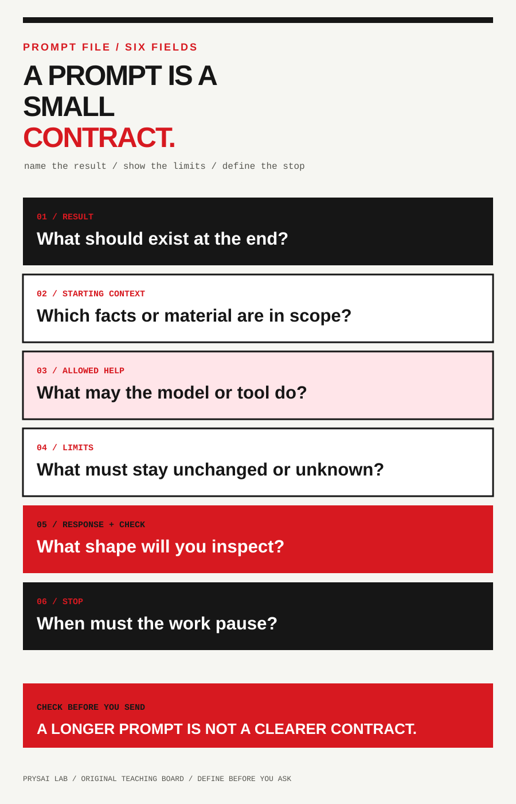
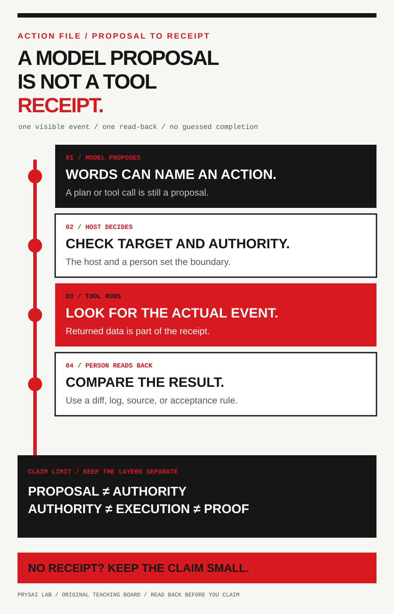

<!-- content_id: llm-fundamentals-guide | locale: DE | language: de | default_locale: EN | translation_status: candidate | translated_from: EN | source_revision: worktree-2026-08-17-foundation-observations -->

# Was ist ein LLM? Was es kann und was nicht

**Einheit:** `core-llm-boundaries`
**Status:** `candidate`. **Laufstatus:** `not_run`.
**Zeit:** etwa 25 Minuten. **Voraussetzung:** keine. Du brauchst weder Codex,
Git, ein kostenpflichtiges Konto noch ein Tool.

Dies ist das Fundament des Playbooks. Bevor du eine Plattform auswählst, eine
Datei verbindest, ein Skill installierst oder einen Agenten handeln lässt,
brauchst du ein einfaches Modell davon, was passiert. Es geht nicht darum,
Abkürzungen auswendig zu lernen. Du sollst erkennen, welche Schicht eine
Behauptung erzeugt, welche Schicht außerhalb des Modells handeln kann und
welche Aufzeichnung die Behauptung prüfbar macht.

Bei jeder neuen KI-Funktion helfen vier Fragen:

1. **Was soll das Modell erzeugen?**
2. **Welcher Kontext wurde für diese Anfrage tatsächlich bereitgestellt?**
3. **Welches Produkt oder Tool kann außerhalb des Modells etwas beobachten oder
   verändern?**
4. **Welche Aufzeichnung würde einer anderen Person die Prüfung ermöglichen?**

Wenn du eine Frage nicht beantworten kannst, behandle das Ergebnis als Entwurf
oder Hypothese. Fülle die Lücke nicht mit einer selbstsicher klingenden Erklärung.

## Das Ergebnis, das du aufbewahrst

Schreibe am Ende eine Erklärungskarte in deinen eigenen Worten und triff zwei
Grenzentscheidungen. Die Karte soll zeigen:

- wie ein Text-LLM aus dem Kontext einer Anfrage generiert;
- was **LLM**, **Token**, **Kontext**, **Prompt**, **Tool**, **MCP**, **Agent**
  und **Skill** für eine sichere erste Aufgabe mindestens bedeuten;
- warum flüssiger Text allein kein Beleg für Wahrheit ist; und
- welche Teile zum Modell, zum Chatprodukt oder zu einem externen Tool gehören.

Das ist eine begrenzte Erklärungsaufgabe, kein Test aller Fähigkeiten eines
KI-Produkts. Plattformspezifische Verfahren kommen später.

## 0.1 Das Arbeitsmodell in einem Satz

Ein modernes Text-LLM ist ein Modell, das Tokenfolgen schätzt und erzeugt.
Viele autoregressive Modelle erzeugen Schritt für Schritt, indem sie aus dem
verfügbaren Kontext das nächste Token vorhersagen. Zusätzliches Training und
Produktschichten formen die Antwort weiter.

Das ist ein nützliches Arbeitsmodell, aber keine vollständige Definition jedes
Sprach-, multimodalen oder eingesetzten Systems, das LLM genannt wird. Es
erklärt, warum ein System Text fortsetzen, übersetzen, zusammenfassen, Felder
extrahieren oder Entwürfe erstellen kann. Es bedeutet nicht, dass jede Ausgabe
wahr ist oder dass alle Produkte dieselben Fähigkeiten haben. **Vorhersagen**
beschreibt die Erzeugung; es sagt nicht, dass das Modell die Welt geprüft, einen
Menschen verstanden oder eine Handlung autorisiert hat. Auch eine hilfreiche
Antwort muss geprüft werden.

## 0.2 Acht Begriffe, klar voneinander getrennt

Das sind Arbeitsdefinitionen für einen sicheren Einstieg. Anbieter verwenden
die Wörter nicht immer genau gleich.

| Begriff | Mindestens nützliche Bedeutung | Was du nicht folgern darfst |
|---|---|---|
| **LLM / Modell** | Gelernte Parameter erzeugen aus einem Eingabekontext eine Antwort. Ein Basismodell erzeugt Text; ein Produkt kann weitere Schichten ergänzen. | Eine verifizierte Datenbank, eine Person oder ein Akteur mit Berechtigung. |
| **Token / Tokenizer** | Ein Tokenizer wandelt Text in modellspezifische Token-IDs und zurück. Ein Token ist oft ein Wortfragment. | Ein universelles Verhältnis von Token zu Wort oder Zeichen. Grenze, Kosten und Geschwindigkeit hängen vom Produkt ab. |
| **Kontext** | Für eine Anfrage verfügbare Information: Anweisungen, Gespräch, bereitgestelltes Material, abgerufene Passagen und gegebenenfalls Tool-Ergebnisse. Ein Produkt kann Suche, Retrieval, Dateien, Speicher oder Tools ergänzen. | Dass alles im Kontext wahr, relevant oder richtig verwendet ist. |
| **Context Window** | Die Menge tokenisierter Ein- und Ausgabe, die ein bestimmtes Modell oder Produkt in einer Interaktion verarbeiten kann; sie bleibt ein **endliches Kontextfenster**. | Eine stabile Zahl für alle Modelle, Konten oder Oberflächen. Ein größeres Fenster ersetzt keine Quellenauswahl und Prüfung. |
| **Prompt** | Anfrage und Material mit Ziel, Einschränkungen und gewünschter Antwortform. | Ein Zauberspruch. Ein längerer Prompt ist nicht automatisch besser. |
| **User-Prompt / System- oder Entwickleranweisung** | Der Nutzer beschreibt die unmittelbare Aufgabe. Der Host kann unsichtbare Anweisungen höherer Priorität anwenden. | Dass Nutzer Hostregeln überschreiben können oder alle Produkte dieselben Ebenen zeigen. |
| **Tool / Retrieval** | Ein Host kann Rechner, Suche, Dateileser, Datenbank oder andere externe Fähigkeiten bereitstellen. Das Modell kann einen Aufruf vorschlagen; Host oder Tool führen ihn aus. | Dass Vorschlag, Schaltfläche oder Zusammenfassung beweisen, dass die Aktion stattfand oder korrekt ist. |
| **MCP / Agent / Skill** | MCP verbindet einen kompatiblen Host mit Kontext oder Tools. Ein Agent ist ein beobachtbarer Ablauf in mehreren Schritten; ein Skill ist ein wiederverwendbares Verfahren. | Universelle Kompatibilität, Vertrauen, sichtbares Denken, Berechtigung oder erfolgreiche Fertigstellung. |

Zwei Unterscheidungen gehören in jede weitere Lektion:

1. **Fähigkeit, Berechtigung und Aufzeichnung sind verschieden.** Eine Aktion vorschlagen,
   sie versuchen dürfen und sie tatsächlich abgeschlossen haben sind drei
   unterschiedliche Beobachtungen.
2. **Eine höhere Schicht repariert nicht automatisch die darunterliegende.** Suche
   kann eine alte Seite liefern, ein Dateitool die falsche Datei lesen, ein Agent
   zu früh stoppen und ein Skill eine ungeeignete Regel enthalten. Jede Schicht
   braucht ihren eigenen Check.

### Häufige Verwechslungen

**Kontext ist kein dauerhaftes Gedächtnis.** Kontext ist, was der Host für diese
Anfrage bereitstellt. Verlauf, Einstellungen, Dateien oder Embeddings können
gespeichert und später abgerufen werden; das ist eine eigene Speicher- und
Retrievalentscheidung. Ein gespeicherter Eintrag kann veraltet, unvollständig
oder diesmal gar nicht im Kontext sein. Prüfe, was jetzt geliefert wurde.

**Retrieval ist ein Evidenzweg, keine Wahrheitsgarantie.** Suche oder RAG wählen
Passagen für den Kontext. Dabei kann die beste Quelle fehlen, eine Kopie oder alte
Version ausgewählt werden. Bewahre URL, Datum und die Zuordnung von Behauptung zu
Quelle auf. Mehr Kontext schafft Kapazität, aber keine Richtigkeit.

**Ein Prompt ist eine Arbeitsvereinbarung, kein Zauber.** Eine erste Anfrage nennt Ergebnis,
Ausgangsmaterial, Grenzen, Antwortform, Prüfung und Stopplinie. Ein zitiertes
Dokument kann nicht vertrauenswürdige Anweisungen enthalten. Behandle gelieferten
Text als Daten, außer die Aufgabe macht ihn ausdrücklich zur Anweisung.

**Ein Tool-Aufruf hat zwei Rollen.** Das Modell kann einen strukturierten Aufruf
vorschlagen. Der Host entscheidet über die Erlaubnis, das Tool führt aus. Notiere
Ziel, Autorität, beabsichtigte Wirkung, Ergebnis und deine anschließende Prüfung.
Ein Toolname in einer Antwort ist keine Ausführungsaufzeichnung.

**MCP verkleinert ein Integrationsproblem, beseitigt aber keine Governance.**
Authentifizierung, Serverimplementierung, Zustimmung, Netzwerkbereich,
Datenabfluss und Ergebnisprüfung bleiben eigene Entscheidungen. „MCP-fähig“
heißt nicht „sicher“ oder „unbegrenzter Zugriff“.

**Ein Agent ist ein prüfbarer Ablauf, keine Person.** Lehre sichtbare Zustände:
Eingang, Plan, vorgeschlagene Aktion, Zustimmung oder Ablehnung, Ergebnis,
Prüfung, Wiederholung, Übergabe und Stopp. Behaupte nicht, einen verborgenen
Gedankengang zu kennen. Das Ende von Text beweist nicht das Ende einer externen Arbeit.

**Ein Skill ist ein Methodenpaket, keine Berechtigung.** Es nennt Anwendung,
benötigte Eingaben, Verbote, Stopbedingungen und die zurückgegebene Aufzeichnung. Das
Laden von Anweisungen verleiht keinen Datei-, Terminal-, Browser-, Konto- oder
Veröffentlichungszugriff.

## 0.3 Was während einer Anfrage geschieht

Für einen einfachen Textaustausch genügt dieses beobachtbare Modell:

```text
deine Anfrage + bereitgestelltes Material
          ↓
der Host stellt Anweisungen und Kontext zusammen
          ↓
das Modell erzeugt eine Tokenfolge
          ↓
der Host zeigt Text oder schlägt einen Tool-Aufruf vor
          ↓
das Tool läuft nur bei erlaubter Autorität
          ↓
eine Person prüft Text, Ergebnis und Grenzen
```

Modelltext kann einen Aufruf beschreiben, ohne dass er ausgeführt wurde. Suche
nach Tool-Ereignis, zurückgegebenen Daten, Dateidiff, Kommandoausgabe oder einer
anderen passenden Aufzeichnung, bevor du eine Aktion als abgeschlossen bezeichnest.

Bei einem Agenten wiederholst du den Check an jeder Grenze:

```text
Zustand beobachtet → Aktion vorgeschlagen → Autorität geprüft → ausgeführt
→ Ergebnis erneut geprüft → Annahmebedingung geprüft → fortsetzen, übergeben oder stoppen
```

Wenn der Zustand nach Timeout oder Unterbrechung unbekannt ist, wiederhole nicht
blind eine Aktion, die senden, veröffentlichen, löschen, bezahlen oder ein Konto
ändern könnte. Lies das Ziel zuerst oder übergib die Unsicherheit einem Menschen.





## 0.4 Ein wenig Geschichte, ohne sie zur Garantie zu machen

Das Paper *Attention Is All You Need* von 2017 stellte die Transformer-Architektur
vor, die viel spätere Sprachmodellarbeit beeinflusste. Attention machte es leichter,
Beziehungen zwischen Tokens in einer bereitgestellten Sequenz zu modellieren, aber
der Kontext wurde nicht unendlich. Moderne Produkte ergänzen Datenauswahl,
Optimierung, Instruction Tuning, Sicherheitskontrollen, Retrieval, Tools und
Oberfläche. Kein historischer Name erklärt das Verhalten jedes heutigen Dienstes.

## 0.5 Was LLMs allein nicht feststellen können

Ein Modell hilft bei klaren Text-zu-Text-Zielen: bereitgestellten Text umschreiben,
ein Konzept erklären, Gliederungen erstellen, Felder extrahieren oder Code vorschlagen,
den du anschließend testest. Das sind nützliche Muster, keine Garantien.

Ohne passende Quelle oder Tool kann es nicht feststellen, ob ein Zitat echt ist,
eine Website noch existiert, eine aktuelle Behauptung stimmt oder eine vorgeschlagene
Aktion stattgefunden hat. Suche kann hinzugefügt werden, aber das gefundene Material
kann veraltet, unvollständig oder falsch sein: **Prüfe Originalquelle und Datum.**

Vor dem Einfügen, Hochladen oder Verbinden von Daten prüfe **was die aktuelle Oberfläche
verlassen darf und wer dies autorisiert hat**. Verwandle einen plausiblen
Entwurf nicht ohne ausdrückliche Grenze und überprüfbare Aufzeichnung in Zahlung, Veröffentlichung,
Löschung, Kontenänderung oder Überzeugung.

Training formt die Parameter vor der Nutzung; die aktuelle Anfrage liefert neuen
Kontext. Ein Cutoff ist keine Livequelle. Für aktuelle Behauptungen brauchst du
eine Quelle, **ein Cutoff allein entscheidet die Frage nicht**. Speicher, Suche,
Datei und Tool sind unterschiedliche Evidenzwege mit eigener Aktualität und Autorität.

## 0.6 Fünf-Minuten-Grenzcheck

Dies ist eine reine Textbeobachtung. Aktiviere keine Suche, lade keine Datei hoch
und gib keine privaten Informationen ein.

Vervollständige zuerst, ohne ein Modell zu fragen:

> Die Stadtbibliothek schließt heute um 18 Uhr.

Schreibe zwei mögliche Fortsetzungen und markiere, welche davon die Aussage stützt.
Korrekt ist: Es werden weder eine zusätzliche Uhrzeit noch ein Grund genannt.
Plausibilität ist kein Beleg.

Sende anschließend nur diese fiktive Mitteilung:

```text
Mitteilung: „Der Club trifft sich Dienstag um 18:00 Uhr. Bring ein Notizbuch mit.
Die Raumnummer wird später bestätigt.“

Aufgabe: Schreibe die Mitteilung für ein neues Mitglied in zwei Sätzen um. Erhalte
jede genannte Tatsache. Setze fehlende Details in [Klammern]. Liste anschließend
die erhaltenen Fakten auf.
Prüfung: Vergleiche jede Aussage mit der Mitteilung. Erfinde keine Raumnummer,
Gebühr, Kontaktangabe, Zusage oder neue Uhrzeit.
Stopp: Nicht browsen, senden, veröffentlichen oder unbekannte Details annehmen.
```

Bewahre die Anfrage und die erste Antwort auf und prüfe:

| Check | Frage |
|---|---|
| Quellenübereinstimmung | Kannst du jede Tatsache in der Mitteilung zeigen? |
| Form | Hat die Antwort zwei Sätze und eine Faktenliste? |
| Unbekanntes | Bleibt die Raumnummer `[unbekannt]`, statt erfunden zu werden? |

Wenn eine Nummer erfunden wird, markiere die Behauptung mit `FAIL`. Eine Antwort
beweist nicht, dass ein Modell immer unzuverlässig ist; sie zeigt eine mögliche
sichtbare Abweichung in einer Aufgabe.

Schreibe außerdem auf, was ein Textmodell über **„Die Stadtbibliothek schließt
heute um 18 Uhr“** vor einer Suche feststellen kann. Die aktuelle Wahrheit braucht
eine Quelle. Bitte erfinde keine Quelle.

### Drei begrenzte Beobachtungen

Die bisherigen Checks sind kleine Demonstrationen, kein Beleg dafür, dass ein
Lernender oder ein Modell bei jeder Aufgabe gleich handelt. Übe dieselben
Grenzen mit den folgenden Protokollen und fiktiven Aufzeichnungen, ohne Konto,
private Daten, Tools oder Netzwerkanfragen zu verwenden (der vollständige Text
ist derzeit nur auf Englisch verfügbar):

- [Context change and unknowns (Kontextänderung und Unbekanntes)](../../evals/candidates/core-course-v1/observations/context-change-and-unknowns.md) — Vergleiche zwei Versionen der Eingabe, markiere jede Aussage mit `PASS`, `FAIL` oder `UNSURE` und lasse die Raumnummer unbekannt.
- [First-request contract and controlled repeat (Vertrag der ersten Anfrage und kontrollierte Wiederholung)](../../evals/candidates/core-course-v1/observations/first-request-contract.md) — Notiere Ziel, Material, Grenzen, Antwortform und Stoppbedingung vor der Antwort; falls eine sichere Textoberfläche vorhanden ist, wiederhole dieselbe Anfrage zweimal und halte Gemeinsames und Unterschiede fest.
- [Tool boundary, authority, and evidence (Toolgrenze, Autorität und Evidenz)](../../evals/candidates/core-course-v1/observations/tool-boundary-authority-evidence.md) — Trenne vorgeschlagene Handlung, erteilte Autorität, Tool-Ausführung und Evidenz aus dem Read-back.

Jedes Protokoll verlangt das erste Ergebnis vor einem Hinweis und erfasst Hilfe,
Unbekanntes und die Stoppregel. Der Status ist `candidate / not_run`: Eine spätere
Durchführung kann nur die genannte Aufgabe, die Bedingungen und die Rubrik
beschreiben. Sie beweist weder Kurswirksamkeit, Prompt-Überlegenheit,
Modellqualität, Behalten, allgemeinen Transfer, Plattformgleichheit noch
Produktionsreife.

### Ein tragbares Muster für die erste Anfrage

Fülle bei einer risikoarmen echten Aufgabe diese sechs Zeilen aus:

```text
Ergebnis: [ein beobachtbares Ergebnis]
Ausgangskontext: [Fakten oder Text, den ich liefere]
Erlaubte Hilfe: [was das Modell tun darf]
Grenzen: [was gleich bleiben muss oder nicht passieren darf]
Antwort und Check: [prüfbare Form und meine Prüfmethode]
Stopp: [fehlende Eingabe, Autorität, Quelle oder Evidenz]
```

Nutze am Anfang fiktiven oder nicht sensiblen Kontext. Bitte zuerst um Entwurf
oder Klassifikation, bevor du ein Tool verlangst. Bewahre Anfrage und Antwort auf;
sonst ist nicht erkennbar, ob eine spätere Umschreibung repariert oder verdeckt hat.

## 0.7 Der einzige Abschlusscheck dieser Einheit

Schreibe ohne Kopieren dieser Seite eine Karte:

```text
Meine Erklärung:

LLM-Grenze:
Token- oder Kontextgrenze:
Grenze zwischen Prompt, Produkt und Tool:
Grenze zwischen Kontext und Speicher:
Grenze zwischen Tool, MCP, Agent und Skill:
Ein Grund, warum eine flüssige Antwort falsch sein kann:

Entscheidung 1 (belegt / nicht belegt):
Beleg:
Entscheidung 2 (Modell / Produkt / Tool):
Beleg:
```

`0` behandelt flüssigen Text als Beweis, schreibt dem Modell Autorität zu oder
hat keinen Beleg. `1` erwähnt kontextbasierte Erzeugung, lässt aber eine Grenze
oder den Prüfgrund offen. `2` verwendet eigene Worte, trennt Modell und Produkt
oder Tool und nennt einen Prüfgrund für diese Aufgabe.

Bewahre Karte, erste Antwort und einen Satz über das Unbekannte auf. Behaupte aus
diesem Selbstcheck weder Lernerfolg noch Kursabschluss. Weiter geht es mit
[Kapitel 1: Verstehe GPT, bevor du Codex vertraust](../chapters/01-gpt-and-codex-DE.md).

## Quellen und Grenzen

Diese Lektion ist eine originäre, allgemeinverständliche Neufassung. Es wurden
keine Quellensätze, Prompts, Diagramme oder Modellausgaben kopiert. Prüfdatum
dieser Überarbeitung: 2026-08-17.

- Microsoft Learn, [LLM fundamentals](https://learn.microsoft.com/en-gb/agent-framework/journey/llm-fundamentals) — Konzepte und Grenzen; produktbezogene Anleitung.
- Anthropic, [Claude glossary](https://platform.claude.com/docs/en/about-claude/glossary) — Token- und Kontextbegriffe; veränderliche Produktinformation.
- Model Context Protocol, [Specification](https://modelcontextprotocol.io/specification/2025-06-18) — Protokollumfang; beweist keine Host- oder Serverkonfiguration.
- OpenAI, [Prompt engineering](https://platform.openai.com/docs/guides/prompt-engineering) — Anleitung eines Anbieters; keine plattformübergreifende Garantie.
- Vaswani et al., [Attention Is All You Need](https://arxiv.org/abs/1706.03762) — historische Transformer-Arbeit.
- NIST, [AI 600-1 Generative AI Profile](https://nvlpubs.nist.gov/nistpubs/ai/NIST.AI.600-1.pdf) — Risiko- und Informationsintegritätskontext; kein Produkttest.
- 3Blue1Brown, [Attention in transformers](https://www.3blue1brown.com/lessons/attention) — unabhängige visuelle Erklärung.

Veränderliche Produktfakten brauchen in ihrem eigenen Quellenregister URL,
Zugriffsdatum, Geltungsbereich, Verantwortliche und nächste Prüfung. Diese Seite
behauptet weder ein bestes Modell noch universelles Verhalten, Lernerfolg,
Behalten, Transfer oder Produktionsreife. Die Übersetzung ist `candidate` und
braucht weiterhin unabhängige Sprachprüfung und einen Lauf mit Lesenden.
