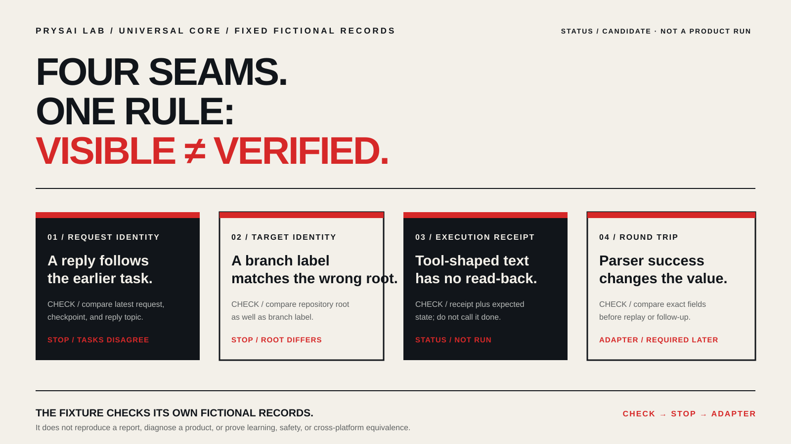

<!-- content_id: universal-core-foundations-route | locale: ZH | language: zh-CN | default_locale: EN | translation_status: in-progress | translated_from: EN | source_revision: worktree-2026-08-15 -->

# 通用 LLM 协作：先做一个安全的小任务，再掌握四个基础

状态：`candidate`。运行状态：`not_run`。

如果你想先在普通文字聊天中完成一件小事，还没必要先研究某个平台的设置，就从这里开始。下面的第一次练习可以直接在文字聊天里完成；它不会把 ChatGPT、Claude、Grok、Gemini、Codex 或其他产品当成同一种产品。这条路线只提炼一层跨平台通用的判断方法：把任务讲清楚、只提供必要材料、写明如何检查，并设定停止点。它不表示各个平台共享工具、权限、记忆、账号、价格或 Agent 行为。

## 现在就做一个安全小任务

只使用下面的虚构通知。不要粘贴私人聊天、客户资料、密码或令牌、未公开内容或真实文件。这次练习不需要浏览、使用工具、上传、修改账号、发送或发布内容。

把下面这段请求复制到你选择的文字聊天中：

```text
目标：把这则虚构社团通知改写给新成员看。
材料：“社团每周二 6 点见面。请带一本笔记本。房间稍后确认。”
输出形式：写两句话。保留所有已经说明的事实；缺失的细节用 [方括号] 标出。然后列出你保留了哪些事实。
检查：把原文和改写并排比较。不得新增时间、房间、费用、联系人或承诺。
停止：不要浏览、发送、发布，也不要猜测未知细节。
```

然后亲自检查三点：

1. 改写中的每个说法，都能在原通知里找到依据吗？
2. 回答有没有遵守“两句话”的限制，并列出保留的事实？
3. 有没有把应该继续保持未知的细节写成事实？

如果第三项的答案是“有”，就删掉新增细节，或只要求它改正这一处。如果聊天工具主动提出搜索、发送、发布、调用工具，或要求提供这项练习不需要的材料，先停下来。这段回答读起来通顺，不等于事实正确，也不等于这套做法已经在每个平台上验证过。

这是一个候选练习，不是万能提示词，也不是效果结论。它没有跨模型运行、学习者或效果证据。想再练几张文字聊天起步卡，可以阅读[新手提示卡：把话说清](../communication-clinic-ZH.md)。

## 再用四个基础单元理解刚才的练习

完成一次尝试后，再看下面四个单元，理解为什么一个小任务也需要目标、材料、检查和停止线。任务一旦不再是纯文字交流，这四个判断会更重要。

1. [**把一个想法写成任务契约**](../chapters/03-task-protocol-ZH.md#core-task-contract)——写明结果、相关背景、行动边界、验收、停止规则和交接方式。
2. [**让主张对应证据，并按边界恢复**](../chapters/09-verification-and-recovery-ZH.md#core-evidence-recovery)——只验证眼前这个小主张；遇到第一层证据不足就停下来。
3. [**规划一个带证据的最小切片**](../chapters/10-planning-and-slicing-ZH.md#core-evidence-bearing-slice)——选择别人能检查、也能继续完成的最小结果。
4. [**分清能力、授权、确认与证据**](../chapters/13-action-boundaries-ZH.md#core-action-boundary)——能做，不等于被允许做，更不等于已经做成或已经验证。

涉及特定产品的操作请放进对应的平台适配器；具体领域练习请放进应用路线。

## 先练一个关键边界，再选平台

本路线配套的[通用边界固定练习](../../examples/universal-seam-v1/README-ZH.md)包含四条虚构记录，分别对应“最新请求不一致”“目标错误”“缺少工具执行记录”和“结构化值被改动”。对每条记录，先指出现有文字没能证明什么，再选择最小且安全的检查；一旦需要真实平台行为，就先停下来，等待平台适配器说明。练习说明会保持在中文路径；固定数据本身仍是共享的虚构材料。



该练习的验证器只检查固定虚构记录是否自洽：`verified_in_fixture` 不等于产品实际运行，`not_run` 不等于已有执行证据；要从 `inferred`（根据现有材料推断）走向真实诊断，仍需要平台适配器。它不会新增章节、实验、Skill、模型评测或兼容性主张。

## 这条路线能证明什么

这张路线图只能证明：每项内容的教学归属明确、锚点稳定、引用有效、依赖没有环、路线投影足够精简。练习验证器也只能证明它的数据契约。两者都不能证明平台行为、学习者或迁移效果、安全结果，或真实产品运行。
