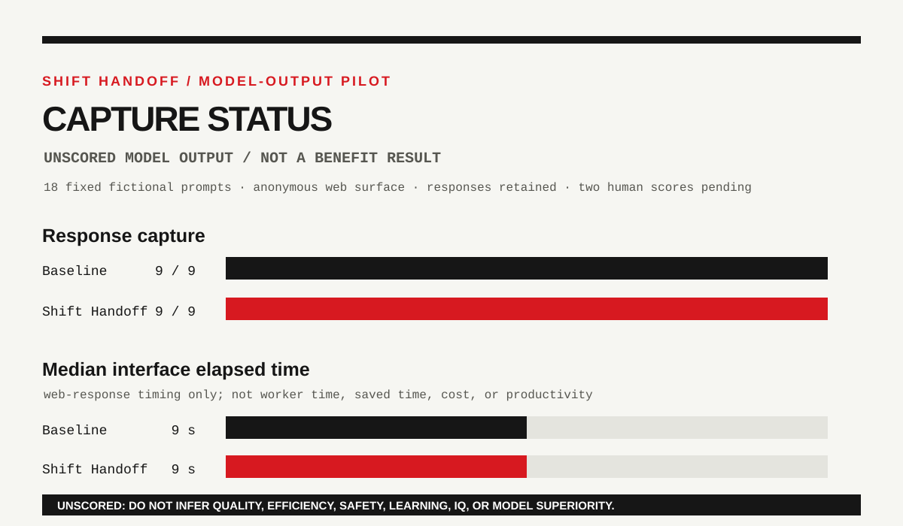

# Shift Handoff pilot capture — 2026-08-15

**Status:** `candidate / captured_unscored`
**Owner:** evaluation-maintainer
**Candidate SHA:** `a99d0adae1b8211bd9a1870fc7fc02c021790046`
**Fixture:** [shift-handoff-v1](../../evals/candidates/shift-handoff-v1/README.md)
**Raw evidence:** [captured model-output packet](../../evals/results/shift-handoff-pilot-chatgpt-anonymous-2026-08-15/README.md)

## What happened

A collection round sent the declared fictional prompts from the prepared packet
manifest to the anonymous `chatgpt.com` web surface. The maintainer reports a
fresh conversation for each run. All 18 pre-specified packets, executed in a
randomized order, returned one captured response: 9 baseline and 9 Shift
Handoff. This is not a random sample of tasks, people, models, or real work.

The visible selector said `ChatGPT`; the anonymous page did not reveal a
versioned model identifier. The interface was Chinese-language. No files,
browsing, tools, or external actions were provided to or invoked by the model.

| Condition | Captured responses | Interface elapsed range | Median interface elapsed |
| --- | ---: | --- | ---: |
| Baseline | 9/9 | 8–10 seconds | 9 seconds |
| Shift Handoff | 9/9 | 7–9 seconds | 9 seconds |

The displayed timing is only the observed browser interval between send and a
stable captured response. It is not a measure of human effort, time saved,
cost, productivity, quality, safety, accuracy, learning, IQ, or model
capability.

## Integrity notes

Three earlier local preflight attempts were excluded before a prompt was
submitted: one selected the page's hidden fallback textarea, and two rejected
browser newline normalization during exact-input checking. They produced no
model response and are retained in the raw log so the successful 18-packet
round is not presented as seamless.

The final run used a packet manifest with seed `2026081503`; its SHA-256 is
`58c7ef6f98a116d353126a58c8b6dca574699b3bf23749b979167683aa523c14`.
Every included response is preserved with an individual response SHA-256 in
`run-log.json`. A subsequent integrity review found that the v1 prompt hash
was calculated before Windows line-ending conversion, so the declared prompt
hashes do not bind the prepared file bytes. The raw collection record is
preserved; see the [input-integrity review](../../evals/results/shift-handoff-pilot-chatgpt-anonymous-2026-08-15/input-integrity-review.md).

## What remains open

This is evidence that one reported collection procedure captured model outputs
under one declared surface. It is not a scored comparative result. Its v1
input-byte mismatch makes it ineligible for comparative scoring or aggregate
analysis. Q-002 remains open because the required evidence is still missing:

1. Two independent human scores per response using the frozen rubric;
2. preserved scorer disagreement and a declared resolution rule;
3. a review of the exposed model-version limitation;
4. a threshold decision before any upgrade claim.

The repository now also includes a condition-blind review-packet generator and
its [scoring handoff procedure](shift-handoff-blind-score-packet-v1.md). Its
local output is ready for two independent reviewers, but it contains no human
score yet and does not alter the boundaries above.

Do not use this record to claim that Shift Handoff improved a model, made a
person faster, increased efficiency, improved safety, or changed IQ.
