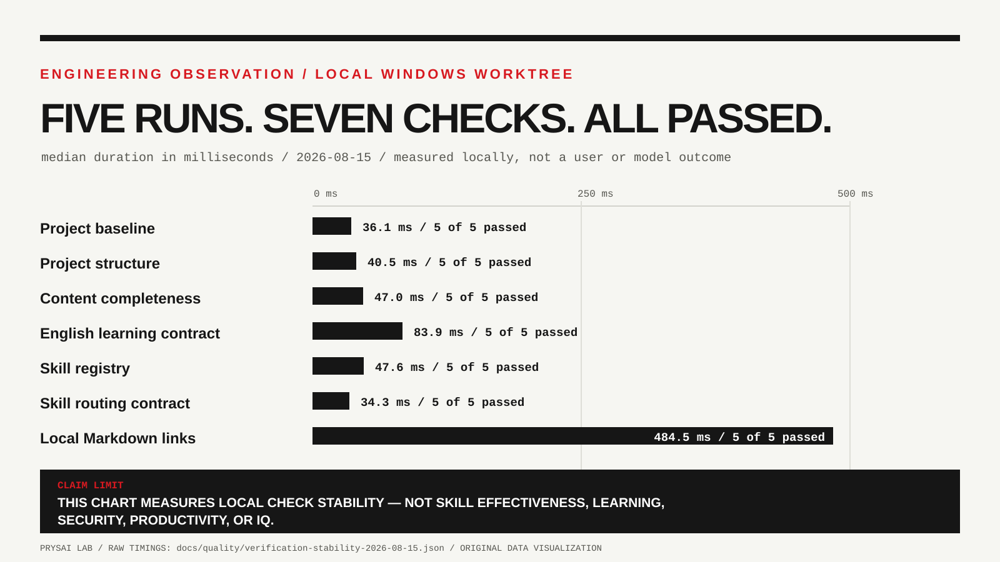

<!-- content_id: verification-stability-2026-08-15 | locale: JA | language: ja | default_locale: EN | translation_status: in-progress | translated_from: verification-stability-2026-08-15.md | source_revision: 2026-08-15 -->

# ローカル検証を5回繰り返した記録

**状態：**候補段階のエンジニアリング観測

**記録日：**2026-08-15（America/Los_Angeles）  
**データ：**[機械可読な実行時間](verification-stability-2026-08-15.json) · [グラフ](verification-stability-2026-08-15.svg)

## 実際に観測したこと

現在の Windows ワークツリーで、リポジトリのローカルチェック7項目を同じ順番で5回連続実行した。どの回も正常終了した。グラフには各チェックの実行時間の中央値を示し、表には5回分の生データを残している。要約だけを信じずに、元の値を確認できるようにするためだ。

スマートフォンでは下の表で正確な値を確認してほしい。Reader ではこの情報量の多いグラフを名前付きリンクとして表示し、全体サイズで開けるようにしている。小さな画面で読める文字だと誤解しないためである。

| チェック | 成功回数 | 生データ（ms） | 中央値（ms） | 平均（ms） |
| --- | ---: | --- | ---: | ---: |
| プロジェクトのベースライン | 5 / 5 | 48.9, 38.3, 36.1, 34.4, 35.1 | 36.1 | 38.6 |
| プロジェクト構造 | 5 / 5 | 43.2, 42.3, 40.5, 39.1, 39.5 | 40.5 | 40.9 |
| コンテンツ完全性 | 5 / 5 | 49.4, 47.5, 46.9, 47.0, 44.7 | 47.0 | 47.1 |
| 英語版の学習契約 | 5 / 5 | 86.8, 83.8, 84.5, 83.1, 83.9 | 83.9 | 84.4 |
| Skill レジストリ | 5 / 5 | 49.7, 47.4, 47.6, 48.2, 47.4 | 47.6 | 48.1 |
| Skill ルーティング契約 | 5 / 5 | 34.2, 35.2, 35.4, 34.0, 34.3 | 34.3 | 34.6 |
| ローカル Markdown リンク | 5 / 5 | 498.1, 496.1, 474.8, 473.9, 484.5 | 484.5 | 485.5 |

## ここから分かること、分からないこと

これは有用なエンジニアリング上の証拠だ。指定した7項目のチェックは、連続5回のローカル実行で安定して成功した。この小さなサンプルでは、リンク監査に最も時間がかかった。ただし、本やモデル、Skill のベンチマークではない。

特に、この数値から「読者の学習が速くなった」「Skill が生産性を上げた」「モデルが安全または正確になった」「誰かの IQ が変化した」とは言えない。このリポジトリには検証済みの心理測定法も、資格を持つ評価者も、そのような主張を支える倫理的根拠もない。IQ はここでの運用指標ではない。

別の [Shift Handoff パイロット計画](shift-handoff-pilot-protocol-v1.md)では、もっと限定したプロセス結果を観測するために必要な条件を定めている。承認済みで匿名化された実行記録がそろい、独立した採点者が確認するまでは、初期状態は `candidate / not_run` のままだ。

## この観測を再現する

[AGENTS.md](../../AGENTS.md) に記載したプロジェクト環境を使い、JSON ファイルに列挙された7つのコマンドを同じ順番で5回実行する。完全な出力、終了コード、コミット識別子、OS、ランタイム、ローカルワークツリーの状態を保存する。異なるマシンの実行時間を生産性の点数として比較してはいけない。クリーンチェックアウトや CI との比較は新しい観測であり、この観測の続きではない。

## 証拠の範囲

この観測が扱うのは、指定した静的チェックと構造チェックだけである。チェックに通っても、学習者の理解、Skill のランタイム動作、自動トリガー、出典の意味、翻訳品質、ブラウザー動作、デプロイ、安全性、有用性、公開準備が証明されるわけではない。
