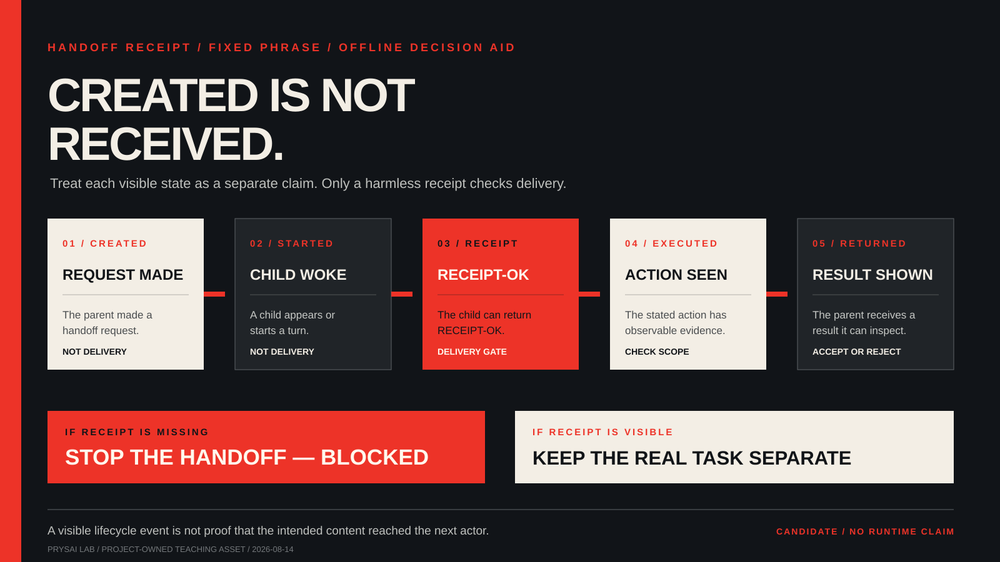

<!-- content_id: field-case-agent-handoff-receipt-2026-08-14 | locale: ZHTW | language: zh-TW | default_locale: EN | translation_status: in-progress | translated_from: field-case-agent-handoff-receipt-2026-08-14.md | source_revision: 2026-08-23 -->

# 現場案例：建立子代理，不代表已收到任務回執

## 先確認缺少哪個檢查點

在任務清單中看到子代理出現，不代表你知道它已經收到工作。在委派真實任務前，請分開記錄以下檢查點：

1. 交接請求已建立；
2. 接收端代理已啟動或被喚醒；
3. 接收端代理能出示無害的任務回執；
4. 接收端代理完成了所述行動；以及
5. 父流程收到可以檢查的結果。

只有第三個檢查點能證明內容已送達。如果缺少它，就將交接標記為 `blocked`，停止透過這條路徑傳送真實工作，改用單一代理或人工交接。本頁是離線決策輔助：它不會建立代理、傳送訊息、檢查工作階段，也不會診斷產品。



## 案例身分

- `case_id`：`FC-HANDOFF-01`
- `title`：建立子代理，不代表已收到任務回執
- `problem`：父工作流程看似建立了子代理，但接收端可能無法看見任務本文。
- `audience`：在多步驟、具工具的程式設計環境中學習的初學者與審閱者
- `collected_at`：2026-08-14
- `owner`：research-maintainer
- `content_status`：`candidate`
- `related_chapters`：第 10 章；第 12 章
- `related_labs`：Lab 013
- `related_skills`：Task Protocol；Evidence Review
- `related_evaluations`：未分配

## 來源紀錄

- `source_type`：`github_issue`
- `source_url`：https://github.com/openai/codex/issues/37822
- `source_title`：關於代理交接顯示已建立、卻沒有可見任務回執的公開報告
- `source_author_or_publisher`：公開 GitHub 報告者
- `accessed_at`：2026-08-14
- `source_license_or_usage_boundary`：僅供參考的公開報告；本案例使用原創摘要與虛構離線夾具
- `quotation_policy`：未複製 Issue 原文、指令、紀錄、螢幕擷圖、附件、帳號、專案路徑、供應商設定或重現檔案
- `source_scope`：存取時，Issue 中繼資料顯示這是一份公開且處於 Open 狀態的報告。它只能說明一名作者在所述環境中的描述與預期，不能證明根因、目前產品行為、普遍性、受支援的解法，也不能推論其他帳號、版本、供應商、工作流程或平台的行為。

## 報告情況

- `user_report_summary`：一名公開報告者描述父流程向子代理交接的情況：子代理看似已啟動，卻像沒收到任務一樣回覆。報告者表示，這項症狀出現在不只一個指定的工作介面與設定中。
- `observed_symptom`：報告中的子任務可見或處於作用中，但子代理的回覆沒有證明它收到預期的任務文字。
- `expected_behavior`：報告者預期子代理會收到父流程提供的任務訊息並據此行動。
- `official_boundary`：`unknown`。本案例不說明產品內部機制、目前能力支援、設定或修正方法。
- `product_surface`：報告涉及桌面版與 CLI；本專案沒有重現任何一方。
- `product_version`：來源報告了版本與設定，但本案例沒有獨立核驗這些事實。
- `operating_system`：來源作者報告了一個平台；本專案沒有檢查該平台。
- `model_or_provider`：來源涉及自訂供應商環境；本專案不比較供應商。
- `network_or_auth_context`：未檢查；沒有使用帳號、憑證、供應商或連線。
- `input_shape`：僅使用虛構的固定短語回執檢查；不含真實任務、儲存庫、檔案、秘密或使用者內容。
- `risk_level`：若真實工作流程在確認回執前委派不可逆行動或敏感內容，則為 `medium`

## 主張與證據表

| 主張 | 證據類別 | 來源或產物 | 日期 | 範圍 | 限制 | 狀態 |
|---|---|---|---|---|---|---|
| 存取本案例時，公開 Issue #37822 存在且處於 Open 狀態。 | `direct` | [GitHub Issue #37822](https://github.com/openai/codex/issues/37822) | 2026-08-14 | 公開 Issue 中繼資料 | Open 狀態不能證明存在活躍缺陷、優先級、可重現性或根因仍未解決。 | candidate |
| 一名報告者描述子代理被建立或喚醒，卻沒有可見任務回執。 | `reported` | 同一份公開 Issue | 2026-08-14 | 一名作者所述的環境與觀察 | 這份報告不是獨立重現，也不是普遍行為主張。 | candidate |
| 訊息因某個特定內部欄位或解密路徑而遺失。 | `not_observed` | 沒有本地來源、執行階段或獨立審閱 | 2026-08-14 | 產品內部機制與診斷 | 不把報告者對機制的推測採納為專案事實。 | unverified |
| 建立、喚醒、回執、執行與返回是值得分開記錄的斷言。 | `project_inference` | 本案例；第 10 章；第 12 章；Lab 013 | 2026-08-14 | 保守的多步驟工作流程教學 | 這不能保證交接實作、發現所有失敗，或證明代理適合安全使用。 | candidate |

## 重現狀態

- `reproduction_status`：`not_run`
- `reproduction_scope`：本專案沒有呼叫交接工具、建立子代理、檢查紀錄、讀取工作階段、使用供應商或執行報告中的環境。
- `fixed_input_or_fixture`：**教學轉換**中的原始離線回執卡。
- `logs_or_artifacts`：若之後批准授權的學習者執行，可保留一張已完成的虛構檢查點卡與有界決策回執
- `independent_reviewer`：待定
- `last_checked_at`：2026-08-14
- `root_cause_status`：`unknown`

## 最小安全診斷路徑

| 步驟 | 唯讀檢查或低風險行動 | 預期觀察 | 停止規則 |
|---|---|---|---|
| 1 | 閱讀固定的虛構交接卡，並標出每個已觀察檢查點：已建立、已啟動、回執、執行、返回。 | 不會把可見狀態悄悄升級成任務回執。 | 若引入真實任務、私有內容、工具呼叫、帳號或設定，立即停止。 |
| 2 | 當卡片只有建立狀態與泛化的子代理回覆時，將回執欄位標為 `not_observed`。 | 交接分類為 `blocked`；不接受任何結果。 | 不要推斷缺陷、權限不足或安全的重試條件。 |
| 3 | 選擇後備方案：一個有界的單一代理任務，或可供人閱讀的人工交接。 | 下一步有明確負責人，不依賴隱藏的送達假設。 | 在建立代理、傳送訊息、修改供應商設定或重試真實副作用前停止。 |

- `allowed_actions`：閱讀虛構紀錄、分類觀察、寫下本地回執，以及選擇不委派的後備方案
- `forbidden_actions`：建立或喚醒代理、傳送任務、暴露秘密、讀取紀錄或工作階段、修改供應商或功能開關、重試副作用、安裝軟體、提交、推送、發佈或使用帳號
- `minimal_safe_probe`：使用固定短語 `RECEIPT-OK` 完成五項檢查點卡
- `stop_condition`：任何以真實任務取代固定短語的嘗試、後備方案沒有負責人，或任何未經審閱的外部副作用
- `rollback_or_cleanup`：若本地暫存回執不含有用的決策紀錄，就刪除它；虛構夾具保持不變

## 教學轉換

- `learner_problem`：工作流程面板顯示有一個助手，但學習者無法判斷助手是否收到任務。
- `core_concept`：生命週期可見性不等於訊息送達。可信的交接必須在信任執行前設置回執邊界。
- `decision_to_teach`：要麼在另一個已核准的任務前先使用無害回執探針，要麼在沒有回執時把工作交給單一代理或人類。第一種方案增加一個檢查點；第二種可能較慢。兩者都不憑空製造送達證據。
- `smallest_experiment`：只使用本頁的原始離線卡片：

  ```text
  handoff_id: demo-01
  parent_request: "準確返回：RECEIPT-OK"
  visible_status: child created; child started
  child_reply: "等待分配任務。"
  receipt_observed: no
  execution_observed: no
  result_returned: no usable task result
  ```

  不執行工具，完成下方這張有界決策回執：

  ```text
  created: observed
  started: observed
  receipt: not_observed
  execution: not_observed
  returned_result: not_accepted
  decision: blocked — 使用單一代理或人工交接
  external_actions: not_run
  ```

- `intentional_failure`：把 `created` 當成送達證明、要求子代理猜測遺失的任務、在缺少回執後傳送真實任務，或把報告描述為已確認的產品缺陷。
- `required_artifact`：完成的回執、一句話說明哪個檢查點未觀察到，以及一個附有負責人的後備方案
- `acceptance`：回執區分全部五個檢查點；將訊息回執標為未觀察到；不寫根因或設定；拒絕傳送真實工作；寫明後備方案；並記錄 `external_actions: not_run`。
- `transfer`：把同一張檢查點卡套用到佇列工作器、Webhook、核准系統、建置管線或團隊工單。不變的是：可見的生命週期事件不等於預期內容已抵達下一位執行者。
- `forbidden_claims`：目前 Codex 缺陷、內部機制、受支援設定、安全重試、已重現執行結果、代理能力保證、學習者能力、遷移成功、安全有效性或已可供生產使用

## 內容位置

- `primary_chapter`：[第 10 章——規劃與切片](../../book/chapters/10-planning-and-slicing-ZHTW.md)
- `supporting_chapters`：[第 12 章——Agent 迴圈與停止](../../book/chapters/12-agent-loop-and-stop-ZHTW.md)；[第 9 章——驗證、懷疑與復原](../../book/chapters/09-verification-and-recovery-ZHTW.md)
- `primary_lab`：[Lab 013——垂直切片](../../book/labs/lab-013-l3-vertical-slice-ZHTW.md)
- `supporting_labs`：[Lab 007——行動邊界](../../book/labs/lab-007-action-boundaries-ZHTW.md)；[Lab 016——副作用邊界](../../book/labs/lab-016-side-effect-boundary-ZHTW.md)
- `related_skill`：[Task Protocol](../../skills/prysai-task-protocol/SKILL.md)；[Evidence Review](../../skills/prysai-evidence-review/SKILL.md)
- `evaluation_fixture`：未分配
- `update_registry_entry`：來源變化、承認官方產品邊界、提出受控的本地重現或要求可執行的交接練習時複查

本案例讓一個較早的公開訊號可被搜尋，並賦予它安全的教學形式。它不會改變關聯章節、實驗、Skill 或評測的成熟度。

## 隱私、權限與維護

- `personal_data_removed`：是；練習為虛構內容，不重用來源身分
- `secrets_removed`：是；沒有使用憑證、帳號、供應商、專案路徑、任務內容或工作階段內容
- `private_paths_removed`：是
- `copyrighted_material_boundary`：僅使用原創摘要與原創虛構卡片；未複製 Issue 原文、指令、紀錄、附件、螢幕擷圖或答案
- `asset_register_entry`：S89，見 `docs/sources/asset-register.md`
- `volatile_facts`：Issue 狀態、產品支援、交接行為、版本、供應商、權限與實作細節
- `next_review`：2026-09-14，或在提出任何產品、執行階段、設定或發佈主張之前
- `change_trigger`：來源變化、官方文件承認、提議的線上練習，或要求加入可執行的交接
- `owner`：research-maintainer

## 主張邊界

- `what_can_be_claimed`：一份較早的公開報告現在被呈現為有界案例，包含來源類型、症狀、證據類別、重現狀態、離線診斷路徑與停止條件。
- `what_must_not_be_claimed`：報告目前仍成立或可重現；所有交接都受影響；根因已知；某項設定能修復它；子代理收到了隱藏訊息；離線卡片能發現所有失敗；或學習者完成了真實委派。
- `next_smallest_check`：經獨立審閱並取得同意後，在指定環境執行固定回執探針。必須使用無害短語，不收集工作階段、儲存庫、憑證、帳號、私有任務或個人資料，並在任何副作用前停止。
- `current_status`：`candidate`
