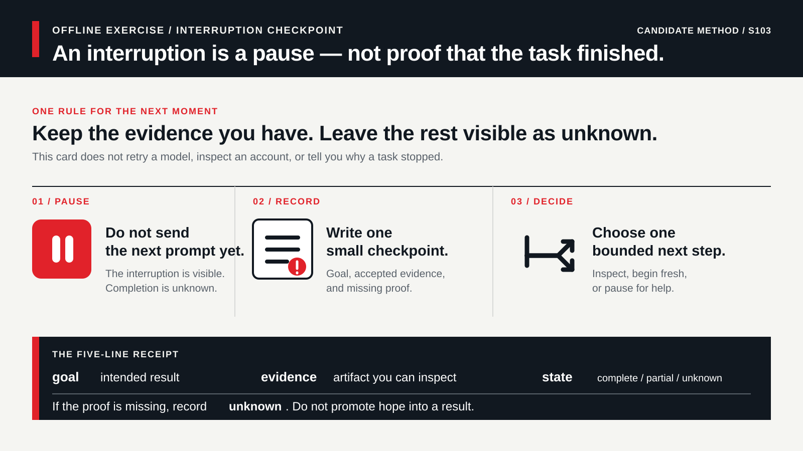

# Field case: Pause before retrying an interrupted task

## Start here: do not make the interruption invisible

When a selected model becomes unavailable, it is tempting to send the next
prompt, switch something, or assume that the task nearly finished. Pause
instead. Before starting another attempt, make a tiny checkpoint that separates
what you know from what you hope happened:

1. Write the goal in one sentence.
2. Keep the last artifact you can actually inspect, such as a diff, test
   result, note, or the fact that no artifact is available.
3. Mark every missing result `unknown` rather than filling the gap with a
   reassuring story.
4. Choose one bounded next step only after you can say whether the previous
   task was complete, partial, or unknown.

This page is an offline decision exercise. It does not send a prompt, retry a
model, change a model, inspect an account, or establish how any provider will
behave. Its purpose is more modest: an interruption should leave a reviewable
receipt before it becomes another task.



## Case identity

- `case_id`: `FC-CAPACITY-01`
- `title`: Pause before retrying an interrupted task
- `problem`: A task is interrupted by an unavailable-model message, and the
  learner must avoid treating an unobserved result as a completed task.
- `audience`: beginners and reviewers using a model-assisted work surface
- `collected_at`: 2026-08-14
- `owner`: research-maintainer
- `content_status`: `candidate`
- `related_chapters`: Chapter 6; Chapter 9; Chapter 19
- `related_labs`: Lab 001; Lab 013
- `related_skills`: Interruption Checkpoint; Task Protocol; Evidence Review; LLM Comparison Protocol
- `related_evaluations`: `three-task-smoke-v1` is linked as a `not_run` fixture

## Source record

- `source_type`: `github_issue`
- `source_url`: https://github.com/openai/codex/issues/33865
- `source_title`: A public report about a selected model becoming unavailable
- `source_author_or_publisher`: public GitHub issue author
- `accessed_at`: 2026-08-14, as recorded in [the capacity field signal](field-signal-model-capacity-budget-2026-08-14.md)
- `source_license_or_usage_boundary`: reference-only public report; this case
  uses an original summary and a fictional offline fixture
- `quotation_policy`: no issue prose, comments, logs, account details, model
  names, machine details, command output, workaround, screenshot, or task
  payload is copied
- `source_scope`: the issue establishes that one person made a dated public
  report about an unavailable selected model. It does not establish a cause,
  prevalence, current availability, retry behavior, service policy, queue
  semantics, fix, or behavior on another surface, account, model, or provider.

The linked field signal also records an official API rate-limit guide. That
guide documents an API boundary only. It is not evidence that an API rate limit
explains this Codex report or that the two surfaces behave alike.

## Reported situation

- `user_report_summary`: A public issue author reported being unable to use a
  selected model because of a capacity-related message in a stated context.
- `observed_symptom`: The source reports that the selected model was
  unavailable before the author had a complete task result.
- `expected_behavior`: The author expected the chosen model to be available
  for the intended task; that expectation is not a vendor promise.
- `official_boundary`: `unknown` for this reported Codex event. The linked API
  documentation describes its own rate-limit boundary, not this event.
- `product_surface`: CLI, as reported; not reproduced here
- `product_version`: not established as a verified fact in this case
- `operating_system`: not established as a verified fact in this case
- `model_or_provider`: intentionally omitted; this is not a model comparison
- `network_or_auth_context`: not inspected; no account or entitlement was used
- `input_shape`: a bounded local editing task with a stated acceptance check
- `risk_level`: `medium` when later prompts could act on an unclear local state

## Claim and evidence table

| Claim | Evidence class | Source or artifact | Date | Scope | Limitation | Status |
|---|---|---|---|---|---|---|
| One public author reported an unavailable selected model in a Codex context | `reported` | [GitHub issue #33865](https://github.com/openai/codex/issues/33865) | 2026-08-14 | One dated public report | It is not a reproduction, diagnosis, prevalence measure, or support guarantee | candidate |
| OpenAI's API documentation describes request-rate limits and response headers for its API | `official` | [Rate limits](https://platform.openai.com/docs/guides/rate-limits), as bounded in the [field signal](field-signal-model-capacity-budget-2026-08-14.md) | 2026-08-14 | API documentation only | It does not identify the cause of this report or define Codex behavior | candidate |
| The interrupted task completed, partially completed, or can be resumed safely | `not_observed` | No local task, retry, account, model, or artifact was inspected | 2026-08-14 | This repository | Absence of evidence is not evidence that no work occurred | unverified |
| A learner should preserve an explicit checkpoint before sending a later prompt | `project_inference` | This offline case; Chapters 6 and 9; `three-task-smoke-v1` | 2026-08-14 | Conservative learning method | It cannot guarantee recovery, preserve context, or prevent an interruption | candidate |

## Reproduction status

- `reproduction_status`: `not_run`
- `reproduction_scope`: This project did not select a model, send a task,
  inspect an account, retry a request, change a setting, or obtain service
  telemetry.
- `fixed_input_or_fixture`: The original fictional record in **Teaching
  conversion** below.
- `logs_or_artifacts`: a learner-created checkpoint receipt only, if an
  independently reviewed offline run is later approved
- `independent_reviewer`: pending
- `last_checked_at`: 2026-08-14
- `root_cause_status`: `unknown`

## Smallest safe diagnostic path

| Step | Read-only check or low-risk action | Expected observation | Stop rule |
|---|---|---|---|
| 1 | Stop the fictional task and copy the goal, last visible artifact, and acceptance check into a local receipt. | The goal is separate from any unobserved result. | Stop if the goal, artifact class, or acceptance check is unknown. Do not send a later prompt. |
| 2 | Classify the previous state as `complete`, `partial`, or `unknown` using only the listed artifact. | Missing evidence remains visible rather than becoming an assumed completion. | Do not mark `complete` without the stated acceptance evidence. |
| 3 | Choose one next decision: a bounded read-only inspection, a fresh task with the receipt, or a pause for the current official help/status path. | The next action names its evidence and does not inherit proof from the interrupted task. | Stop before retrying, switching a model, changing settings, spending credits, uploading context, or claiming that work resumed. |

- `allowed_actions`: read this fictional case, write a local checkpoint,
  classify evidence, and name one future decision
- `forbidden_actions`: sending a prompt, retrying, switching a model, changing
  configuration, viewing an account, spending credits, uploading files,
  calling an API, committing, pushing, publishing, or using a secret
- `minimal_safe_probe`: a five-line local checkpoint receipt with no real
  product data
- `stop_condition`: the last artifact, its acceptance meaning, or the authority
  for a next external action is missing
- `rollback_or_cleanup`: delete an unneeded local fictional receipt; no system,
  account, or repository state has been changed

## Teaching conversion

- `learner_problem`: An unavailable-model message appears while a beginner is
  drafting a small change, and the beginner wants to continue by sending an
  additional instruction.
- `core_concept`: A visible interruption, an artifact, and a successful task
  are three different things. A new attempt does not inherit proof from the
  previous one.
- `decision_to_teach`: either (a) preserve a receipt and perform one bounded
  inspection before a new task, or (b) pause and use the surface's current
  official help or status path. The first can clarify local evidence; the
  second avoids adding activity when authority or evidence is missing. Neither
  option guarantees capacity, recovery, or completion.
- `smallest_experiment`: Work only from this fictional record:

  ```text
  Goal: add one acceptance checklist line to a local practice page.
  Last visible event: an unavailable-model message appeared.
  Artifact available: no completion summary, diff, or test result has been inspected.
  Tempting next action: send “continue from where you left off”.
  ```

  Create this checkpoint without opening a tool:

  ```text
  goal: add one acceptance checklist line
  last accepted evidence: unknown
  state classification: unknown
  missing evidence: diff or file view, and the checklist result
  next decision: blocked — preserve this receipt before any new task
  external actions: not_run
  ```

- `intentional_failure`: Say the line was added, that a retry will continue
  safely, that the model is poor, or that an API rate limit caused the event.
- `required_artifact`: the six-line checkpoint plus one sentence explaining why
  a new prompt would not prove the earlier task complete
- `acceptance`: The checkpoint names the goal; preserves `unknown` where no
  artifact exists; distinguishes the event from completion; avoids a cause or
  provider claim; and records `external actions: not_run`.
- `transfer`: Use the same checkpoint after a timeout, a lost browser session,
  a missing tool, a disconnected handoff, or any other interruption. The
  invariant is that the next action needs fresh evidence; only the observable
  artifact and safe boundary change.
- `forbidden_claims`: current service availability, root cause, queue behavior,
  retry success, model quality, platform equivalence, billing behavior, task
  completion, safety effectiveness, learner competence, transfer success, or
  production readiness

## Content placement

- `primary_chapter`: [Chapter 9 — Verification, doubt, and recovery](../../book/chapters/09-verification-and-recovery-EN.md)
- `supporting_chapters`: [Chapter 6 — Model selection](../../book/chapters/06-model-selection-EN.md); [Chapter 19 — Evaluate models and workflows](../../book/chapters/19-evaluate-models-and-workflows-EN.md)
- `primary_lab`: [Lab 013 — Auditable vertical slice](../../book/labs/lab-013-l3-vertical-slice-EN.md)
- `supporting_labs`: [Lab 001 — First safe task](../../book/labs/lab-001-first-safe-task-EN.md)
- `related_skill`: [Interruption Checkpoint](../../skills/prysai-interruption-checkpoint/SKILL.md); [Task Protocol](../../skills/prysai-task-protocol/SKILL.md); [Evidence Review](../../skills/prysai-evidence-review/SKILL.md); [LLM Comparison Protocol](../../skills/prysai-llm-comparison-protocol/SKILL.md)
- `evaluation_fixture`: [three-task-smoke-v1](../../evals/candidates/three-task-smoke-v1/README.md), `not_run`
- `update_registry_entry`: review when the public report changes, current
  first-party Codex guidance is admitted, a live run is proposed, or a reader
  requests a product-specific recovery recipe

The case makes one existing public signal teachable without raising the
maturity of its linked chapter, lab, Skill, evaluation, or platform claim.

## Privacy, permission, and maintenance

- `personal_data_removed`: yes; no source identity, account, or environment
  detail is reused
- `secrets_removed`: yes; no credential, token, plan, model identifier,
  project path, task payload, or log is included
- `private_paths_removed`: yes
- `copyrighted_material_boundary`: original summary and fictional fixture only;
  no issue prose, comments, workaround, or documentation text is copied
- `asset_register_entry`: S103 in `docs/sources/asset-register.md`
- `volatile_facts`: issue state, source metadata, service availability, API
  rate-limit details, product controls, help paths, and platform behavior
- `next_review`: 2026-09-14, or before a recovery, capacity, or product claim
- `change_trigger`: source change, first-party Codex documentation admission,
  proposed live run, or a request to teach a retry/configuration procedure
- `owner`: research-maintainer

## Claim boundary

- `what_can_be_claimed`: One dated public report is now represented as a
  bounded candidate case with source type, evidence classes, reproduction
  status, an offline checkpoint exercise, and a stop condition.
- `what_must_not_be_claimed`: The report is common, current, reproducible, or
  caused by an API rate limit; an interruption can be resumed safely; a
  provider is better or worse; the exercise prevents loss; or a learner,
  runtime, release, or production claim has been established.
- `next_smallest_check`: An independently reviewed, consented offline run of
  the fictional checkpoint. It must collect no account, model, task, prompt,
  project, usage, personal, or external service data.
- `current_status`: `candidate`
