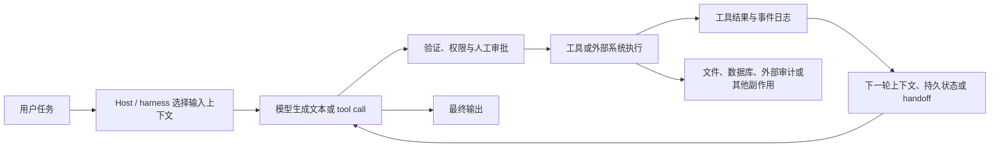

# 大语言模型与 Agent 可观察机制深挖

研究日期：2026-08-10 [fact | 来源=任务上下文 | 访问=2026-08-10 | 适用=本次研究运行]
报告范围：Codex Field Guide 中关于大语言模型、工具调用、检索、Agent 运行时与证据的机制教学。[fact | 来源=用户任务 + PROJECT-RULES | 访问=2026-08-10 | 适用=本报告范围]
当前状态：verified（截至 2026-08-10；易变产品事实仍需按来源表复核；不表示 production-ready）。[inference | 来源=PROJECT-RULES + 本报告验证记录 | 访问=2026-08-10 | 适用=本报告交付状态]
研究者：Prysai [fact | 来源=用户任务 | 访问=2026-08-10 | 适用=本次研究运行]

## 0. 阅读范围、标注规则与证据边界

本报告只写入原创概括、比较和实验设计；不复制官方长文、代码、图像或完整提示词。官方文档和协议只作为链接式证据使用，未把其内容当作可再分发的教材资产。此处的来源记录与本报告同文件保存，是因为本任务明确限定为“只写一个新文件”；没有改动 `docs/sources/asset-register.md` 或其他文件。[fact | 来源=用户任务 + PROJECT-RULES + 本报告编辑记录 | 访问=2026-08-10 | 适用=本报告的编辑与许可边界]

每一个有事实含义的断言都带有如下标签。[inference | 来源=本报告标注规则 | 访问=2026-08-10 | 适用=本文件的证据表达]

`[fact | 来源=ID | 访问=2026-08-10 | 适用=范围]`：来源直接说明或可由规范条文直接读出。
`[inference | 来源=ID | 访问=2026-08-10 | 适用=范围]`：由一个或多个事实推导出的教学模型、工程建议或风险判断，不冒充官方原话。
`[unknown | 来源=ID | 访问=2026-08-10 | 适用=范围]`：这些来源没有证明该结论；它是应保留的未知量，而不是“模型一定不会做”的断言。

“访问日期”是本次核验日期；模型名称、API 行为、Agents SDK、MCP 版本、网页路径和产品限制均可能变化。源表的 `next_review` 是建议复核时间，不表示该事实在未来必然继续成立。[inference | 来源=PROJECT-RULES + 本报告来源登记 | 访问=2026-08-10 | 适用=易变官方资料的维护规则]

## 1. 先给结论：把“模型回答”拆成可观察链

最适合初学者的心智模型不是“一个会思考的黑盒”，而是一条由宿主程序编排的链。[inference | 来源=OAI-FC + OAI-STATE + OAI-AGENT-LOOP + OAI-RESULTS + ANT-TOOLS + MCP-2026 | 访问=2026-08-10 | 适用=本报告的跨供应商教学抽象]

图 1 是本报告的原创抽象模型；它把官方文档分别描述的请求上下文、tool-call 往返、Agent runtime loop、结果对象和外部工具边界拼成一条可验证链，而不是声称某一家模型内部就以此方式实现。[inference | 来源=OAI-FC + OAI-STATE + OAI-AGENT-LOOP + OAI-RESULTS + ANT-TOOLS + MCP-2026 | 访问=2026-08-10 | 适用=本报告的跨供应商教学抽象]

最重要的六个区分如下：

1. 上下文窗口是一次生成可用的工作上下文；它不是训练语料库，也不等于宿主保存的全部历史。[fact | 来源=ANT-CONTEXT + OAI-STATE | 访问=2026-08-10 | 适用=Anthropic Messages API 与 OpenAI API 的相应上下文/状态文档]
2. 一个 tool call 是模型输出的调用请求；是否真的执行，要看宿主、工具服务、权限、审批和外部日志。[fact | 来源=OAI-FC + ANT-TOOLS + OAI-APPROVALS | 访问=2026-08-10 | 适用=OpenAI function calling、Anthropic client/server tools、OpenAI Agents approvals]
3. Structured Output 约束结构或 schema，不自动证明字段里的事实正确、最新或来自正确证据。[fact | 来源=OAI-SO | 访问=2026-08-10 | 适用=OpenAI Structured Outputs]
4. Retrieval 只负责选择并放入上下文的材料；“检索到了”不等于“材料完整、最新、可信”，也不等于模型必然使用了它。[inference | 来源=OAI-RET + ANT-CONTEXT | 访问=2026-08-10 | 适用=使用检索增强的 Agent；模型是否真正使用某 chunk 的因果证据仍未知]
5. Agent loop 通常由 host/runtime 驱动：模型提出下一步，host 处理 tool、handoff、guardrail、审批、重试和停止。[fact | 来源=OAI-AGENT-LOOP + OAI-APPROVALS + ANT-TOOLS | 访问=2026-08-10 | 适用=OpenAI Agents runtime、Anthropic client/server tool 往返]
6. 最终文字、工具事件、持久化 state、文件/数据库 diff 和外部审计是不同证据层；最终文字本身不是副作用已发生的证明。[inference | 来源=OAI-RESULTS + OAI-FC + GITHUB-CLOUD | 访问=2026-08-10 | 适用=本报告的工程证据模型；具体证据仍由宿主和外部系统定义]

### 1.1 可直接写进章节的最小观察记录

下表不是供应商规定的日志 schema，而是从上述边界推导出的低风险观察协议。它的目的，是让读者能定位“错在看错材料、生成错参数、执行错、恢复错，还是证明不足”。[inference | 来源=OAI-STATE + OAI-FC + OAI-AGENT-LOOP + OAI-RESULTS | 访问=2026-08-10 | 适用=本报告的工程观察建议]

| 观察字段 | 要回答的问题 | 类型与依据 |
|---|---|---|
| `run_id`、`turn_id`、时间、stop reason | 这是哪次运行、哪一轮、为什么停？ | [inference | 来源=OAI-AGENT-LOOP + OAI-RESULTS | 访问=2026-08-10 | 适用=Agent 运行审计；建议字段，不是统一标准] |
| 原始任务、消息角色、工具定义版本 | 模型实际被送入了什么？ | [fact | 来源=OAI-PROMPT + OAI-STATE + ANT-CONTEXT | 访问=2026-08-10 | 适用=相应 API 请求；具体日志能力依 host 而异] |
| 输入/输出 token、上下文长度、截断或 compaction 事件 | 是不是工作内存超载或被压缩？ | [fact | 来源=OAI-STATE + OAI-COMPACT + ANT-CONTEXT | 访问=2026-08-10 | 适用=相应 provider 的状态/上下文机制] |
| 原始 query、query rewrite、filters、检索索引快照、chunk ID/分数/内容 hash/上下文位置 | 模型看到了哪些候选材料，关键限制是否被选中？ | [inference | 来源=OAI-RET + ANT-CONTEXT | 访问=2026-08-10 | 适用=自建或托管 retrieval；建议把 selection 变成可复核事件] |
| `tool_call_id`、工具名、参数、schema 校验结果、审批决定 | 模型请求了什么，参数是否合规，谁批准了？ | [fact | 来源=OAI-FC + OAI-APPROVALS + ANT-TOOLS | 访问=2026-08-10 | 适用=对应工具调用接口] |
| tool start/end、执行身份、结果、错误、重试次数 | 请求是否实际运行、结果是什么、是否重复副作用？ | [inference | 来源=OAI-FC + OAI-AGENT-LOOP + GITHUB-CLOUD | 访问=2026-08-10 | 适用=宿主/工具服务日志；需按最小权限落地] |
| state ID、history/previous response reference、pending interruption、handoff | 暂停、恢复、压缩、交接后延续的到底是哪一个状态？ | [fact | 来源=OAI-STATE + OAI-RESULTS + OAI-APPROVALS | 访问=2026-08-10 | 适用=OpenAI Responses/Agents 文档所述状态能力] |
| 最终输出、artifact/diff、外部系统审计 ID | “说完成”是否有独立结果证明？ | [inference | 来源=OAI-RESULTS + GITHUB-CLOUD | 访问=2026-08-10 | 适用=本报告的验收建议，不是 GitHub 或 OpenAI 的统一格式] |

## 2. 机制卡

每张卡按“问题—概念—决定—行动—证据—失败—反思”组织，便于直接拆成 Field Guide 章节或课堂实验。[inference | 来源=PROJECT-RULES + 本报告结构设计 | 访问=2026-08-10 | 适用=本报告的章节建议]

### 机制卡 A：token 与 context window

**问题。** 为什么追加一段看似相关的资料后，模型反而漏掉前面已经给出的限制？

**概念。** Anthropic 将 context window 描述为模型生成时可以引用的工作记忆，并明确把消息、工具定义、工具结果、图像/文档、输出和 thinking 等内容计入上下文；这不是模型训练数据的同义词。[fact | 来源=ANT-CONTEXT | 访问=2026-08-10 | 适用=Anthropic Messages API；计费和具体 token 类型以 provider 文档为准] OpenAI 的状态文档把对话历史、当前输入和模型输出的延续管理放在请求状态/上下文窗口中，并说明长上下文需要截断或其他管理；OpenAI compaction 文档描述了把长上下文压缩为后续可用状态的机制。[fact | 来源=OAI-STATE + OAI-COMPACT | 访问=2026-08-10 | 适用=OpenAI API 的 conversation state 与 compaction]

**决定。** 把 context 当作“本轮有限工作内存”，把历史数据库、检索库和持久化 state 当成不同层；不要用“模型曾经见过”替代“本轮确实送入”。[inference | 来源=ANT-CONTEXT + OAI-STATE + OAI-COMPACT | 访问=2026-08-10 | 适用=跨 provider 的教学与系统设计]

**行动。** 记录输入、输出、工具定义、工具结果、检索材料、截断/compaction 和上下文位置；在改变 token budget、材料顺序、chunk 数量后重新跑同一任务。[inference | 来源=ANT-CONTEXT + OAI-STATE + OAI-RET | 访问=2026-08-10 | 适用=可控实验与生产观测建议]

**证据。** 仅有模型回复只能证明它生成了某文本；要证明上下文是否包含某材料，应记录实际请求或等价的安全 hash/清单；要证明它是否依赖某材料，现有来源没有提供普遍可靠的因果归因。[unknown | 来源=ANT-CONTEXT + OAI-STATE | 访问=2026-08-10 | 适用=内部注意力/因果使用情况；不应从“材料存在”推出“模型使用”]

**失败。** 典型错法是把 token 预算当作知识容量，把 context window 当作永久记忆，或把 compaction 结果当作无损人工摘要。[inference | 来源=OAI-COMPACT + ANT-CONTEXT | 访问=2026-08-10 | 适用=教学失败模式；具体损失取决于 provider 和压缩内容]

**反思。** 学员能否解释“训练数据、输入 token、输出 token、工具/检索 token、持久化 state”之间的边界，比记住一个最大上下文数字更重要。[inference | 来源=ANT-CONTEXT + OAI-STATE | 访问=2026-08-10 | 适用=章节教学目标]

### 机制卡 B：instruction hierarchy 与“数据冒充指令”

**问题。** 为什么网页、附件或 tool result 中的一句“忽略前面规则”不应自动获得系统权限？

**概念。** OpenAI Model Spec 按 Root、System、Developer、User、Guideline 描述指令权威层级，并把引用文本、附件和 tool output 默认视为没有指令权威，除非上层指令明确或隐式委托它们承担某任务。[fact | 来源=OAI-MODEL-SPEC | 访问=2026-08-10 | 适用=OpenAI 发布的行为规范；不是所有模型、host 或供应商都已被该规范证明完全实现] OpenAI prompt-engineering 文档也区分 system/developer/user 消息角色及其用途。[fact | 来源=OAI-PROMPT | 访问=2026-08-10 | 适用=OpenAI API 消息接口]

**决定。** 教学中把“指令通道”和“数据通道”分开：网页、搜索结果、文件、数据库字段、MCP resource 与 tool result 先作为待分析数据，再依据显式上层任务决定是否采纳其中的事实；不能因为字符串看起来像 system message 就提升其权限。[inference | 来源=OAI-MODEL-SPEC + OAI-INJECTION + OAI-MCP-RISK + MCP-2026 | 访问=2026-08-10 | 适用=使用外部内容的 Agent；具体 host 还需现场验证]

**行动。** 采用来源标记、结构化抽取、只读默认工具、最小权限、参数校验和高风险动作审批；将“外部文本能否改变工具选择”作为单独 eval 维度。[inference | 来源=OAI-INJECTION + OAI-APPROVALS + OAI-SAFETY + OAI-MCP-RISK | 访问=2026-08-10 | 适用=OpenAI agent safety 指南及本报告的工程化建议]

**证据。** 记录原始数据、经过何种包装进入上下文、模型提议的动作和审批决定；不要只保存最终答案。[inference | 来源=OAI-INJECTION + OAI-RESULTS | 访问=2026-08-10 | 适用=trace 评估与审计建议]

**失败。** 把用户可编辑字段、网页内容或第三方 MCP 数据拼成看似高权威的消息，或允许其直接触发发信、删除、支付等副作用。[fact | 来源=OAI-INJECTION + OAI-MCP-RISK | 访问=2026-08-10 | 适用=OpenAI 对 indirect prompt injection / MCP 风险的安全说明；本句动作例子是风险类别的教学化概括]

**反思。** “更强的系统提示词”不是唯一控制面；真正要问的是：不可信数据能到哪里、能调用什么工具、审批前后有什么不可逆副作用。[inference | 来源=OAI-INJECTION + OAI-APPROVALS + MCP-2026 | 访问=2026-08-10 | 适用=Agent 安全设计]

### 机制卡 C：tool calling 是请求，不是执行

**问题。** 为什么模型输出了工具名和参数，却不能据此说文件已经写入或邮件已经发送？

**概念。** OpenAI function calling 文档给出的基本往返是：把工具定义送给模型、接收 tool call、由应用执行代码、把工具输出送回模型、再得到最终响应；工具定义还会占用上下文，调用可能配置为并行或其他选择策略。[fact | 来源=OAI-FC | 访问=2026-08-10 | 适用=OpenAI Responses/API function calling] Anthropic 区分由客户端执行的 tools 与由服务端执行的 tools，并展示 `tool_use`/`tool_result` 的往返边界。[fact | 来源=ANT-TOOLS | 访问=2026-08-10 | 适用=Anthropic tool use]

**决定。** 将 `model_proposed_call`、`approval_decision`、`tool_started`、`tool_finished` 和 `external_effect` 分成不同事件；若只有第一项，状态应为“已提议/未证明执行”。[inference | 来源=OAI-FC + ANT-TOOLS + OAI-APPROVALS | 访问=2026-08-10 | 适用=跨 provider 的审计模型]

**行动。** 先用无副作用 mock read/write 工具；为每个调用记录 call ID、参数 schema 校验、审批、执行返回、重试和幂等键。需要真实副作用时，默认暂停并要求人工批准。[inference | 来源=OAI-FC + OAI-APPROVALS + OAI-SAFETY | 访问=2026-08-10 | 适用=低风险教学实验和受控 Agent]

**证据。** 工具服务日志、文件 diff、数据库审计、任务队列状态或第三方平台 event ID 比模型的自然语言“已完成”更接近执行证据；具体哪些日志存在取决于 host/工具实现。[inference | 来源=OAI-FC + GITHUB-CLOUD + OAI-RESULTS | 访问=2026-08-10 | 适用=工程验收；不能假定所有服务都有相同日志]

**失败。** 参数 JSON 合法但业务对象错误；工具返回错误却被下一轮当作成功；host 重试导致非幂等写操作重复；并行 calls 之间有竞态。[inference | 来源=OAI-FC + OAI-AGENT-LOOP + OAI-APPROVALS | 访问=2026-08-10 | 适用=工具编排风险；具体是否并行由调用设置和 host 决定]

**反思。** 读者应能画出“模型—host—工具—结果—模型”的往返，并指出哪一个节点拥有执行权限。[inference | 来源=OAI-FC + ANT-TOOLS + MCP-2026 | 访问=2026-08-10 | 适用=章节验收]

### 机制卡 D：structured output 把语法错误变成语义错误

**问题。** 为什么通过 schema 校验的 JSON 仍可能是错误答案？

**概念。** OpenAI Structured Outputs 旨在让模型遵守开发者提供的 JSON Schema；文档区分了 schema adherence 与 JSON mode，后者保证有效 JSON 但不保证遵守 schema，并说明拒绝和不完整响应是需要单独处理的状态。[fact | 来源=OAI-SO | 访问=2026-08-10 | 适用=OpenAI Structured Outputs/JSON mode] 同一文档仍要求应用处理模型在字段值、事实和任务语义上的错误；结构合法不是事实校验。[fact | 来源=OAI-SO | 访问=2026-08-10 | 适用=OpenAI schema-constrained generation]

**决定。** 将校验分成三层：语法/类型、业务约束、外部事实与副作用验证；schema pass 只让第一层（以及所写进 schema 的部分约束）通过。[inference | 来源=OAI-SO + OAI-APPROVALS | 访问=2026-08-10 | 适用=结构化 Agent 输出]

**行动。** 为日期、ID、权限、数量和状态增加可执行的业务校验；对需要真实事实的字段回查来源或工具；对拒绝、不完整、空结果和不确定值保留显式状态，不把它们默认为成功。[inference | 来源=OAI-SO + OAI-RET + OAI-SAFETY | 访问=2026-08-10 | 适用=应用层实现建议]

**证据。** 同时保存原始模型输出、schema 校验结果、业务校验结果、来源引用和最终接受/拒绝决定。[inference | 来源=OAI-SO + OAI-RESULTS | 访问=2026-08-10 | 适用=可追溯评测]

**失败。** `status="approved"`、日期格式正确、必填字段齐全，但对象不存在、权限不符、数值过期或与检索来源相矛盾。[inference | 来源=OAI-SO + OAI-RET | 访问=2026-08-10 | 适用=教学构造案例，不声称来自某一次生产事故]

**反思。** 读者能否给出一个“schema pass、semantic fail”的例子，且能指出哪一步独立发现了错误？[inference | 来源=OAI-SO | 访问=2026-08-10 | 适用=章节验收]

### 机制卡 E：retrieval 是 context selection，不是知识真空吸尘器

**问题。** 为什么相似度最高的 chunk 仍可能无法回答一个带例外条件的问题？

**概念。** OpenAI Retrieval 文档描述了 semantic search、query rewriting、属性过滤、ranking、hybrid search、chunking 和将结果合成回答等步骤。[fact | 来源=OAI-RET | 访问=2026-08-10 | 适用=OpenAI Retrieval/File Search 相关接口] 检索结果被送入后续模型上下文，是否足够取决于 query、索引、过滤、分块、排序和上下文预算；“相关”与“完整/最新/权威”不是同一个性质。[inference | 来源=OAI-RET + ANT-CONTEXT | 访问=2026-08-10 | 适用=任何检索增强流程]

**决定。** 将 retrieval 当成有召回率和精确率代价的选择器；对范围限定、否定词、例外条款、版本和权限进行可观察测试，不以单个相似度分数替代证据判断。[inference | 来源=OAI-RET + OAI-MODEL-SPEC | 访问=2026-08-10 | 适用=检索与指令边界的教学/工程判断]

**行动。** 记录原始 query、rewrite、filters、索引版本、候选数量、chunk ID、分数、内容 hash、上下文顺序和回答引用；用不同 chunk 边界、metadata filter、hybrid/ranking 设置做对照。[inference | 来源=OAI-RET | 访问=2026-08-10 | 适用=自建检索评测]

**证据。** “检索命中”可以由检索日志证明；“模型实际使用”需要引用、对照实验或其他可复核信号，不能从命中日志单独推出。[unknown | 来源=OAI-RET + ANT-CONTEXT | 访问=2026-08-10 | 适用=模型内部使用路径；官方文档没有给出普遍因果归因方法]

**失败。** chunk 把限制和它的标题分开；过滤条件排除了唯一的例外；query rewrite 删除了时间范围；最相似的通用说明压过了较不相似但决定性的细则。[inference | 来源=OAI-RET | 访问=2026-08-10 | 适用=可在本地无敏感数据语料中复现的教学案例]

**反思。** 读者应能区分“模型没看见关键事实”“看见但生成错”“看见且生成对但工具执行错”。[inference | 来源=OAI-RET + OAI-FC + OAI-RESULTS | 访问=2026-08-10 | 适用=错误归因训练]

### 机制卡 F：Agent loop 与停止条件

**问题。** 为什么 Agent 的“下一步”不能只理解为模型的下一句话？

**概念。** OpenAI Agents runtime 文档把运行描述为模型输出、工具调用、guardrail、handoff、暂停/恢复和停止之间的循环；工具调用或 handoff 可能让循环继续，最终输出、错误或限制可能使其停止。[fact | 来源=OAI-AGENT-LOOP + OAI-APPROVALS | 访问=2026-08-10 | 适用=OpenAI Agents runtime/SDK 文档所述运行模型] MCP 规范则定义 Host、Client、Server 及 resources/prompts/tools 等协议边界；协议本身不等于完整 Agent loop。[fact | 来源=MCP-2025 + MCP-2026 | 访问=2026-08-10 | 适用=MCP 协议版本页面；不同 host 可采用不同循环]

**决定。** 把 loop 画成状态机：`model_turn → proposed_action → policy/approval → execution → observation → next_turn | stop | pause | handoff`；模型是转移条件的重要来源，但 host 决定哪些转移真正发生。[inference | 来源=OAI-AGENT-LOOP + OAI-APPROVALS + MCP-2026 | 访问=2026-08-10 | 适用=跨实现教学抽象]

**行动。** 为每轮保存 turn index、输入上下文版本、输出类型、工具结果、handoff 目标、guardrail、暂停原因、重试计数和停止原因；设最大轮数和超时，所有写操作都要幂等或需要审批。[inference | 来源=OAI-AGENT-LOOP + OAI-APPROVALS + OAI-SAFETY | 访问=2026-08-10 | 适用=运行时安全与调试]

**证据。** “最终输出存在”只证明某个返回路径发生；是否还有 pending interruption、未执行 action 或未提交 artifact，应检查 run state 和外部事件。[fact | 来源=OAI-RESULTS + OAI-APPROVALS | 访问=2026-08-10 | 适用=OpenAI Agents results/approvals]

**失败。** Agent 过早停在计划文本、因工具错误循环重试、handoff 后丢失约束、到达 max turns 却生成看似完整的总结。[inference | 来源=OAI-AGENT-LOOP + OAI-RESULTS | 访问=2026-08-10 | 适用=运行时测试案例]

**反思。** 读者应能回答：“这一步是模型选择的，还是 host 放行的？停止是成功、失败、暂停、超时，还是输出限制？”[inference | 来源=OAI-AGENT-LOOP + OAI-APPROVALS | 访问=2026-08-10 | 适用=章节验收]

### 机制卡 G：state 与 output 不是一回事

**问题。** 为什么最终文本说“完成”时，任务仍可能等待批准、等待恢复或没有真实 artifact？

**概念。** OpenAI results 文档区分 final output、history、last response ID、interruptions 和可恢复状态；approvals 文档描述暂停后在同一 state 上恢复；conversation state 文档说明可以通过历史或 previous response 继续，而不是把每个请求误解为天然共享记忆。[fact | 来源=OAI-RESULTS + OAI-APPROVALS + OAI-STATE | 访问=2026-08-10 | 适用=OpenAI Responses/Agents 文档所述状态模型]

**决定。** 至少分别命名 `model_output`、`run_state`、`tool_execution`、`artifact` 和 `external_audit`；任何验收条件都明确要求哪一个层次。[inference | 来源=OAI-RESULTS + GITHUB-CLOUD | 访问=2026-08-10 | 适用=本报告的证据设计]

**行动。** 让恢复操作引用明确 state ID；在重试前检查幂等键和外部审计；把 pending interruption、失败工具、未提交 diff 和部分结果显式显示给用户。[inference | 来源=OAI-APPROVALS + OAI-RESULTS + OAI-SAFETY | 访问=2026-08-10 | 适用=可恢复 Agent]

**证据。** 同时保存状态转换、工具事件、最终输出以及文件/数据库/平台的独立结果；GitHub cloud agent 文档所描述的计划、分支、测试、日志、提交和环境状态，是“host 行为可见性”的一个产品例子，不是所有 Agent 的通用保证。[fact | 来源=GITHUB-CLOUD | 访问=2026-08-10 | 适用=GitHub Copilot cloud agent 产品描述]

**失败。** UI 只展示一段成功总结，隐藏了实际为 `paused`、`approval_required` 或 `tool_failed` 的 state；恢复时把旧的自然语言总结当成新的事实，造成重复执行。[inference | 来源=OAI-RESULTS + OAI-APPROVALS | 访问=2026-08-10 | 适用=可复现的状态设计失败模式]

**反思。** “有没有输出？”、“状态是否成功？”、“副作用是否发生？”、“证据在哪里？”必须是四个问题。[inference | 来源=OAI-RESULTS + GITHUB-CLOUD | 访问=2026-08-10 | 适用=验收语言]

### 机制卡 H：evals 要评估 trace，而不只是最终答案

**问题。** 为什么一个“答案正确”的样本仍可能暴露出危险的 Agent 行为？

**概念。** Anthropic 建议把成功标准写成具体、可测量、与任务相关的标准，使用接近真实分布的样本和边界案例，并组合自动评分、LLM grading 与人工 rubric。[fact | 来源=ANT-EVAL | 访问=2026-08-10 | 适用=Anthropic eval guidance；方法可迁移但不是强制标准] OpenAI agent safety 文档把 trace grading 作为检查 Agent 中间步骤与工具行为的方式之一。[fact | 来源=OAI-INJECTION | 访问=2026-08-10 | 适用=OpenAI agent safety/trace grading guidance]

**决定。** 一个 eval case 至少拆成：任务/约束、允许的上下文、检索选择、工具提议、参数/权限、执行结果、停止/恢复状态、最终输出、外部副作用和证据覆盖。[inference | 来源=ANT-EVAL + OAI-INJECTION + OAI-RESULTS | 访问=2026-08-10 | 适用=本报告的 trace-eval 设计]

**行动。** 使用正常、边界、失败、注入、超时、重复和权限不足样例；分别评分最终语义、工具安全、状态正确、证据充分和副作用正确性，保留失败 trace 而非只汇总一个分数。[inference | 来源=ANT-EVAL + OAI-SAFETY + OAI-INJECTION | 访问=2026-08-10 | 适用=Agent 回归测试]

**证据。** 自动分数可以说明一个 rubric 的表现，但不能单独证明真实环境中的安全或鲁棒性；人工复核和外部系统结果仍需保留。[inference | 来源=ANT-EVAL + OAI-SAFETY | 访问=2026-08-10 | 适用=评测解释边界]

**失败。** 只比较 final text，忽略模型先尝试读取不该读取的资料；只测“命中率”，忽略检索过滤遗漏例外；只测一次，忽略 retry/timeout 的副作用。[inference | 来源=ANT-EVAL + OAI-INJECTION + OAI-RET + OAI-AGENT-LOOP | 访问=2026-08-10 | 适用=评测反例]

**反思。** 学员能否从 trace 找到第一次发生偏差的节点，而不是只说“模型幻觉了”？[inference | 来源=ANT-EVAL + OAI-INJECTION | 访问=2026-08-10 | 适用=章节学习目标]

### 机制卡 I：prompt injection 与 indirect instructions

**问题。** 为什么“把外部内容放进 prompt”会改变工具行为，即使开发者没有把它写成正式指令？

**概念。** OpenAI 将 indirect prompt injection 描述为来自网页、文件、第三方数据或其他外部内容的指令影响，并警告 Agent 可能被诱导泄露数据或采取不期望的动作；其建议包括结构化抽取、隔离、guardrail、人工审批与 trace 评估，同时明确这些措施不能把风险完全消除。[fact | 来源=OAI-INJECTION | 访问=2026-08-10 | 适用=OpenAI Agent Builder safety guidance] OpenAI MCP/connector 文档强调第三方数据和工具存在提示注入、跨工具数据泄露等风险，信任一个开发者不等于信任其返回的所有内容。[fact | 来源=OAI-MCP-RISK | 访问=2026-08-10 | 适用=OpenAI connectors/MCP guidance]

**决定。** 注入防御的最小闭环是：标记不可信来源 → 限制数据到指令的转换 → 约束可调用工具/参数 → 高影响操作前审批 → 记录 trace 和副作用。[inference | 来源=OAI-INJECTION + OAI-APPROVALS + OAI-MCP-RISK + MCP-2026 | 访问=2026-08-10 | 适用=Agent 安全架构建议]

**行动。** 建立一个无网络、无真实凭据、只允许 mock 工具的注入实验；比较“外部文本只做摘要”和“外部文本被允许影响工具选择”两种包装，记录工具提议和审批，而不执行真实外发动作。[inference | 来源=OAI-INJECTION + OAI-SAFETY | 访问=2026-08-10 | 适用=低风险教学实验]

**证据。** “防住了”至少要有多个注入变体、工具调用 trace、拒绝/审批结果和无外部副作用的审计；一条通过样本不能证明普遍防御。[inference | 来源=OAI-INJECTION + ANT-EVAL | 访问=2026-08-10 | 适用=安全评测]

**失败。** 文档中的伪系统指令改变了摘要范围；检索结果诱使 Agent 把另一个工具返回的数据拼接到外发参数；工具描述本身与用户任务冲突。[inference | 来源=OAI-MODEL-SPEC + OAI-INJECTION + OAI-MCP-RISK | 访问=2026-08-10 | 适用=教学推演案例，不声称是本仓库已执行的攻击]

**反思。** “模型看到了攻击文本”不是“已经被攻破”的同义词；要检查它是否产生了不应有的 tool call、是否被 host 拦截、是否有副作用。[inference | 来源=OAI-INJECTION + OAI-FC + OAI-APPROVALS | 访问=2026-08-10 | 适用=事件分析]

## 3. 为什么模型会错：六类可定位的故障

下表把泛化的“幻觉”拆成可以观察和修复的阶段。分类是教学推论，不是声称供应商提供了唯一正式分类。[inference | 来源=OAI-STATE + OAI-FC + OAI-AGENT-LOOP + OAI-RESULTS + OAI-INJECTION | 访问=2026-08-10 | 适用=本报告的错误诊断分类]

| 故障类别 | 典型症状 | 首个证据检查 | 不应直接下的结论 |
|---|---|---|---|
| context selection error | 关键事实没有进入本轮，或被截断/压缩/位置竞争掩盖 | 请求上下文清单、token/截断/compaction、检索 query/rewrite/chunk | 不能直接说“模型忘记了训练知识” | [inference | 来源=OAI-STATE + OAI-COMPACT + OAI-RET + ANT-CONTEXT | 访问=2026-08-10 | 适用=使用上下文和检索的系统] |
| authority/data confusion | 外部文本被当成高优先级指令，或真正的 developer/user 约束被覆盖 | 消息角色、来源标记、包装、工具/资源返回值 | 不能直接说“模型故意违抗” | [inference | 来源=OAI-MODEL-SPEC + OAI-INJECTION + OAI-MCP-RISK | 访问=2026-08-10 | 适用=OpenAI 行为规范及外部数据 Agent] |
| generation/semantic error | 结构有效但字段、推理、事实或引用错误 | raw output、schema pass、业务/来源校验 | 不能把 JSON 合法当作事实正确 | [inference | 来源=OAI-SO | 访问=2026-08-10 | 适用=OpenAI Structured Outputs；诊断顺序为本报告建议] |
| tool/harness execution error | call 没执行、参数被改、权限错误、工具失败、重试重复 | call → approval → start/end → external audit | 不能把 tool call 当作执行结果 | [inference | 来源=OAI-FC + ANT-TOOLS + OAI-APPROVALS | 访问=2026-08-10 | 适用=工具调用系统] |
| state/compaction/retry error | 恢复错 state、handoff 丢约束、压缩丢例外、重试重复副作用 | state ID、transition、pending interruption、idempotency、history | 不能把 final text 当作当前 state | [inference | 来源=OAI-STATE + OAI-COMPACT + OAI-RESULTS + OAI-APPROVALS | 访问=2026-08-10 | 适用=OpenAI state/Agents 文档和通用运行时设计] |
| verification gap | 没有独立证据却报告完成，或 eval 只看答案 | artifact/diff/audit、trace rubric、失败样本 | 不能把“看起来合理”当作 verified | [inference | 来源=OAI-RESULTS + GITHUB-CLOUD + ANT-EVAL + OAI-SAFETY | 访问=2026-08-10 | 适用=本报告验收模型] |

“模型会错”不是单一机制解释；同一错误文本可能由不同阶段产生。应从最早可观察的分叉开始排查：上下文选择 → 权威解析 → 输出结构/语义 → host/tool 执行 → state 转换 → 外部证据。[inference | 来源=OAI-STATE + OAI-FC + OAI-AGENT-LOOP + OAI-RESULTS + OAI-INJECTION | 访问=2026-08-10 | 适用=本报告诊断顺序]

## 4. 可直接加入章节的实验

所有实验都应使用本地、合成、无凭据数据；不发送真实邮件、不写生产数据库、不访问真实私有文件。实验的“预期现象”是待观察假设，不是预先宣布的结果。[inference | 来源=OAI-SAFETY + OAI-INJECTION + PROJECT-RULES | 访问=2026-08-10 | 适用=本报告的低风险实验边界]

### 实验 1：token budget ladder 与 needle/position

- **问题：** 增加上下文长度、改变关键事实位置或触发 compaction 时，错误从哪里开始？
- **动作：** 用同一任务和同一合成资料集，逐级增加无关材料；把一个非敏感标记放在开头、中间、结尾，并记录每轮实际输入清单。分别测试原始上下文、截断和 compaction 版本。
- **观察：** 输入/输出 token、上下文长度、截断/compaction、标记是否被复述、答案的证据引用和 stop reason。
- **安全与可逆性：** 纯本地文本，结果可删除，无外部副作用。
- **教学判断：** 如果标记未在请求中出现，属于 selection/截断证据；如果出现却回答错，只能说明生成/语义问题，不能凭此推断内部注意力原因。[inference | 来源=ANT-CONTEXT + OAI-STATE + OAI-COMPACT | 访问=2026-08-10 | 适用=本地上下文实验；因果归因仍未知]

### 实验 2：层级冲突与不可信 wrapper

- **问题：** 角色层级和外部数据中的伪指令是否被区分？
- **动作：** 在不执行工具的情况下，给出互相冲突的高低层约束；再把同样的冲突放进引用文档、tool result 和用户可编辑字段。要求模型只做分类/摘要，并把“是否可作为指令”输出为结构化状态。
- **观察：** 角色、来源包装、模型输出、是否改变任务目标、是否生成 tool call；不要用真实秘密检验。
- **安全与可逆性：** 禁用网络和写工具，使用无害字符串。
- **教学判断：** Model Spec 的默认权威规则可作为预期基线，但实际 host 是否正确包装消息、模型是否遵守，必须用 trace 验证。[inference | 来源=OAI-MODEL-SPEC + OAI-PROMPT + OAI-INJECTION | 访问=2026-08-10 | 适用=OpenAI 风格消息与自建 host；不是跨模型保证]

### 实验 3：mock tool call 与执行证明

- **问题：** 模型提议、host 审批、工具执行和外部结果是否被混为一谈？
- **动作：** 提供只读 `lookup`、模拟写入 `dry_run_write` 和默认拒绝的 `realistic_write` 三个 mock 接口；先只记录 calls，再分别批准/拒绝，模拟工具失败、超时和重试。
- **观察：** call ID、参数 schema、approval、tool start/end、返回值、重试/idempotency key、artifact diff、最终输出。
- **安全与可逆性：** `dry_run_write` 只生成临时 diff；不连接真实系统。
- **教学判断：** 只有 call 没有 start/end 或 artifact 时，验收状态应为“未证明执行”；工具成功也不自动证明业务语义正确。[inference | 来源=OAI-FC + ANT-TOOLS + OAI-APPROVALS + OAI-RESULTS | 访问=2026-08-10 | 适用=工具边界实验]

### 实验 4：retrieval 的 scope、filter、chunk boundary 对照

- **问题：** 选择机制如何遗漏例外或时间范围？
- **动作：** 建立一组本地合成政策文档：通用规则、带日期的例外、权限限制和版本变更。分别改变 query rewrite、metadata filter、chunk 边界、ranking/hybrid 配置，要求回答时列出使用的 chunk ID 和适用范围。
- **观察：** raw query、rewrite、filters、候选/命中 chunk、分数、顺序、上下文位置、回答引用、漏掉的例外。
- **安全与可逆性：** 文档为合成内容，不含秘密；索引可重建。
- **教学判断：** 命中率、引用存在和答案完整性是三个不同指标；需要对照组才可定位是 retrieval 还是 generation。[inference | 来源=OAI-RET + ANT-CONTEXT | 访问=2026-08-10 | 适用=检索增强教学]

### 实验 5：indirect instruction 的无副作用测试

- **问题：** 外部文本能否把数据处理任务转成不应有的工具动作？
- **动作：** 在本地文档中放入几种“看似指令”的内容，只允许摘要和 mock 工具；比较原样展示、带来源边界的展示、结构化抽取后的展示。让一组样例要求模型提议动作，所有动作默认拒绝。
- **观察：** 外部文本是否改变目标、工具名/参数、审批决定、拒绝原因和完整 trace；不测试真实外发或数据窃取。
- **安全与可逆性：** 无网络、无密钥、无真实副作用。
- **教学判断：** 结构化抽取和审批降低风险，但通过几条样例不能证明“完全防住”；应覆盖变体并保留 unknown。[inference | 来源=OAI-INJECTION + OAI-MCP-RISK + ANT-EVAL | 访问=2026-08-10 | 适用=安全实验]

### 实验 6：pause、crash、resume 与 retry

- **问题：** 恢复时使用的是哪个 state，非幂等动作是否重复？
- **动作：** 在 mock write 前强制 approval pause；在 pause、tool start、tool finish 三个位置模拟进程崩溃；分别用同一 state 恢复、错误 state 恢复和重复提交，检查幂等键。
- **观察：** state ID、history/previous response reference、pending interruption、工具事件序列、重复次数、artifact diff、最终 state。
- **安全与可逆性：** 所有写入是临时文件 diff，实验结束可删除；不连接生产系统。
- **教学判断：** 最终 output 不足以判断恢复是否正确；必须比对 state transition 和 artifact。[inference | 来源=OAI-STATE + OAI-RESULTS + OAI-APPROVALS | 访问=2026-08-10 | 适用=可恢复 Agent 实验]

### 实验 7：十例 trace-eval 矩阵

- **问题：** 评测能否找出“答案对但过程危险”的运行？
- **动作：** 至少准备 10 条合成用例：正常、关键例外、无命中、schema 语义错误、工具失败、权限不足、注入、超时、重试、handoff/恢复各一类或按项目风险加权。每条同时评分 final text、context selection、tool safety、state、evidence 和副作用。
- **观察：** 每个 rubric 原始证据、自动分数、人工复核、失败第一次出现的 turn、最终外部结果。
- **安全与可逆性：** 只测本地 mock 组件；不把测试数据当生产凭据。
- **教学判断：** 评测的目标不是制造漂亮平均分，而是让失败可定位、可复现、可回归。[inference | 来源=ANT-EVAL + OAI-INJECTION + OAI-RESULTS | 访问=2026-08-10 | 适用=章节实验与 Agent 回归]

## 5. 失败案例库（教学构造，不冒充生产事故）

下列案例是基于官方机制边界设计的可复现情景；它们不是本仓库已执行、也不是某个供应商承认的具体事故。每个案例都应配一条成功对照和完整 trace。[inference | 来源=OAI-FC + OAI-SO + OAI-RET + OAI-INJECTION + OAI-RESULTS | 访问=2026-08-10 | 适用=本报告的教学构造案例]

1. **Schema 合法但语义错误。** 模型返回合法对象，日期格式和必填字段都通过，但对象 ID 不存在或与检索到的版本冲突。应检查 raw output、schema pass、业务校验和来源，不把结构通过当事实正确。[inference | 来源=OAI-SO + OAI-RET | 访问=2026-08-10 | 适用=结构化输出实验]
2. **声称完成但没有执行证据。** final text 写“已写入”，trace 只有 tool call，没有 approval、tool start/end 或 artifact diff。状态应为“未证明执行”，而非成功。[inference | 来源=OAI-FC + OAI-RESULTS + OAI-APPROVALS | 访问=2026-08-10 | 适用=工具调用验收]
3. **高相似度但缺少关键限制。** retrieval 返回通用规则，漏掉较小 chunk 中的日期例外，模型生成看似流畅的全局答案。应比较 filters、chunk boundary、rank 和上下文清单。[inference | 来源=OAI-RET + ANT-CONTEXT | 访问=2026-08-10 | 适用=检索实验]
4. **外部内容改变工具选择。** 网页或 MCP 返回值中嵌入伪指令，模型提议把另一工具结果加入输出参数；host 在 approval 处拒绝，因而没有副作用。这个案例要同时区分“看到注入”“提议动作”“被拦截”“已经泄露”。[inference | 来源=OAI-INJECTION + OAI-MCP-RISK + OAI-APPROVALS | 访问=2026-08-10 | 适用=安全测试；具体事件为教学构造]
5. **重试导致重复副作用。** 工具已成功但响应丢失，host 按超时重试非幂等写操作；最终文本可能只显示一次成功。应查 idempotency、外部 event 和实际 diff。[inference | 来源=OAI-AGENT-LOOP + OAI-APPROVALS + OAI-RESULTS | 访问=2026-08-10 | 适用=恢复/重试测试；官方来源未承诺每个 host 自动幂等]
6. **final output 已返回但 run 仍未完成。** 结果对象带有 pending interruption 或需要恢复的状态，UI 却只显示最终摘要。应以 run state 和审批事件作为状态依据。[inference | 来源=OAI-RESULTS + OAI-APPROVALS | 访问=2026-08-10 | 适用=OpenAI Agents state/results；案例为教学构造]
7. **材料可引用但使用情况未知。** chunk 出现在请求清单中，答案也包含相似措辞，但没有对照、引用或 trace 信号证明它影响了决定。应保留 unknown，不把可见性当因果性。[unknown | 来源=OAI-RET + ANT-CONTEXT | 访问=2026-08-10 | 适用=模型内部使用归因]

## 6. 章节验收标准

下列标准可直接改成读者实验的 checklist。通过标准要求“有证据”，不是要求模型口头承诺。[inference | 来源=ANT-EVAL + OAI-SAFETY + PROJECT-RULES | 访问=2026-08-10 | 适用=本报告的章节验收建议]

### 学习结果

- [ ] 学员能用自己的话区分训练语料、输入/输出 token、context window、retrieval store 和持久化 state，并在一个 trace 中标出各自边界。[inference | 来源=ANT-CONTEXT + OAI-STATE | 访问=2026-08-10 | 适用=学习目标]
- [ ] 学员能画出至少一轮 `model → host → tool → result → model`，并指出 tool call 和执行事件的区别。[inference | 来源=OAI-FC + ANT-TOOLS | 访问=2026-08-10 | 适用=学习目标]
- [ ] 学员能提供一个 schema pass、semantic fail 案例，并说明独立校验在哪里发生。[inference | 来源=OAI-SO | 访问=2026-08-10 | 适用=学习目标]
- [ ] 学员能记录 query、rewrite、filter、chunk、排序/分数、上下文位置和回答证据，并知道“命中”不等于“使用”。[inference | 来源=OAI-RET + ANT-CONTEXT | 访问=2026-08-10 | 适用=学习目标]
- [ ] 学员能区分 model output、tool execution、run state、artifact/diff 和 external audit，并拒绝用“模型说完成”作为唯一完成证据。[inference | 来源=OAI-RESULTS + GITHUB-CLOUD + OAI-FC | 访问=2026-08-10 | 适用=学习目标]
- [ ] 学员能处理 injection、approval、timeout、retry、handoff、pause/resume，并说出每种情况下应观察的事件。[inference | 来源=OAI-INJECTION + OAI-APPROVALS + OAI-AGENT-LOOP | 访问=2026-08-10 | 适用=学习目标]

### 实验与证据

- [ ] 至少完成一个 context selection 对照，并保存实际输入清单、token/上下文事件和结果差异。[inference | 来源=ANT-CONTEXT + OAI-STATE + OAI-COMPACT | 访问=2026-08-10 | 适用=实验验收]
- [ ] 至少完成一个 mock tool 实验，能证明 call、approval、execution 和 artifact 是不同事件。[inference | 来源=OAI-FC + OAI-APPROVALS + OAI-RESULTS | 访问=2026-08-10 | 适用=实验验收]
- [ ] 至少完成一个 retrieval 过滤/chunk 对照，并记录漏掉的例外，而不是只报告相似度。[inference | 来源=OAI-RET | 访问=2026-08-10 | 适用=实验验收]
- [ ] 至少完成一个无副作用 indirect-instruction 实验，包含拒绝/审批 trace；不使用真实 token、cookie、私有资料或外发工具。[inference | 来源=OAI-INJECTION + OAI-SAFETY | 访问=2026-08-10 | 适用=安全验收]
- [ ] 至少有 10 条包含正常、边界、失败和注入的 eval case，并同时评分最终输出与 trace。[inference | 来源=ANT-EVAL + OAI-INJECTION | 访问=2026-08-10 | 适用=评测验收]

### 内容质量与边界

- [ ] 每个章节保留问题、概念、决定、行动、证据、失败和反思七部分。[inference | 来源=本项目 `AGENTS.md` 的内容约定 | 访问=2026-08-10 | 适用=本仓库课程写作；该项目文件是本报告的内部约束来源]
- [ ] 每条易变产品/协议断言有官方 URL、访问日期、适用范围、类型标签和建议复核时间。[inference | 来源=本项目 `AGENTS.md` + 本报告来源登记 | 访问=2026-08-10 | 适用=本仓库内容治理]
- [ ] 报告不把 OpenAI Model Spec 当作所有生产模型都已实现的保证，不把 MCP 版本页面当作永久不变事实，也不把 GitHub cloud agent 的产品行为泛化到所有 Agent。[inference | 来源=OAI-MODEL-SPEC + MCP-2026 + GITHUB-CLOUD | 访问=2026-08-10 | 适用=范围控制]
- [ ] 报告不复制长段落、代码、图像或完整提示词；示例均为原创、合成、低风险概括。[fact | 来源=本报告编辑记录 | 访问=2026-08-10 | 适用=本文件]

## 7. 来源登记

下表中的 URL 是本次核验使用的官方一手资料。`applies_to` 是适用范围，不是对其他产品、模型或版本的承诺。除非特别注明，`next_review` 是建议复核窗口。[fact | 来源=本报告来源登记 | 访问=2026-08-10 | 适用=本报告的来源记录]

| ID | 官方来源 | `applies_to` | 访问日期 | `next_review` / 说明 |
|---|---|---|---|---|
| OAI-FC | [OpenAI Function calling](https://developers.openai.com/api/docs/guides/function-calling.md) | OpenAI API function calling 的工具定义、tool call 往返、tool choice、并行调用、strict schema | 2026-08-10 | 2026-09-10；API 行为易变 |
| OAI-SO | [OpenAI Structured Outputs](https://developers.openai.com/api/docs/guides/structured-outputs.md) | OpenAI Structured Outputs、JSON mode、schema adherence、refusal/incomplete 边界 | 2026-08-10 | 2026-09-10；不要泛化到其他 provider |
| OAI-RET | [OpenAI Retrieval](https://developers.openai.com/api/docs/guides/retrieval.md) | OpenAI retrieval 的 semantic search、rewrite、filter、ranking、hybrid、chunking | 2026-08-10 | 2026-09-10；具体索引/模型能力需复核 |
| OAI-PROMPT | [OpenAI Prompt engineering](https://developers.openai.com/api/docs/guides/prompt-engineering.md) | OpenAI 消息角色、上下文组织和模型输出形态的提示工程建议 | 2026-08-10 | 2026-09-10；不等于跨模型保证 |
| OAI-STATE | [OpenAI Conversation state](https://developers.openai.com/api/docs/guides/conversation-state.md) | OpenAI 请求状态、历史/previous response、上下文窗口和截断管理 | 2026-08-10 | 2026-09-10；版本和模型差异需复核 |
| OAI-COMPACT | [OpenAI Compaction](https://developers.openai.com/api/docs/guides/compaction.md) | OpenAI 长上下文压缩与后续状态使用 | 2026-08-10 | 2026-09-10；不要当作无损摘要保证 |
| OAI-AGENT-LOOP | [OpenAI Running agents](https://developers.openai.com/api/docs/guides/agents/running-agents) | OpenAI Agents runtime 的 loop、tool、handoff、停止、暂停/恢复 | 2026-08-10 | 2026-09-10；SDK/runtime 可能演进 |
| OAI-RESULTS | [OpenAI Agent results](https://developers.openai.com/api/docs/guides/agents/results) | OpenAI Agents 的 final output、history、response ID、interruptions、resumable state | 2026-08-10 | 2026-09-10；以实际 SDK/API 为准 |
| OAI-APPROVALS | [OpenAI guardrails and approvals](https://developers.openai.com/api/docs/guides/agents/guardrails-approvals) | OpenAI Agents guardrail、human approval、暂停与 state 恢复 | 2026-08-10 | 2026-09-10；权限实现需现场验证 |
| OAI-SAFETY | [OpenAI Safety best practices](https://developers.openai.com/api/docs/guides/safety-best-practices.md) | OpenAI API 安全建议、red-team、HITL、输入/输出约束与局限 | 2026-08-10 | 2026-09-10；属于建议而非安全证明 |
| OAI-INJECTION | [OpenAI Agent Builder safety](https://developers.openai.com/api/docs/guides/agent-builder-safety) | OpenAI indirect prompt injection、结构化抽取、隔离、trace grading、审批 | 2026-08-10 | 2026-09-10；攻击面和缓解能力易变 |
| OAI-MCP-RISK | [OpenAI connectors and MCP](https://developers.openai.com/api/docs/guides/tools-connectors-mcp) | OpenAI 对 MCP/第三方数据的注入、跨工具泄露与信任边界提醒 | 2026-08-10 | 2026-09-10；connector 支持面易变 |
| OAI-MODEL-SPEC | [OpenAI Model Spec source](https://raw.githubusercontent.com/openai/model_spec/main/model_spec.md) | OpenAI 发布的指令权威层级和不可信内容默认权限规则 | 2026-08-10 | 2026-09-10；`main` 会变，且不是所有模型实现保证 |
| ANT-CONTEXT | [Anthropic context windows](https://platform.claude.com/docs/en/build-with-claude/context-windows.md) | Anthropic context window、计入内容、工作记忆和 context rot 说明 | 2026-08-10 | 2026-09-10；模型/套餐限制易变 |
| ANT-TOOLS | [Anthropic tool use overview](https://platform.claude.com/docs/en/agents-and-tools/tool-use/overview.md) | Anthropic client/server tools、tool_use/tool_result、tool_choice、strict tool use | 2026-08-10 | 2026-09-10；工具类型依产品而异 |
| ANT-EVAL | [Anthropic develop tests](https://platform.claude.com/docs/en/test-and-evaluate/develop-tests.md) | Anthropic eval 成功标准、真实分布、边界案例、自动/LLM/人工评分 | 2026-08-10 | 2026-09-10；方法建议可迁移但非强制标准 |
| MCP-2025 | [MCP specification 2025-06-18](https://modelcontextprotocol.io/specification/2025-06-18.md) | MCP 2025-06-18 的 Host/Client/Server、resources/prompts/tools、stateful connection 与同意原则 | 2026-08-10 | 2026-09-10；只适用该协议版本 |
| MCP-2026 | [MCP specification 2026-07-28](https://modelcontextprotocol.io/specification/2026-07-28.md) | 页面所展示的 MCP 2026-07-28 版本：stateless/self-contained request、per-request capability negotiation 与安全边界 | 2026-08-10 | 2026-08-24；页面版本可能继续变化，MCP 不能在协议层自动强制所有安全原则 |
| GITHUB-CLOUD | [GitHub Copilot cloud agent](https://docs.github.com/en/copilot/concepts/agents/cloud-agent/about-cloud-agent.md) | GitHub 对 cloud agent 的计划、分支、测试、日志、提交、环境和状态可见性描述 | 2026-08-10 | 2026-09-10；只说明 GitHub 产品范围 |
| CODEX-README | [OpenAI Codex repository README](https://raw.githubusercontent.com/openai/codex/refs/heads/main/README.md) | OpenAI Codex CLI 官方仓库，用于区分 Codex 产品/host 与底层模型 | 2026-08-10 | 2026-09-10；仓库 `main` 会变 |
| PROJECT-RULES | 本仓库 [AGENTS.md](../../AGENTS.md)、[CONTEXT.md](../../CONTEXT.md)、[charter.md](../charter.md)、[book-architecture.md](../book-architecture.md) | 本仓库的术语、内容顺序、来源/许可、验证与交付状态约束；不是外部机制的一手资料 | 2026-08-10 | 2026-09-10；随项目规则变化复核 |

### 7.1 来源与许可边界

本报告使用的材料均为官方网页、官方协议或官方源代码仓库的引用入口；报告只做短引用式定位和原创转述，没有复制长文、代码、图或完整提示词。官方页面的许可、商标和产品条款仍由各自所有者控制；本报告不授予再分发权，也不把官方页面当作本仓库原创资产。[fact | 来源=上述来源登记 + 本报告编辑记录 | 访问=2026-08-10 | 适用=本文件的研究引用边界]

## 8. 最终状态判断

- **draft：** 只有问题清单或未完成来源核验的笔记；本文件不再属于此阶段。[inference | 来源=本报告结构与来源登记 | 访问=2026-08-10 | 适用=本项目状态词]
- **candidate：** 资料、边界、机制卡、实验和验收标准已写入，但易变产品事实仍应按 `next_review` 复核；这是来源核验完成、仓库验证尚未完成时的中间状态。[inference | 来源=本项目 `AGENTS.md` + 本报告来源登记 | 访问=2026-08-10 | 适用=本项目状态词]
- **verified：** 目标文件存在、来源链接与访问日期可检查、项目验证命令通过，且没有把未知写成事实；本报告当前采用此状态，但不表示 production-ready。[inference | 来源=本项目 `AGENTS.md` + 本报告验证记录 | 访问=2026-08-10 | 适用=本仓库交付判定]
- **production-ready：** 本报告不作此声明；研究报告不是对任意模型、host、工具或安全控制的生产保证。[inference | 来源=OAI-SAFETY + OAI-INJECTION + MCP-2026 + ANT-EVAL | 访问=2026-08-10 | 适用=所有实现的范围控制]
