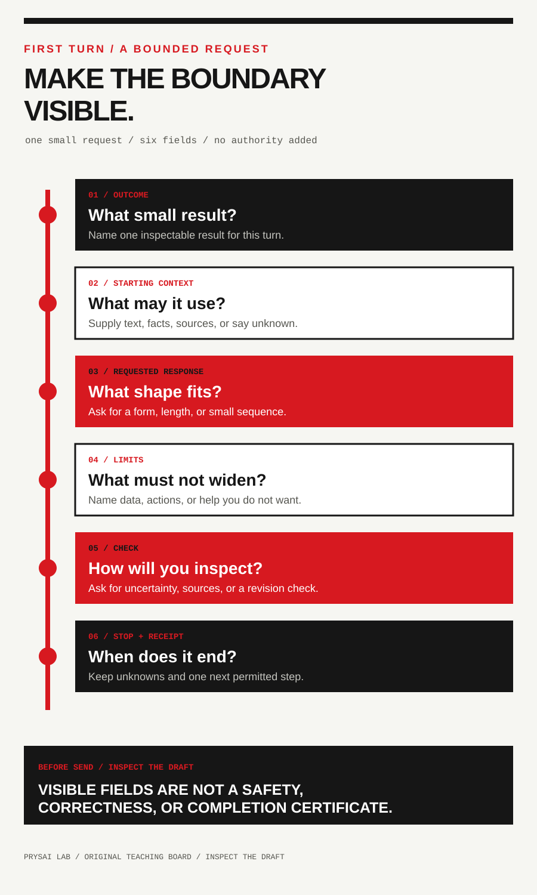

<!-- content_id: universal-first-turn-prompt-contract-2026-08-13 | locale: ZH | language: zh-CN | default_locale: EN | translation_status: in-progress | translated_from: universal-first-turn-prompt-contract-2026-08-13.md | source_revision: 2026-08-23 -->

# 通用首轮提示词契约：一份有界的入门记录

**记录日期：**2026-08-13  
**来源访问时间：**2026-08-13（America/Los_Angeles）  
**状态：**候选研究记录。本记录没有运行提示词，没有比较模型，也没有进行学习者、来源质量、留存、迁移或独立评估。  
**负责人：**curriculum-maintainer  
**下次复核：**2026-09-13；如果卡片要适配具体产品、用于研究或被当作用户结果证据，则应提前复核。

## 范围与问题

本记录为初学者提出两张小型、原创的首轮提示词卡：一次五分钟西班牙语练习，以及一次五分钟研究分诊。它们使用普通文本字段，不依赖某个产品的语法、工具名、账号设置、模型名或隐藏指令层。

**问题：**在避免声称不同产品、账号、工具或输出等价的前提下，哪些首轮字段能在多个 LLM 产品之间保持可理解？

这里的“通用”只表示读者换用产品时，可以用普通语言表达相同字段。它**不表示** OpenAI、Anthropic、Google、Microsoft 和 Meta 提供相同的模型、功能、工具、上下文处理、数据控制、价格、可用性、权限、回答或安全行为。读者必须核对自己实际使用的产品和界面的当前文档。

两张卡都刻意收窄了范围：不请求账号访问、浏览、语音、上传、联系、购买、发布、代码执行，也不请求健康、法律、财务、就业或教育安置决定。读者在理解适用的数据控制和授权前，不应把私人记录、凭据、个人身份信息或机密研究材料粘贴到产品中。

## 证据类别与声明边界

| 类别 | 本记录如何使用 | 它不能证明 |
| --- | --- | --- |
| official fact | 产品所有者在自身产品范围内发布的提示词指导 | 跨产品等价、输出正确性或教学有效性 |
| public user report | 一位作者在特定日期报告的需要或困难 | 普遍性、当前产品事实、根因或已验证的补救措施 |
| community suggestion | 本记录不保留此类项目 | 官方指导或有效性证据 |
| local reproduction | 没有；`not_run` | 任何产品行为或用户结果 |
| project inference | 一张让意图、限制和回执可见的保守卡片 | 在合适评估前卡片有效 |

`not_run` 是状态，不是证据。它表示本记录没有观察到完成时间、模型行为、质量分数、学习者回应、语言评估、引用核查或迁移结果。

## 官方指导：分开标注，不合并成产品结论

下面五个官方页面来自不同组织，仍然各自受产品范围约束。OpenAI 在自身页面讨论指令、上下文、示例和提示词评估；Anthropic 要求在优化提示词前定义成功标准和经验测试；Google 将清晰、具体的指令和示例描述为提示设计策略；Microsoft 把指令、主要内容和示例列为提示工程要素；Meta 发布 Llama 提示指南。

这是五条彼此独立的官方事实，不是一个合并基准。它们只支持下面这条狭义的**项目推论**：初学者的第一轮请求应明确任务、可用上下文、希望得到的回应、限制条件，以及停止或检查条件。来源没有证明这些字段是必要、充分、最优、跨产品稳定，也没有证明它们能有效学习语言或研究。

## 两条有日期的公开信号，保持狭义

下列报告只用于让两种合理的初学者需求可见，不复制为教学资产，也不当作产品事实。

| ID | 有日期的公开报告 | 保留的狭义信号 | 严格边界 |
| --- | --- | --- | --- |
| U1 | OpenAI Community，[*Learn languages at the same time*][U1]，发布于 2024-12-03，访问于 2026-08-13 | 一位作者希望进行更长的语言练习，并描述了自己感知到的使用限制 | 只说明一人的目标和感知限制，不是当前配额、需求估计或提示词能带来学习的证据 |
| U2 | OpenAI Community，[*Long instruction prompt on short input data*][U2]，发布于 2024-06-24，访问于 2026-08-13 | 一位作者描述反复发送长指令和少量变化输入，并询问更好的交互方式 | 只说明一项工作流担忧，不是首轮提示词、所有产品、模型记忆、成本或推荐配置的证据 |

**项目推论：**带有可见任务边界和小回执的短首轮请求，比“教我一门语言”或“研究这个”更容易检查。这不是对访问限制、指令持久性、难度控制或回答质量的已验证解决方案。

## 候选首轮契约

以下契约是项目原创措辞，是组织请求的清单，不是命令语法，也不承诺系统会如何解释。

| 字段 | 读者提供什么 | 为什么需要 | 不要推断 |
| --- | --- | --- | --- |
| **一个结果** | 本次会话中一个小而可观察的结果 | 把下一步行动和宏大愿望分开 | 掌握、流利、专业能力或完成保证 |
| **起始上下文** | 自己写的小样本、已知事实、提供的来源或 `unknown` | 说明回答可以依赖什么 | 对读者或材料的有效评估 |
| **请求的回应** | 有界的回应形式、长度或顺序 | 让读者有东西可以保存或拒绝 | 正确性、相关性或遵循程度 |
| **限制** | 不应分享的数据、不应执行的动作和不需要的帮助 | 明确权限和副作用 | 完整隐私、安全或政策合规 |
| **检查** | 暴露不确定性的提问、来源条件或修改请求 | 防止把答案当成自我验证 | 已验证事实、教学质量或可靠分数 |
| **停止与回执** | 结束会话的条件和要保存的小记录 | 让未完成部分和下一步可见 | 留存、迁移或真实任务已完成 |

### 发送前：先检查，不要认证

如果读者已经写好一份未发送、纯文本、低风险的请求，可以使用 [First-Turn Check Skill](../../skills/prysai-first-turn-check/SKILL.md)，把每个字段标为 `visible`、`missing`、`unclear` 或 `out_of_scope`。它最多返回三条重要的 `add_or_clarify`，不会替读者重写提示词。需要起草首条消息时使用 [Dialogue Brief](../../skills/prysai-dialogue-brief/SKILL.md)；涉及文件、工具、账号、权限或外部影响时使用 [Task Protocol](../../skills/prysai-task-protocol/SKILL.md)。

这是一种候选的结构化方法，使草稿更容易检查；它不验证答案、产品行为、数据处理、安全或学习结果。

## 提示词卡 A：五分钟西班牙语练习

这是原创、低风险的练习模式，只要求短篇文字交流；它不评估个人、不分配 CEFR 或其他水平、不使用语音或浏览，也不声称能带来现实沟通能力。

### 仅在以下条件下使用

- 主题普通且不敏感，例如问候或点饮料；
- 读者可以把尝试控制在几句话内；
- 读者把纠正当作需要核对的建议，而不是权威语言评估。

### 原创卡片

~~~text
我有五分钟练习初级西班牙语。

目标：我想为[一个简单情境]写出一条礼貌的两句回复。
起始上下文：[我会的词、自己写的尝试，或“unknown”]。

请给我一个简短情境，然后等待我的回复。不要给我定级，也不要声称我已经学会西班牙语。我回复后，最多指出两处最影响意思或礼貌程度的修改。每处说明你是否不确定，并要求我再修改一次。

不要使用个人信息、浏览、联系任何人，也不要把练习变成学习计划。结束时列出：我的第一次回复、我的修改、使用的帮助、我应在别处核对的一件事，以及最小的下一次练习或停止条件。
~~~

### 五分钟回执能说明什么

回执最多能说明读者在一次记录的会话里完成了短尝试、看到了披露的帮助并作出修改。它不能说明学会了西班牙语、语法正确、语域合适、能够独立完成、记住了内容、迁移到别处或达到某个语言水平。如果修改要用于真实消息，应先通过合适的人或权威参考资料核对。

## 提示词卡 B：五分钟研究分诊

这张卡用于让下一步研究可检查，不用于生成最终答案或看起来像引用的回复。除非读者另外授予并核对产品已文档化的研究/浏览能力，否则只使用当前会话中读者自己提供的材料。

### 仅在以下条件下使用

- 问题足够窄，可以用一句话说清；
- 不会据此作出高风险结论；
- 读者能保留之后复核所需的来源 URL 或文档标题。

### 原创卡片

~~~text
我有五分钟准备一次研究核查，不是要最终答案。

问题：[一个狭窄的问题]。
我提供的材料：[URL、标题、摘录或“none”]。

先复述问题，并说明需要什么证据。然后做一个三行表格，列出：可能的声明、已提供的来源或“missing”，以及还需要核对的内容。不要编造引用，不要声称打开了你无法访问的来源，也不要给出建议。把事实、报告和推论分开。如果材料缺失、矛盾、涉及个人或风险很高，就停止并告诉我最小安全下一步。

最后列出：实际提供的来源、未知项，以及继续前我应回答的一个问题。
~~~

### 这张卡解决不了什么

它不能证明来源存在、仍然有效、被公平呈现或支持某项声明，也不能证明事实正确、内容完整、学术质量、法律充分性或决定安全。生成的 URL、引文、摘要、表格或信心表述本身都不是证据。

## 七天语言学习边界

本记录不证明一个人能或不能在七天内学会西班牙语或其他语言。要提出七天结论，至少需要明确学习者基线、目标能力、练习和帮助记录、评估任务、评分标准、评分者独立性、留存间隔和迁移条件；本记录没有收集这些信息。

完成七次每日聊天或各完成一次卡片，不等于流利、达到某个水平、记住内容、能够独立沟通，也不证明 LLM 产生了因果影响。官方提示词指南不能填补这些证据缺口，两份个人公开报告也不是学习研究。

## 尚未建立的结论

本记录**没有建立**：

- 两张卡会提升语言学习、研究能力或提示词能力；
- 任何命名的 LLM 产品会以相同方式遵循卡片；
- 回答、纠正、引用或摘要是正确的；
- 产品能评估学习者、核验来源或作出高风险决定；
- U1 或 U2 很常见、仍然当前、由某个产品造成，或由本契约解决；
- 任何读者或产品都能在五分钟内完成；
- 七天会带来流利、留存、迁移或某个水平；
- 本记录已经有学习者测试、独立审阅、安全评估或生产批准。

## 来源、复用与许可边界

这是 Prysai Lab 的原创综合记录。两张提示词卡和契约为本记录撰写，并非复制或改写外部提示词、供应商示例、论坛文字、评估题、代码、截图、图片、标志、凭据或用户数据。本记录只链接并简短转述外部文档；其条款、许可、产品范围和可用性仍归各自所有者，且可能变化。

公开报告只作为参考信号。它们的原文、作者身份和关联内容没有并入面向读者的教学材料。适配具体产品前，必须重新检查目标界面的当前文档和适用条款。

## 来源台账

| ID | 证据类别 | 来源与访问日期 | 有界用途 | 负责人 / 下次复核 | 不证明 |
| --- | --- | --- | --- | --- | --- |
| O1 | official fact | OpenAI，[*Prompt engineering*][O1]，2026-08-13 | 产品范围内关于指令、上下文、示例和提示词评估的指导 | facts-maintainer / 2026-09-13 | 其他产品行为、输出正确性或学习效果 |
| O2 | official fact | Anthropic，[*Prompt engineering overview*][O2]，2026-08-13 | 产品范围内关于成功标准和优化前经验测试的指导 | facts-maintainer / 2026-09-13 | 其他产品行为、提示词效果或学习结果 |
| O3 | official fact | Google AI for Developers，[*Prompt design strategies*][O3]，2026-08-13 | 产品范围内关于清晰、具体指令和示例的指导 | facts-maintainer / 2026-09-13 | 其他产品行为、来源正确性或语言结果 |
| O4 | official fact | Microsoft Learn，[*Prompt engineering techniques*][O4]，2026-08-13 | 产品范围内关于指令、主要内容和示例的提示工程要素 | facts-maintainer / 2026-09-13 | 其他产品行为、模型等价或研究质量 |
| O5 | official fact | Meta for Developers，[*Prompt engineering*][O5]，2026-08-13 | 产品范围内的 Meta Llama 提示指导 | facts-maintainer / 2026-09-13 | 其他产品行为、输出正确性或初学者结果 |
| U1 | public user report | OpenAI Community，[*Learn languages at the same time*][U1]，2024-12-03 发布，2026-08-13 访问 | 一位作者的语言练习目标和感知限制 | curriculum-maintainer / 2026-09-13 | 普遍性、当前产品限制、学习结果或补救办法 |
| U2 | public user report | OpenAI Community，[*Long instruction prompt on short input data*][U2]，2024-06-24 发布，2026-08-13 访问 | 一位作者反复发送指令的工作流担忧 | curriculum-maintainer / 2026-09-13 | 普遍性、根因、当前行为或背书模式 |
| P1 | project inference | 本记录的首轮契约和两张卡 | 一种让第一次请求可检查、与产品无关的写法 | curriculum-maintainer / `not_run`，等待授权评估 | 产品等价、输出正确性、学习效果或完成时间 |
| L1 | local reproduction | 无；`not_run` | 没有运行提示词、模型、产品或学习者 | curriculum-maintainer / `not_run` | 任何行为、质量或学习结果 |
| C1 | community suggestion | 无保留项目 | 本记录的狭窄结论不需要社区建议 | curriculum-maintainer / `not_run` | 需求、最佳实践或有效性 |

## 停止记录与未解决的证据缺口

研究在检查了五份分别负责的官方指南和两份有日期、可追踪的公开报告后停止。没有使用账号，没有询问模型，没有收集个人数据，也没有做跨产品比较。

仍未解决的问题包括：初学者是否理解任一卡片、能否在五分钟内完成、不同产品界面是否一致接受措辞、输出是否准确、纠正是否合适，以及练习是否会在会话之外持续或迁移。未来评估需要授权的协议、明确的任务和环境、参与者同意与数据边界、记录的产品条件，以及在提出有效性或质量结论前进行适当的独立核查。

[O1]: https://developers.openai.com/api/docs/guides/prompt-engineering
[O2]: https://docs.anthropic.com/en/docs/build-with-claude/prompt-engineering/overview
[O3]: https://ai.google.dev/gemini-api/docs/prompting-strategies
[O4]: https://learn.microsoft.com/en-us/azure/ai-foundry/openai/concepts/prompt-engineering
[O5]: https://www.llama.com/docs/how-to-guides/prompting/
[U1]: https://community.openai.com/t/learn-languages-at-the-same-time/1040799
[U2]: https://community.openai.com/t/long-instruction-prompt-on-short-input-data/837381
